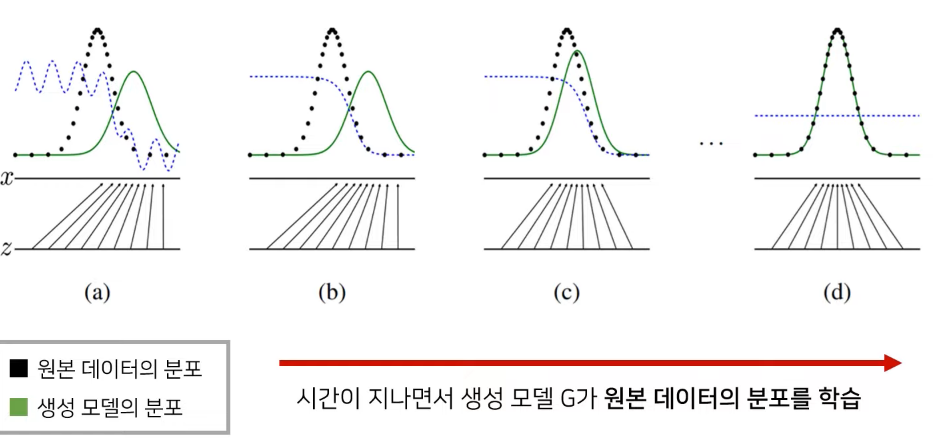
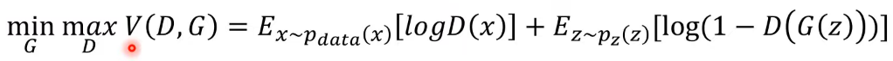
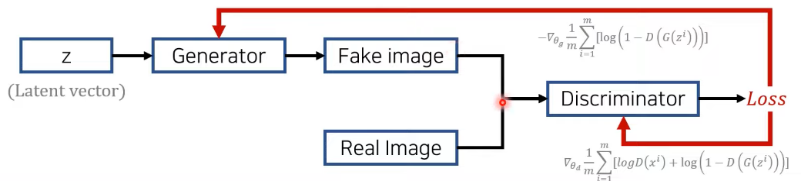
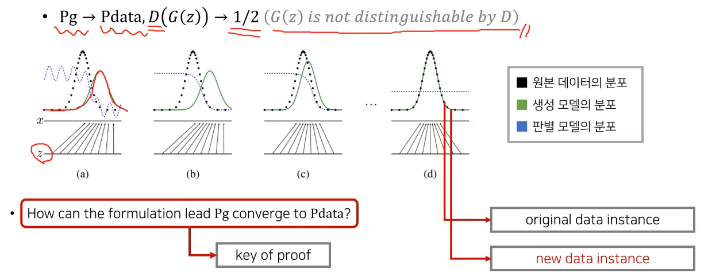

# GAN (Generative Adversarial Networks)

## 1. GAN이란?

- 실제로는 존재하지는 않지만 있을법한 이미지를 생성하는 모델

## 2. 이미지 데이터에 대한 확률분포

- 이미지 데이터는 다차원 특징 공간의 한 점으로 표현된다.
  - 이미지의 분포를 근사하는 모델을 학습할 수 있다.
- 사람의 얼굴에는 통계적인 평균치가 존재할 수 있다.
  - 따라서 모델은 이를 수치적으로 표현할 수 있게된다.

### 1) 이미지에 대한 확률분포란?

- 이미지에서 다양한 특징들이 각각의 확률 변수가 되는 분포.

- 확률값이 높은 이미지를 샘플링하면 자연스러운 이미지.

### 2) 생성 모델(Generative Model)의 목표

- 이미지 데이터의 분포를 근사하는 모델 G를 만드는 것이 생성 모델의 목표이다.
- 모델 G가 잘 동작한다는 의미는 원래 이미지들의 분포를 잘 모델링 할 수 있다는 것을 의미.
  - GAN(Generative Adversarial Networks)가 대표적.

- 모델 G는 원래 데이터(이미지)의 분포를 근사할 수 있도록 학습된다.

- 학습이 잘 되었다면 원본 데이터의 분포를 근사한다.

## 3. GAN 의 원리

### 1) GAN이란?

- 생성자(generator)와 판별자(discriminator) 두 개의 네트워크를 활용한 생성 모델.
- 다음의 목적 함수를 통해 생성자는 이미지 분포를 학습할 수 있다.

- Pdata : 원본 데이터
  - x : 임의의 이미지
- Pz : 노이즈 데이터
  - z : 임의의 노이즈
- G(z) : Generator
  - 노이즈 데이터로부터 가짜 이미지를 생성
- D(x) : Discriminator
  - 생성된 이미지와 원본 이미지를 비교하여 loss값을 구함.
  - D의 값이 1(real image)를 반환하도록 학습을 진행한다.

### 2) GAN의 수렴과정

- 공식의 목표
  - 생성자의 분포가 원본의 분포를 잘 따르게 하는 것

- 원본 + 노이즈 => 새로운 이미지