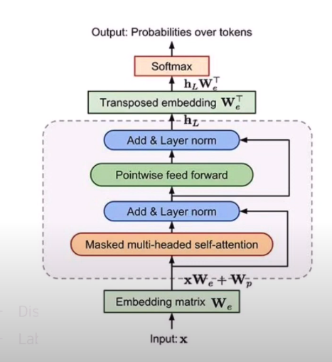
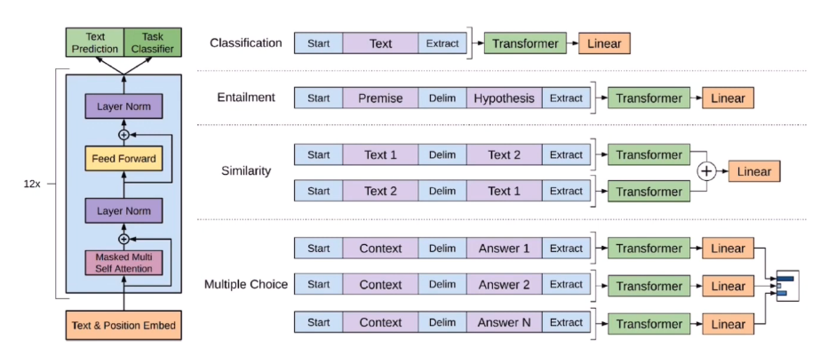

# Improving Language Understanding by Generative Pre-Training

> 해당 논문 *Improving Language Understanding by Generative Pre-Training* 에서는 GPT에 대한 원리를 설명한다. 이를 분석해보고 원리를 이해하자.

## 1. 서론

### 1) 기존 언어모델

- 기존 언어모델은 RNN 기반의 언어모델로, 각 단어 Sequence에 확률을 할당한다.
- Sequence의 확률을 할당하기위한 방법으로, 이전 단어들이 주어졌을 때 다음 단어를 예측하는 방식을 가진다.  

### 2) GPT 모델 요약

- Transformer의 Decoder구조를 기반한 모델
- Unlabeled Corpus를 이용한 사전학습

## 2. Generate Pre-Training Model

### 1) Architecture Summary

1. Unlabeled Large Corpus를 이용한 사전학습
2. 이후, Discriminative Fine-tuning 진행
3. Labeled data를 활용하여 특정 task에 학습

### 2) Pre-Training with Unlabeled Corpus

- 구조

- 기존 transformer의 decoder을 12개 쌓음 : BERT는 Encoder 이용
  - 기존 Transformer의 Decoder와 완전 동일하지는 않음
    - Masked Multi - Head Attention을 적용하는 점
    - Masked Multi - Head Attention이란?
      - 정답 단어 이후의 단어에 masking을 해주는 Attention 매커니즘
      - value vector의 가중합 계산 시, masked word에 곱해지는 score가 0이 되도록 한다.
- Input token에 대해 Masked Multi - Head Attention 적용

- 학습 동작
  - Unlabeled Large Corpus에 대해 window size가 k인 token이 주어졌을 때, 그 다음 token을 예측한다.
  - 다음 token이 등장할 가능성을 최대화하도록 학습한다.

1. Input
   - x에 대해 Embedding Matrix를 구한 후
   - position embedding matrix + token embedding matrix연산
   - 이것은 Masked Multi Head Attention의 입력 값으로 들어가게된다.
2. N개 (본 논문에서는 12개)의 Decoder를 거치게된다.

3. 이후, 마지막 hidden state와 Token Embedding Matrix를 Transposed 하여 Softmax를 취한다.
4. Output
   - 각 Tokens 의 확률 값을 얻게된다.
   - 최종적으로 가장 높은 확률의 단어를 선택

### 3) Fine-tuning Model

> Fine-tuning 과정에서는 downstream task에 따라 사용되는 Dataset이 상이하다.

- Labeled data를 활용하여 downstream task에 맞게 학습한다.

- 구조

  - GPT의 Fine-tuning에서 BERT와 다른 점은 task에 따라 모델이 구조가 상이하다는 것이다.

    

  - Pre-Trained Model에 linear layer를 추가하여 각 task별로 fine-tuning을 진행한다.

  - Task에 따라서 input x를 token sequence로 변환하는 부분에서 차이가 존재한다.

- 성능

  - Pre-trained 과정이 없으면 약 15%의 성능이 떨어진다.
  - Fine-Tuning은 Dataset이 클수록 좋은 성능을 보인다.