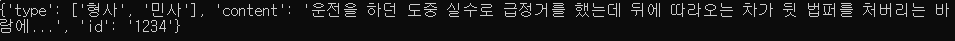

# Child - process

> child process를 이용한 Nodejs 및 python 간의 데이터 교환


## * 한글깨짐 해결

1. ``npm install iconv``  필요 라이브러리 설치
2. 사용은 코드 참조


## 1. 교환 방식

1. Nodejs에서 ``.py`` 파일을 전달할 인자와 함께 호출하여 실행한다. (child process)
2. python에서는 전달받은 인자와 함께 기능을 수행하고 그 결과를 ``print`` 로 출력한다.
3. Nodejs에서는 print로 출력된 값을 읽어서 처리한다. 값은 반드시 String 형태로 읽히기 때문에 다른 형태로 바꾸려면 별도의 처리가 필요하다.


## 2. 예시 코드


### (1) Nodejs

```javascript
// 1. Child Process 선언
const spawn = require("child_process").spawn;
const iconv = require('iconv-lite');
const json = '{"type" : ["형사", "민사"], "content": "운전을 하던 도중 실수로 급정거를 했는데 뒤에 따라오는 차가 뒷 법퍼를 처버리는 바람에...", "id" : "1234"}';

// 2. Python 파일 실행 및 인자 전달 
var process = spawn("python", ["test.py", json]);

let rs

// 3. Python 파일의 Return 값 받기
const data = process.stdout.on("data", function (data) {
  rs = iconv.decode(data, 'euc-kr');
  console.log(rs);
}); // 실행 결과

process.stderr.on("data", function (data) {
  rs = iconv.decode(data, 'euc-kr');
  console.log(rs);
}); // 실행 >에러

console.log(data)
```


### (2) Python

> sys 라이브러리의 시스템 핸들링 함수를 이용하여 인자를 전달받아 처리한다. 해당 인자는 역시 Str 형태로 받아진다.


```python
import sys
import json

def test(data):
    input_json = json.loads(data)
    print(input_json)

if __name__ == '__main__':
    input_data = sys.argv[1]
    test(input_data)
```


### (3) 실행 및 결과

1. ``node test.js`` 

   - Nodejs 파일 실행

2. 터미널 상의 결과 확인

   

   데이터의 교환이 잘 이루어짐을 알 수 있다.

