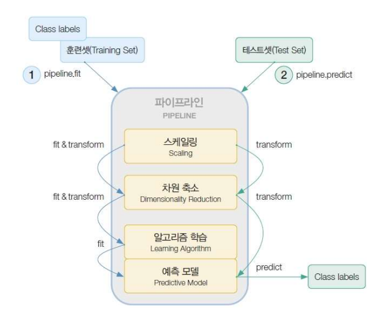

# 1. NBC(나이브 베이지안 분류기)

- 정의
  - 특성들 사이의 독립을 가정하는 베이즈 정리를 적용한 확률 분류기
- 베이즈 정리
  - 두 확률 변수의 사전확률과 사후확률 사이의 관계를 나타내는 정리
  - 객관적인 확률이 존재하지 않고 이전 사건으로 인해 확률이 지속적으로 갱신된다


## 1) 수식적인 코드

- 모듈을 활용하지않고 직접 수식을 코드로 나타냄

- 코드 예시

  ```python
  from pandas import Series, DataFrame
  import pandas as pd
  import numpy as np
  
  df = pd.read_csv('day5_data2.csv')
  # 데이터 전처리
  del df['ID']
  Y_data = df.pop('Fraud')
  Y_data = Y_data.values
  
  # 원-핫-인코딩
  x_df = pd.get_dummies(df)
  X_data = x_df.values
  
  # Y_data 중 true 인 것의 확률
  P_Y_T = sum(Y_data == True) / len(Y_data)
  # Y_data 중 false 인 것의 확률
  P_Y_F = 1 - P_Y_T
  
  # True 인 것과 False 인 것의 인덱스 얻기
  idx_Y_T = np.where(Y_data == True)
  idx_Y_F = np.where(Y_data == False)
  
  # ??
  p_x_y_t = (X_data[idx_Y_T].sum(axis=0)) / sum(Y_data == True)
  p_x_y_f = (X_data[idx_Y_F].sum(axis=0)) / sum(Y_data == False)
  
  # ??
  tt_x = [0, 1, 0, 0, 0, 1, 0, 0, 1, 0]
  tt_y_t = P_Y_T + p_x_y_t.dot(tt_x)
  tt_y_f = P_Y_F + p_x_y_f.dot(tt_x)
  ```


## 2) 모듈을 이용한 코드

- 코드 예시

  ```python
  # 데이터 셋 임의 지정
  y_example_text = ["Sports", "Not sports","Sports","Sports","Not sports"]
  y_example = [1 if c=="Sports" else 0 for c in y_example_text ]
  text_example = ["A great game game", "The The election was over","Very clean game match","A clean but forgettable game game","It was a close election", ]
  
  # 문장을 전처리(비정형데이터의 학습을 위한 작업)
  from sklearn.feature_extraction.text import CountVectorizer
  
  c_v = CountVectorizer()
  X_example = c_v.fit_transform(text_example) # 벡터 생성 (문장->단어화, 키워드)
  # 각 피쳐의 이름을 반환
  c_v.get_feature_names()
  X_example.toarray() # 값을 배열로 표현 (문장별 각각 단어의 포함 개수)
  c_v.vocabulary_ # 단어별 개수
  ```

  - CountVectorizer : 텍스트 문서 모음을 토큰 수의 행렬로 변환한다.

  ```python
  from sklearn.naive_bayes import *
  '''
  alpha : 가산 스무딩 매개변수
  binarize : 샘플 기능의 이진화를 위한 임계값, None이면 입력이 이미 이진 벡터로 구성된 것으로 간주
  '''
  clf = BernoulliNB(alpha=1, binarize=0)
  clf.fit(X_example, y_example)
  
  # class_log_prior_ : 각 클래스의 로그 확률(평활화)
  clf.class_log_prior_
  ```

  - 베르누이 나이브 베이지안 분류기
    - 베르누이 방정식을 사용한 분류기
    - 이산형 데이터를 모두 불린 타입으로 변경


## 3) 비정형 텍스트데이터을 이용한 분류기 실습

- 코드

  ```python
  import pandas as pd
  import numpy as np
  import matplotlib.pyplot as plt
  import seaborn as sns
  import re
  ```

  - 데이터 준비

    ```python
    from sklearn.datasets import fetch_20newsgroups
    new = fetch_20newsgroups(subset='all')
    
    # 키 값 확인
    print(new.keys())
    
    # 타겟 값 확인
    print(new.target)
    
    # 타겟 이름 확인
    print(new.target_names)
    
    ```

  - 데이터 전처리

    ```python
    # 데이터 프레임으로 변환
    new_df = pd.DataFrame({'News':new.data,'Target':new.target})
    
    t_dict ={idx:name for  idx,name in enumerate(new.target_names)}
    
    # 타겟을 변환 (숫자를 그에 대응되는 문자열로 변경)
    new_df['Target'] = new_df['Target'].replace(t_dict)
    
    # 불필요 문자열 제외하는 함수
    def data_cleansing(df):
        # r''의 의미 : raw string -> 진짜 문자열을 의미(공백과 개행조차 문자열로 인식)
        delete_email = re.sub(r'\b[\w\+]+@[\w]+.[\w]+.[\w]+.[\w]+\b', ' ', df)
        delete_number = re.sub(r'\b|\d+|\b', ' ',delete_email)
        delete_non_word = re.sub(r'\b[\W]+\b', ' ', delete_number)
        cleaning_result = ' '.join(delete_non_word.split()) # join : 문자열을 연결
        return cleaning_result
    new_df.loc[:,'News'] = new_df['News'].apply(data_cleansing)
    new_df # apply(함수) : 함수적용
    ```

  - 데이터 정형화 = 벡터화(비정형데이터)

    - 벡터화의 기법
      - tfidf : 전체 문서에서 많이 나오는 단어의 중요도는 줄이고 해당 문서에만 많이 나오는 단어의 중요도를 올리는 기법
      - TF(Term Frequency) : 문서에서 해당 단어가 얼마나 나왔는지 나타내주는 빈도 수
      - DF(Document Frequency) : 해당 단어가 있는 문서의 수
      - IDF(Inverse Document Frequency) : 해당 단어가 있는 문서의 수가 높아질수록 가중치를 축소하기 위해 역수를 취함(중요도 떨어뜨림)
    - 토큰화
      - 인덱스를 지정해야 하는 단어들의 리스트를 정리하는 기법
    - 어간추출
      - 띄어쓰기 기준이 아닌 의미나 역할이 다른 단어들을 기준으로 분리

    ```python
    # 벡터화를 위한 모듈
    from sklearn.feature_extraction.text import CountVectorizer
    import nltk # nltk 벡터화 기법을 사용하기위한 모듈
    
    stmmer = nltk.stem.SnowballStemmer('english')
    
    # 벡터를 숫자로 세기 위한 클래스
    class S_C_V(CountVectorizer):
        def build_analyzer(self):
            analyzer = super(S_C_V,self).build_analyzer()
            return lambda doc:(stmmer.stem(w)for w in analyzer(doc))
    
    # 벡터화를 위한 변환
    from sklearn.feature_extraction.text import TfidfVectorizer
    stmmer = nltk.stem.SnowballStemmer('english')
    
    # 벡터로 변환하기 위한 클래스
    class S_T_V(TfidfVectorizer):
        def build_analyzer(self):
            analyzer = super(S_T_V,self).build_analyzer()
            return lambda doc:(stmmer.stem(w)for w in analyzer(doc))
    ```

  - 파이프라인

    - 데이터 전처리부터 성능 측정까지 연결된 코드로 나타내는것

      

      ```python
      from sklearn.naive_bayes import MultinomialNB, BernoulliNB,GaussianNB
      from sklearn.linear_model import LogisticRegression
      from sklearn.pipeline import Pipeline,make_pipeline
      vectorzizer = [CountVectorizer(),TfidfVectorizer(),S_C_V(),S_T_V()] # 적용할 벡터화
      algth = [MultinomialNB(),LogisticRegression()] # 적용할 알고리즘
      pipe_l = []
      
      # 파이프라인 구축
      import itertools
      for i in list(itertools.product(vectorzizer,algth)):
          pipe_l.append(make_pipeline(*i))
          
      # 파라미터 값의 초기값 설정
      n_par = [(1, 1), (1, 3)]
      stopw_par = ['english']
      l_case_par = [True, False]
      max_par = np.linspace(0.4, 0.6, num=6)
      min_par = np.linspace(0.0, 0.0, num=1)
      
      # 파라미터 적용을 위한 dict 자료형 구축
      att={'ngram_range':n_par,'max_df':max_par,'min_df':min_par,
          'lowercase':l_case_par,'stop_words':stopw_par,
          }
      vectorzizer_names=['countvectorizer','tfidfvectorizer','s_c_v','s_t_v']
      vectorzizer_par_dict={}
      for i in vectorzizer_names:
          vectorzizer_par_dict[i]={}
          for key,v in att.items():
              par_name = i + "__" + key
              vectorzizer_par_dict[i][par_name] = v
              
      algorithm_names = ["multinomialnb", "logisticregression"]
      
      # 알고리즘에 적용할 파라미터 설정
      algorithm_params_dict = {}
      alpha_params = np.linspace(1.0, 1.0, num=1)
      for i in range(1):
          algorithm_params_dict[algorithm_names[i]] = {
              algorithm_names[i]+ "__alpha" : alpha_params
          }
      c_params = [0.1, 5.0, 7.0, 10.0, 15.0, 20.0, 100.0]
      
      algorithm_params_dict[algorithm_names[1]] = [{
          "logisticregression__multi_class" : ["multinomial"],
          "logisticregression__solver" : ["saga"],
          "logisticregression__penalty" : ["l1"],
          "logisticregression__C" : c_params
          },{ 
          "logisticregression__multi_class" : ["ovr"],
          "logisticregression__solver" : ['liblinear'],
          "logisticregression__penalty" : ["l2"],
          "logisticregression__C" : c_params
          }
          ] 
      
      # 최종 파이프라인 파라미터 정리
      pipeline_params= []
      for case in list(itertools.product(vectorzizer_names, algorithm_names)):
          vect_params = vectorzizer_par_dict[case[0]].copy()
          algo_params = algorithm_params_dict[case[1]]  
          
          if isinstance(algo_params, dict):
              vect_params.update(algo_params)
              pipeline_params.append(vect_params)
          else:
              temp = []
              for param in algo_params:
                  vect_params.update(param)
                  temp.append(vect_params)
              pipeline_params.append(temp)
      ```

  - 입력 데이터 전처리

    ```python
    # LabelEncoder : 0과 n_classes-1 사이의 값으로 대상 레이블을 인코딩한다.
    # 대상 값을 인코딩하는데 사용한다.
    from sklearn.preprocessing import LabelEncoder
    
    X_data = new_df.loc[:, 'News'].tolist()
    y_data = new_df['Target'].tolist()
    y = LabelEncoder().fit_transform(y_data)
    ```

  - 모델 학습

    ```python
    from sklearn.model_selection import GridSearchCV # 추정기에 대해 지정된 매개변수 값에 대한 철저한 검색
    from sklearn.metrics import classification_report, accuracy_score
    
    scoring = ['accuracy']
    estimator_results = []
    for i, (estimator, params) in enumerate(zip(pipe_l,pipeline_params)):
        n_jobs = -1
        gs_estimator = GridSearchCV(
                refit="accuracy", estimator=estimator,param_grid=params,
                scoring=scoring, cv=5, verbose=1, n_jobs=n_jobs)
        print(gs_estimator)
        
        gs_estimator.fit(X_data, y)
        estimator_results.append(gs_estimator)
    ```

    