# 1. 군집의 특성을 이용한 이미지 분류

1. import

   ```python
   import numpy as np
   import matplotlib.pyplot as plt
   ```

   별도의 모델을 사용하지않고 군집의 특성만을 이용하여 이미지를 분류한다

2. 데이터 로드

   ```python
   # 데이터 로드
   data = np.load('data7_data3.npy')
   ```

3. 이미지 파일 확인

   ```python
   plt.imshow(data[0], cmap='gray_r') # 이미지 파일 보기
   plt.show()
   
   plt.imshow(data[100], cmap='gray_r') # 이미지 파일 보기
   plt.show()
   
   plt.imshow(data[200], cmap='gray_r') # 이미지 파일 보기
   plt.show()
   ```

   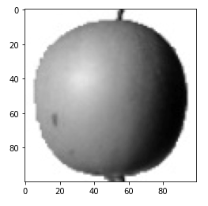

   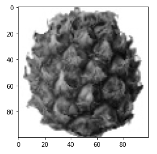

   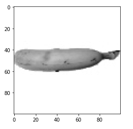

   data는 위의 3가지 사진과 비슷한 사진이 각각 100장씩 있는 data이다.

4. 데이터의 유사성 시각화(히스토그램 표현)

   ```python
   # 데이터들 간의 유사성 시각화
   plt.hist(np.mean(a, axis=1), alpha=0.8)
   plt.hist(np.mean(b, axis=1), alpha=0.8)
   plt.hist(np.mean(c, axis=1), alpha=0.8)
   plt.legend(['a', 'b', 'c'])
   plt.show()
   ```

   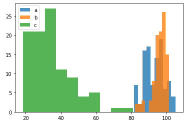

5. 각 사진마다의 평균값 계산 후 사진생성

   ```python
   # 전체 데이터의 유사성을 비교해서 사진생성
   # 평균화 후 사진 생성 -> 데이터들의 중간값
   a_m = np.mean(a, axis=0).reshape(100, 100)
   b_m = np.mean(b, axis=0).reshape(100, 100)
   c_m = np.mean(c, axis=0).reshape(100, 100)
   
   plt.imshow(a_m, cmap='gray_r')
   plt.show()
   plt.imshow(b_m, cmap='gray_r')
   plt.show()
   plt.imshow(c_m, cmap='gray_r')
   plt.show()
   ```

   실행결과로 각 사진의 평균값에 해당하는 사진을 볼 수 있다

   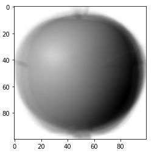

   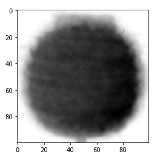

   

6. 유사성을 비교하여 유사한 사진 추출

   ```python
   # 전체 데이터 - 평균값이 0에 가까울수록 유사한 데이터
   a_d = np.abs(data - a_m)
   a_m_d = np.mean(a_d, axis=(1, 2))
   
   # 정렬하면 유사한 데이터 순으로 100개가 나열된다
   a_l = np.argsort(a_m_d)[:100]
   fig, axs = plt.subplots(10, 10, figsize=(10, 10))
   for i in range(10):
       for j in range(10):
           axs[i, j].imshow(data[a_l[i*10+j]], cmap='gray_r')
           axs[i, j].axis('off')
   plt.show()
   ```

   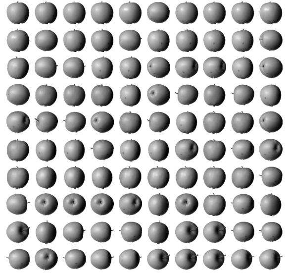

   ```python
   b_d = np.abs(data - b_m)
   b_m_d = np.mean(b_d, axis=(1, 2))
   
   b_l = np.argsort(b_m_d)[:100]
   fig, axs = plt.subplots(10, 10, figsize=(10, 10))
   for i in range(10):
       for j in range(10):
           axs[i, j].imshow(data[b_l[i*10+j]], cmap='gray_r')
           axs[i, j].axis('off')
   plt.show()
   ```

   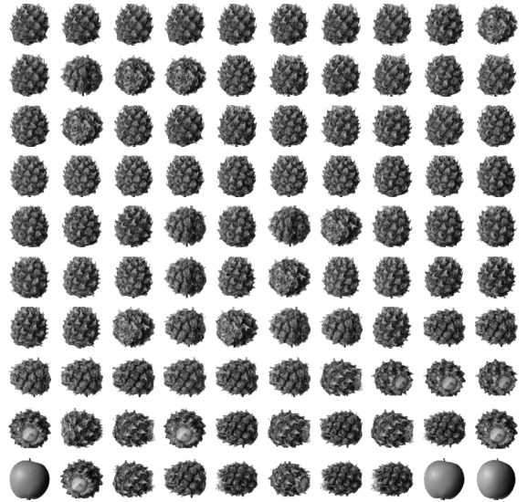

   ```python
   c_d = np.abs(data - c_m)
   c_m_d = np.mean(c_d, axis=(1, 2))
   
   c_l = np.argsort(c_m_d)[:100]
   fig, axs = plt.subplots(10, 10, figsize=(10, 10))
   for i in range(10):
       for j in range(10):
           axs[i, j].imshow(data[c_l[i*10+j]], cmap='gray_r')
           axs[i, j].axis('off')
   plt.show()
   ```

   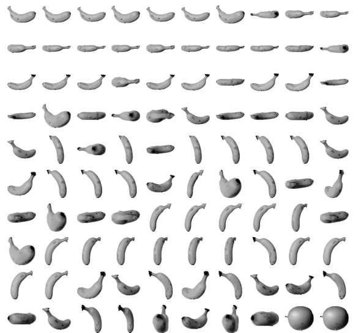

   

## 2) PCA 모델을 활용하여 중요특성만으로 이미지 분류

- 코드

  1. import

     ```python
     import numpy as np
     import matplotlib.pyplot as plt
     from sklearn.decomposition import PCA # 데이터 분석 도구 : 데이터 고유의 특징 말고는 제거
     ```

  2. 데이터 로드 및 구조 조정

     ```python
     # 데이터로드
     data = np.load('data7_data3.npy')
     # 데이터 구조 조정
     re_data = data.reshape(-1, 100 * 100)
     ```

  3. PCA 모델 생성 및 데이터 중요특성만 가진 모델 생성

     ```python
     pca = PCA(n_components=50) # n_components : 꺼내올 개수 지정
     rr_data = pca.fit_transform(re_data)
     ```

  4. Data를 이미지로 시각화할 함수 선언

     ```python
     # 학습결과 시각화를 위한 함수
     def f(data, r=1):
         n = len(data)
         rows = int(np.ceil(n / 10)) # 전체적인 개수에 따라 몇줄로 표현할 것인지 설정
         cols = n if rows < 2 else 10
         fig, axs = plt.subplots(rows, cols, figsize=(cols*r, rows*r))
         for i in range(rows):
             for j in range(cols):
                 if i * 10 + j < n:
                     axs[i, j].imshow(data[i*10+j], cmap='gray_r')
                 axs[i, j].axis('off')
         plt.show()
     ```

  5. PCA로 처리된 모델의 이미지

     ```python
     f(pca.components_.reshape(-1, 100, 100))
     ```

     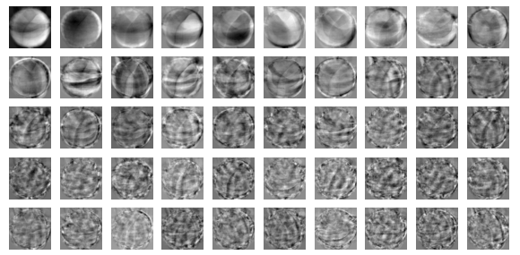

  6. PCA로 처리된 데이터를 다시 복구하여 이미지 출력

     ```python
     k = pca.inverse_transform(rr_data).reshape(-1,100,100) # 단, 원본과 똑같지는 않고 약간 흐릿해진다
     f(k)
     ```

     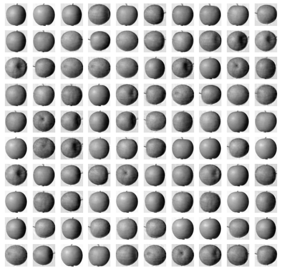

     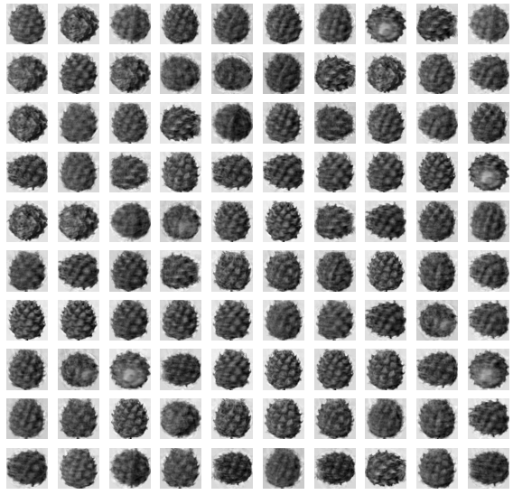

     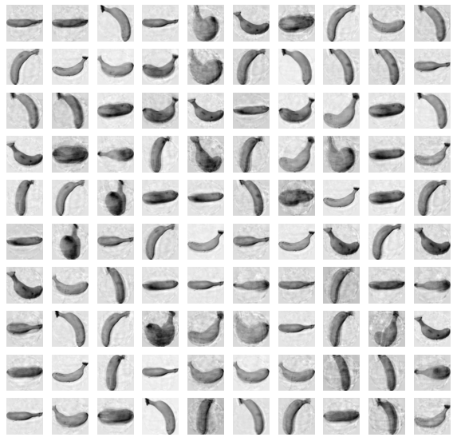

     