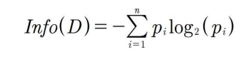
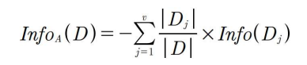
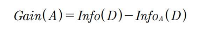

# 1. 의사결정트리 이론 및 코드

## 1) 정의

- 어떤 규칙을 하나의 트리 형태로 표현한 후 이를 바탕으로 분류나 회귀 문제를 해결하는 방법
- 마지막 노드는 분류 문제에서는 클래스, 회귀 문제에서는 예측치의 값이 들어간다.
- if-else 형식의 표현

## 2) 분할속성

- 정의

  - 부모 노드에 들어가는 if-else문의 조건

- 최적의 분할 속성

  - 재귀적 지역 최적화
    - 첫 문제로 분할 속성을 정하고, 그 다음에 남은 데이터 속에서 최적의 분할 속성을 찾아내는 방법
  - 엔트로피
    - 목정 달성을 위한 경우의 수를 정량적으로 표현하는 수치
    - 낮은 엔트로피 : 경우의 수 적음, 낮은 불확실성
    - 높은 엔트로피 : 경우의 수 높음, 높은 불확실성

- 엔트로피 측정

  - 전체 엔트로피

    

  - 속성별 엔트로피

    

- 정보 이득

  - 정의

    - 엔트로피를 사용하여 속성별 분류시 데이터가 얼마나 순수한지를 측정하는 지표

  - 속성별 정보 이득

    

    - 정보 이득이 클수록 A를 기준으로 데이터를 분류했을 때 얻을 수 있는 정보량이 많음
    - 즉, 분류의 기준이 되는 속성을 선정

## 3) 의사결정트리 엔트로피 계산 수식 코드

- 데이터 불러오기

  ```python
  import pandas as pd
  import numpy as np
  
  # 1. 데이터 불러오기
  data = pd.read_csv('day6_data2.csv')
  ```

- 엔트로피 연산 함수

  ```python
  # 2. [함수] 엔트로피 연산 - 속성의 Gain 값 계산을 위함
  def get_info(df):
      buy = df.loc[df['class_buys_computer'] == 'yes'] # 비용(yes)
      not_buy = df.loc[df['class_buys_computer'] == 'no'] # 비용(no)
      x = np.array([len(buy) / len(df), len(not_buy) / len(df)]) # 전체 데이터 중 buy의 비율과 not_buy의 비율
      y = np.log2(x[x != 0]) # 엔트로피 연산 결과값 @ numpy의 log 함수 이용
      info_all = -sum(x[x != 0] * y) # 엔트로피 최종 연산
      return info_all
  
  get_info(data) # 전체 데이터의 엔트로피 값
  
  ```

- 속성별 엔트로피 계산 함수

  ```python
  # [함수] 속성별 엔트로피 계산
  def get_attribute_info(df, attribute_name): # 전체 데이터 프레임과 속성이 가지고 있는 이름
      att_v = df[attribute_name].unique() # 속성이 가지고 있는 값
      get_infos = [] # 연산의 결과를 기록할 리스트
      for i in att_v:
          split_df = df.loc[df[attribute_name] == i]
          get_infos.append((len(split_df) / len(df)) * get_info(split_df))
      return sum(get_infos)
  ```

- gain 값 구하기

  ```python
  # 'age'의 gain 값
  get_info(data) - get_attribute_info(data, 'age')
  
  # 'income'의 gain 값
  get_info(data) - get_attribute_info(data, 'income')
  
  # 'student'의 gain 값
  get_info(data) - get_attribute_info(data, 'student')
  
  # 'credit_rating'의 gain 값
  get_info(data) - get_attribute_info(data, 'credit_rating')
  ```

- 속성의 개별 요소 gain 값 구하기

  ```python
  # 'youth' 의 gain 값
  youth = data.loc[data['age'] == 'youth']
  get_info(youth) - get_attribute_info(youth, 'income')
  
  get_info(youth) - get_attribute_info(youth, 'student')
  
  get_info(youth) - get_attribute_info(youth, 'credit_rating')
  ```

  