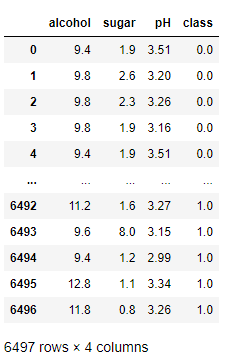

# 1. 의사결정트리 교차검증

## 1) 교차검증 정의

- 데이터를 섞어서 이상적인 결과를 도출하는 방법


## 2) 코드

- 데이터 가져오기

  ```python
  import pandas as pd
  import numpy as np
  
  # 1. 데이터 가져오기
  data = pd.read_csv('day6_data1.csv')
  ```

  

- 분할 속성 추출

  ```python
  # 2. 분할 속성 추출
  X = data[['alcohol', 'sugar', 'pH']].to_numpy()
  Y = data['class'].to_numpy()
  ```

- 사용 데이터 분류 

  - 사용할 데이터는 반드시 고정되어야한다

  ```python
  # 3. 사용 데이터 분류 : 반드시 고정되어야하는 데이터 셋
  from sklearn.model_selection import train_test_split
  # 검증 데이터 분리
  t_x, tt_x, t_y, tt_y = train_test_split(X, Y,test_size=0.2, random_state=42)  
  # 4. training set에서 test data set 분리
  s_t_x, v_t_x, s_t_y, v_t_y = train_test_split(t_x, t_y, random_state=42, test_size=0.2)
  ```

- 모델 생성 및 학습

  ```python
  # 5. 모델 생성 및 학습
  from sklearn.tree import DecisionTreeClassifier
  
  dt = DecisionTreeClassifier(random_state=42) # 생성
  dt.fit(s_t_x, s_t_y) # 학습
  dt.score(s_t_x, s_t_y), dt.score(v_t_x, v_t_y) # 트레이닝 데이터와 테스트 데이터로 점수 확인
  ```

- 교차검증

  ```python
  # 6. 교차검증 : 데이터를 섞어서 이상적인 결과를 도출 (동작마다 값이 다르다)
  from sklearn.model_selection import cross_validate
  sc = cross_validate(dt, t_x, t_y)
  sc # 학습시간, 검증시간, 테스트 점수 출력
  ```

- 객체를 지정하여 교차 검증

  ```python
  # 6-1. 객체를 통한 크로스 검증
  from sklearn.model_selection import StratifiedKFold
  # cv=StratifiedKFold : StratifiedKFold를 학습의 도구로 사용
  sc1 = cross_validate(dt, t_x, t_y, cv=StratifiedKFold()) # cv : 규칙
  np.mean(sc1['test_score'])
  ```

- 객체의 하이퍼 파라미터를 지정하여 교차 검증

  ```python
  # 6-2. 객체의 하이퍼 파라미터를 조정하여 교차 검증
  # StratifiedKFold 의 기능 사용 -> 자체적으로 검증을 해준다
  # 하이퍼 파라미터의 값을 제시 : 하이퍼 파라미터의 값에 따라 학습의 정도가 달라진다
  # n_splits : 입력값의 데이터 분할 수 지정 ex 10이면 10폴드 교차라고 부른다 // 기본값은 5폴드
  sc_ck = StratifiedKFold(n_splits=10, shuffle=True, random_state=42)
  sc2 = cross_validate(dt, t_x, t_y, cv=sc_ck) # cv : 규칙
  np.mean(sc2['test_score'])
  sc2
  ```

  - 검증 데이터의 존재 이유
    - 학습 데이터의 임의 지점에 삽입해서 새로운 학습 모델을 만들면서 모델을 안정화시킨다
    - 학습 데이터가 달라지면 모델의 학습도 달라지기 때문

- GridSearchCV 모델을 사용한 교차검증

  - 기능
    - 교차검증 + 하이퍼 파라미터 지정 + 학습 을 자동으로 진행한다

  ```python
  # GridSearchCV : 교차검증 + 하이퍼 파라미터 지정 + 학습 모두 진행
  # GridSearchCV : params으로 지정한 하이퍼 파라미터의 값을 모두 넣어보고 최적의 값을 가진 모델을 얻기 위한 객체
  # n_jobs=-1 : -1은 내부 코어 전체를 사용한다는 의미
  gs = GridSearchCV(DecisionTreeClassifier(random_state=42), params, n_jobs=-1) # 하이퍼 파라미터 제시
  gs.fit(t_x, t_y) # 데이터 입력 
  
  # 최적의 모델로 설정된 검증트리
  dt = gs.best_estimator_ # 가장 좋은 하이퍼 파라미터로 설정된 학습 모델 반환
  dt.score(t_x, t_y), dt.score(tt_x, tt_y)
  
  gs.best_params_ # 하이퍼 파라미터의 가장 이상적인 값을 반환
  
  gs.cv_results_['mean_test_score'] # 지정한 하이퍼 파라미터 별 점수
  
  i = np.argmax(gs.cv_results_['mean_test_score']) # 가장 최고의 파라미터의 위치 반환
  gs.cv_results_ # 전체적인 정보확인
  
  np.max(gs.cv_results_['mean_test_score']) # 가장 좋은 스코어 값 출력
  ```

- RandomizedSearchCV 를 사용한 교차검증

  ```python
  from scipy.stats import uniform, randint
  
  params = {
      'max_depth' : randint(20, 50), # 깊이 제약 설정
      'min_impurity_decrease' : uniform(0.0001, 0.001),
      'min_samples_split' : randint(2, 25),
      'min_samples_leaf' : randint(1, 25) 
  }
  
  # 제공하는 파라미터 범위의 자동화 -> 랜덤 서치 (임의의 범위를 생성)
  # 랜덤 서치 모듈
  from sklearn.model_selection import RandomizedSearchCV
  rs = RandomizedSearchCV(DecisionTreeClassifier(random_state=42), params, n_iter=100, n_jobs=-1, random_state=42) # n_iter : 반복횟수설정
  rs.fit(t_x, t_y)
  ```

  