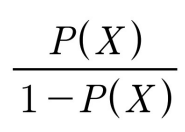
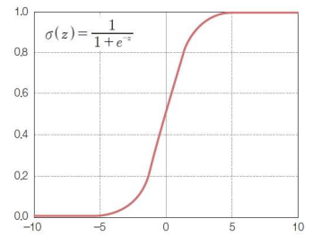
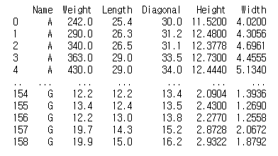
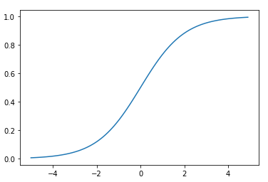
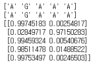

# 1. 로지스틱 회귀


## 1) 정의

- 몇 가지 이산적 값 중 하나를 선택하는 모델, 즉, 분류 모델이다.
- 이진 분류 문제를 확률로 표현한다


## 2) 중요함수

- 로짓함수 : 오즈비에 상용로그를 붙인 수식

  - 오즈비 : 어떤 사건이 일어날 확률과 일어나지 않을 확률의 비율

    

- **로지스틱 함수** : 로짓 함수의 역함수

  

- 시그모이어 함수

  - y 값을 확률 p로 표현

  - z 값은 선형회귀와 같이 가중치와 피처의 선형 결합으로 표현이 가능하다

    


## 3) 코드

- 본 코드는 사용할 모듈을 그 상황에 맞게 import 하였다

  1. 데이터 Load(수집 대체)

     ```python
     import pandas as pd
     import numpy as np
     
     data = pd.read_csv('data1_all.csv')
     print(data) # 데이터 확인
     '''
     Name : 범주형 -> Y 값으로 사용
     나머지 : 피쳐(연속형 데이터) -> X 값으로 사용
     '''
     data_X = data[['Weight', 'Length', 'Diagonal', 'Height', 'Width']].to_numpy() 
     data_Y = data[['Name']].to_numpy()
     ```

     *데이터*

     

  2. 데이터 전처리

     ```python
     from sklearn.preprocessing import StandardScaler
     
     ss = StandardScaler().fit(data_X)
     sc_x = ss.transform(data_X) # 스케일 조정
     ```

  3. 데이터 분류

     ```python
     from sklearn.model_selection import train_test_split
     
     t_x, tt_x, t_y, tt_y = train_test_split(sc_x, data_Y, random_state=42)
     ```

  4. 모델 생성 및 학습

     ```python
     from sklearn.neighbors import KNeighborsClassifier
     
     kn = KNeighborsClassifier(n_neighbors=3)
     kn.fit(t_x, t_y)
     ```

  5. 검증

     ```python
     # 스코어 확인
     print(kn.score(t_x, t_y), kn.score(tt_x, tt_y))
     # 몇 가지로 분류되었는지 그 종류를 출력
     print(kn.classes_)
     # 테스트 데이터로 예측값 확인
     print(kn.predict(tt_x[:4]))
     # 타겟 데이터로 확인하여 예측값과 비교
     print(tt_y[:4])
     # 입력정보의 확률 확인
     # np.round -> 정보를 축약 decimals : 나타낼 소수점의 자리를 지정하는 옵션
     print(np.round(kn.predict_proba(tt_x[:4]), decimals=3))
     ```

  6. 시그모이어 함수 구현(이진 분류만 가능)

     ```python
     import matplotlib.pyplot as plt
     
     # 표현할 z값의 범위 지정
     z = np.arange(-5, 5, 0.1)
     # np.exp 는 자연로그를 나타낸다 매개변수로 제곱을 받는다
     h = 1 / (1 + np.exp(-z)) 
     
     plt.plot(z, h)
     plt.show()
     ```

     

     

  7. 로지스틱 회귀

     ```python
     # A와 G Name 만 추출하여 검증(이진 분류)
     ck_i = (t_y == 'A') | (t_y == 'G')
     ck_t_i = (tt_y == 'A') | (tt_y == 'G')
     b_t_x = t_x[ck_i.flatten()]
     b_t_y = t_y[ck_i.flatten()]
     b_tt_x = tt_x[ck_t_i.flatten()]
     b_tt_y = tt_y[ck_t_i.flatten()]
     
     from sklearn.linear_model import LogisticRegression
     
     lr = LogisticRegression() # 모델 생성
     lr.fit(b_t_x, b_t_y) # 학습
     print(lr.predict(b_t_x[:5]))
     print(b_t_y[:5].flatten())
     # 회귀적으로 접근하니 정답이 맞아 떨어진다.
     # 확률 확인
     print(lr.predict_proba(b_t_x[:5]))
     
     from scipy.special import softmax
     np.round(softmax(d), decimals=3) # 모든 원소를 더하면 1로 수렴 즉, 100퍼센트에서 분류
     ```

     

     ```python
     # 수식꺼내기
     # decision_function : 학습된 공식을 꺼냄
     d = lr.decision_function(b_t_x[:1]) # 음의 영역과 양의 영역으로 나뉜다. -> 2가지의 분류만 가능(이 값은 확률 값이 아니다.)
     
     # 수식을 이용하여 연산하기
     from scipy.special import expit
     expit(d) # 이 값이 진짜 이 데이터의 확률 값이다.
     ```

     