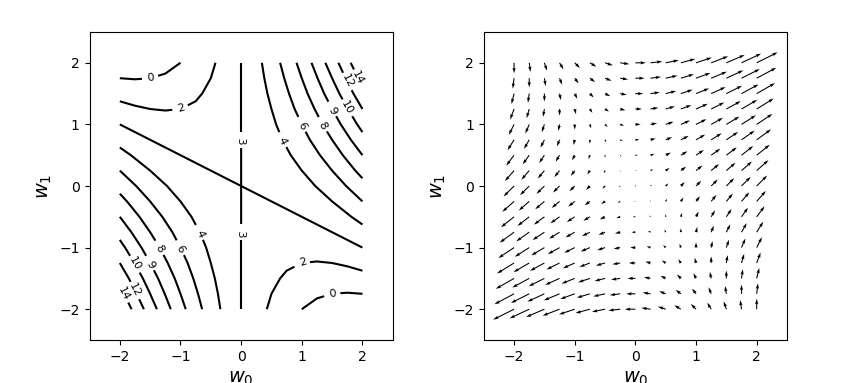

# 1. Numpy 행렬 연산

## 1) 스칼라 연산

- import

  ```python
  import numpy as np
  ```

- 선언 및 연산

  ```python
  # 행렬 m1, m2 선언
  m1 = np.array([[1, 2], [3, 4]])
  m2 = np.array([[1, 2], [3, 4]])
  
  # 스칼라 덧셈
  m1 + m2
  # 스칼라 곱셈
  m1 * m2
  ```

  스칼라 연산은 각 대응대는 원소에 연산한다

## 2) 벡터

- import

  ```python
  import numpy as np
  ```

- 선언 및 함수

  ```python
  # 벡터 : 선
  a = np.array([2, 1])
  
  # np.linalg.norm() : 벡터의 크기를 구하는 함수
  np.linalg.norm(a)
  ```

## 3) 행렬의 연산

- import

  ```python
  import numpy as np
  # 역행렬 변환 연산을 하기위한 모듈
  from numpy.linalg import inv 
  ```

- 내적

  ```python
  # 행렬 x, y 선언
  x = np.array([1, 2, 3])
  y = np.array([4, 5, 6])
  
  # dot : 행렬의 내적을 구하는 함수
  np.dot(x, y) # x.dot(y)와 같음
  ```

- 전치

  ```python
  # 행렬의 전치
  x.T
  ```

- 역행렬 변환

  ```python
  # 역행렬로 변환
  inv(x)
  ```

## 4) 행렬 연산을 통한 미분

- 설명

  - 행렬 연산을 통한 미분의 방식은 연쇄법칙(chain rule)을 따른다. 연쇄법칙을 이용하면 식이 복잡하고 전개하기 어려운 경우 편리하게 사용할 수 있다.

- 예시코드 : 현재 단계에서는 이해하기 힘든 코드

  ```python
  import numpy as np
  import matplotlib.pyplot as plt
  
  # f(x) 를 지정
  def f(w0, w1):
      return w0**2 + 2 *w0 *w1 + 3
  
  # f(x)를 w0로 미분
  def df_dw0(w0, w1):
      return 2*w0 + 2*w1
  
  # f(x)를 w1로 미분
  def df_dw1(w0, w1):
      return 2*w0 + 0*w1
  
  # 레이어 층 생성(전체적인 코드 : 아직 이해가 안될 수 있음)
  w_r = 2
  dw = 0.25
  w0 = np.arange(-w_r, w_r + dw, dw) # 임의의 값 부여
  w1 = np.arange(-w_r, w_r + dw, dw)
  wn = w0.shape[0]
  ww0, ww1 = np.meshgrid(w0, w1)
  ff = np.zeros((len(w0), len(w1)))
  dff_dw0 = np.zeros((len(w0), len(w1)))
  dff_dw1 = np.zeros((len(w0), len(w1)))
  
  for i0 in range(wn):
      for i1 in range(wn):
          ff[i1, i0] = f(w0[i0], w1[i1])
          dff_dw0[i1, i0] = df_dw0(w0[i0], w1[i1])
          dff_dw1[i1, i0] = df_dw1(w0[i0], w1[i1])
  
  # 그래프 표현 코드 -> 자료참고
  plt.figure(figsize=(9, 4))
  plt.subplots_adjust(wspace=0.3)
  plt.subplot(1, 2, 1)
  cont = plt.contour(ww0, ww1, ff, 10, colors='k')
  cont.clabel(fmt='%2.0f', fontsize=8)
  plt.xticks(range(-w_r, w_r + 1, 1))
  plt.yticks(range(-w_r, w_r + 1, 1))
  plt.xlim(-w_r - 0.5, w_r + .5)
  plt.ylim(-w_r - .5, w_r + .5)
  plt.xlabel('$w_0$', fontsize=14)
  plt.ylabel('$w_1$', fontsize=14)
  
  plt.subplot(1, 2, 2)
  plt.quiver(ww0, ww1, dff_dw0, dff_dw1)
  plt.xlabel('$w_0$', fontsize=14)
  plt.ylabel('$w_1$', fontsize=14)
  plt.xticks(range(-w_r, w_r + 1, 1))
  plt.yticks(range(-w_r, w_r + 1, 1))
  plt.xlim(-w_r - 0.5, w_r + .5)
  plt.ylim(-w_r - .5, w_r + .5)
  plt.show()
  ```

- 실행결과

  

  