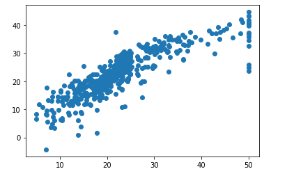

# 1. 사이킷런(sklearn)을 활용한 머신러닝 기초(지도학습)

## 1) 분류

1. import

   ```python
   # 사이킷런을 사용하기 위한 모듈
   from sklearn.neighbors import KNeighborsClassifier
   # 그래프로 나타내기 위한 모듈
   import matplotlib.pyplot as plt
   ```

2. 데이터 생성

   ```python
   A_길이 = [25.4, 26.5, 27.5, 28.4, 29.0, 29.2, 30.1, 30.5, 31.4, 31.2]
   A_무게 = [243, 290, 340, 363, 430, 450, 500, 394, 450, 500]
   B_길이 = [5.4, 6.5, 7.5, 8.4, 9.0, 9.2, 0.1, 0.5, 1.4, 1.2]
   B_무게 = [43, 90, 40, 63, 30, 50, 50, 94, 50, 50]
   ```

3. 데이터 처리

   ```python
   길이 = A_길이 + B_길이
   무게 = A_무게 + B_무게
   data = [[길이, 무게] for 길이, 무게 in zip(길이, 무게)]
   X = data
   # 분류 지정 : A = 0, B = 1
   Y = [0] * 10 + [1] * 10
   ```

4. 모델 생성 및 학습

   ```python
   # 모델 생성
   kn = KNeighborsClassifier()
   # 모델 학습 (지도학습)
   kn.fit(X, Y) 
   ```

5. 결과

   ```python
   kn.predict([[7, 40], [70, 400]])
   '''
   [7, 40]은 1에 속하고, [70, 400]은 0에 속한다.
   array([1, 0])
   '''
   ```

## 2) 선형회귀

1. import

   ```python
   from sklearn.datasets import *
   import matplotlib as mpl
   import matplotlib.pyplot as plt
   import seaborn as sns
   import pandas as pd
   import numpy as np
   ```

2. 데이터 수집

   ```python
   # 기존의 데이터 셋을 가져옴
   t = load_boston()
   ```

3. 데이터 처리

   ```python
   x = t.data
   y = t.target
   ```

4. 모델 생성 및 학습

   ```python
   m = LinearRegression() # 모델 생성
   m.fit(x, y) # 학습
   ```

5. 결과확인

   ```python
   out_d = m.predict(t.data)
   plt.scatter(y, out_d)
   plt.show()
   ```

   