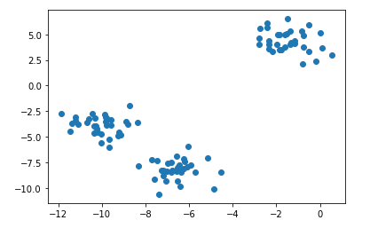
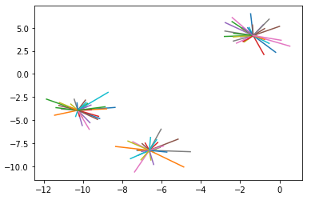

# 1. 사이킷런을 활용한 머신러닝 기초(비지도학습)

- 비지도학습이란?
  - 비지도학습이란 Y의 값, 즉 결과 값을 주지않고 입력 값만을 가지고 데이터를 학습하는 알고리즘이다.

- 코드

  - import

    ```python
    # 비지도학습의 군집화를 하기위한 모듈
    from sklearn.cluster import AffinityPropagation
    ```

  - 군집화를 위한 난수 생성

    ```python
    X, _ = make_blobs(n_features=2, centers=3, random_state=1)
    ```

    - ``make_blobs()`` : 군집화를 위한 등방성 가우스 얼룩을 생성한다.
    - 옵션
      - ``n_features`` :  각 샘플의 기능 수
      - ``centers`` : 고정할 중심의 개수
      - ``random_state`` : 난수 생성의 seed 값

  - 학습

    ```python
    m = AffinityPropagation().fit(X)
    ```

    - ``AffinityPropagation()`` : 데이터 선호도 전파 클러스터링을 진행
    - 입력값 X를 통해서만 학습을 진행한다.

  - 결과확인-1

    ```python
    import matplotlib.pyplot as plt
    plt.scatter(X[:, 0], X[:, 1])
    ```

    

  - 결과확인-2

    ```python
    for k in range(3):
        c = X[m.cluster_centers_indices_[k]]
        for i in X[m.labels_==k]:
            plt.plot([c[0], i[0]], [c[1], i[1]])
    ```

    - ``cluster_centers_indices_`` : 클러스터 센터의 지수

      

      