# Fast R-CNN, Ross Girshick

## 0. Abstract

- 본 논문은, Fast Region-based Convolutional Network method(Fast R-CNN)에 관한 논문이다.
- Fast R-CNN에서는 deep convolutional networks를 통해서 더 효율적으로 classification을 수행한다.
- Fast R-CNN은 R-CNN에 비해 training과 testing에서 정확도와 속도 모두 향상되었다.
  - training 과정에서는 약 9배 정도 빠르고, testing 과정에서는 약 213배 빨랐다. (very deep VGG 16)
  - PASCAL VOC에서도 더 높은 mAP값을 얻었다.
- Fast R-CNN은 SPPnet과 비교했을 때,
  - training 과정에서는 약 3배, testing 과정에서는 약 10배 빨랐다.
  - 또한 정확도도 더 향상되었다.

## 1. Introduction

- 본 논문은 속도, 정확도 그리고 단순화를 위하여 state-fo-the-art ConvNet-based object detectors 구조를 사용하여 학습한다.
- Fast R-CNN은 PASCAL VOC 2012에서 0.3s / image의 시간과 66%의 mAP 성능을 냈다. (R-CNN은 62%)
  - 즉, 더 빠르고 정확해졌다는 의미.
- R-CNN의 문제점
  1. Multi-stage pipeline을 이용한 학습
     - ConvNet - SVMs로 연결되는 과정 -> softmax로 대체 (fine-tuning 과정에서)
     - 즉, R-CNN은 ConvNet - SVMs - bounding box regressors로 연결된다.
  2. 공간적인 비용과 시간적 비용이 많이 든다.
     - SVM과 Bounding box regressor을 학습할 때, 각 이미지에서 여러 개의 region proposal이 추출되고 이것은  disk에 쓰여진다.
     - 매우 deep network를 가지는 VGG16 구조에서 이러한 과정은 5000개의 VOC07 trainval set에서 2.5일(GPU)의 학습시간이 소요된다. 또한 이 추출된 features가 저장되기 위해서는 수백 기가바이트의 공간을 필요로한다.
  3. Object Detection이 느리다.
     - Test-time에서 VGG16 구조를 가진 Detection에서 47s / image (GPU)의 시간이 소모된다.
- Fast R-CNN의 이점
  1. R-CNN과 SPPnet보다 더 높은 Detection 성능을 보인다.(mAP)
  2. Multi-task loss를 사용한 single-stage로 학습한다.
  3. 모든 network layers를 업데이트(학습, 가중치 업데이트)할 수 있다.
  4. feature을 caching하기위한 디스크 공간이 필요없다.

## 2. Fast R-CNN architecture and training

### * 서론

1. Fast R-CNN Architecture

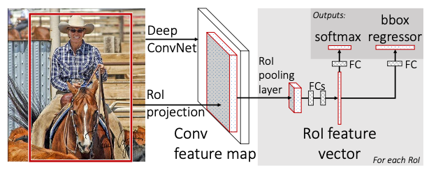

- Fast R-CNN은 전체 이미지와 Object proposals의 set을 입력으로 한다.
- 프로세스
  1. 전체 이미지 -> convolutional과 max pooling layers를 이용하여 conv feature map을 계산한다.
  2. 각 RoI(Region of Interest, 관심 영역) proposals에 대해서 pooling layer는 feature map으로부터 고정된 길이의 feature vector를 추출한다. (본 논문에서는 6x6)
  3. 각 feature vector는 sequence of fully connected layers(fc)를 거친다.
     - fc는 마지막에 2개로 output-layers로 branch한다.
       - 하나는 K object classes와 모든 catch-all background에 대해서 softmax연산을 수행한다.
       - 다른 하나는 4개의 실수를 출력하는데, 이 실수들은 K classes 중 하나에 대한 Bounding-box position으로 인코딩된다. (bounding-box regression 수행)

### 1) The RoI pooling layer

- RoI pooling layer는 max pooling을 사용한다.

- Max pooling layer는 유효한 RoI의 features을 H x W(7 x 7)의 크기를 가지는 고정된 공간을 가지는 작은 feature map으로 변환하기위해 사용된다.

  - H와 W는 어떤 특정한 RoI의 독립적인 layer hyper-parameters이다.

- 본 논문에서 RoI는 conv feature map에 대한 rectangular window이다.

- 각 RoI는 (r, c, h, w)로 정의된다.

  - r, c는 rectangular window의 top-left corner의 좌표이다.
  - h, w는  rectangular window의 너비와 높이이다.

- RoI는 간단하게 SPPnets에서 사용된 하나의 pyramid level에 대한 spatial pyramid pooling layer의 special-case이다.

- 동작

  1. RoI max pooling은 h x w 크기의 RoI를 H x W의 grid of sub-windows로 나눈다.	
     - 각 sub-windows는 대략적으로 h/H x w/W의 크기를 가진다.

  2. 그리고 각 sub-window를 max-pooling한 값을 output grid cell에 대응시킨다.
     - Pooling은 각 feature map channel에 독립적으로 적용된다. (pooling은 standard max pooling을 사용)

### 2) Initializing from pre-trained networks

- 3개의 pre-trained ImageNet으로 실험을 진행.

  - 각 networks는 5개의 max pooling layers를 가지고 5~13개의 Conv layers를 가진다.

- Pre-trained network를 사용한 Fast R-CNN의 3가지 변화

  1. 마지막 max pooling layer가 RoI pooling layer로 대체되었다.

     - RoI pooling layer는 net의 첫번째 fully connected layer에 맞는 크기를 가진다.(H x W, VGG16에서는 H=W=7)

  2. network의 마지막은 fully connected layer와 softmax로 대체된다.

     - softmax - layer
       - softmax를 수행하는 layer는 1000-way ImageNet classification으로 학습되었다.
       - softmax를 수행하는 layer는 K + 1(1개는 background)로 분류한다.

     - bounding box regressor - layer
       - 각 카테고리별로 특화된 bounding box regressor이다.

  3. 이 network는 images 리스트와 그 이미지들의 RoIs의 리스트로 학습된다.

### 3) Fine-tuning for detection

#### * 서론

- 역전파를 활용한 가중치 학습은 Fast R-CNN의 매우 중요한 능력이다.
- SPPnet이 spatial pyramid pooling layer에서 가중치를 업데이트하지 못하는 이유
  - 한 다른 이미지로부터의 각 training sample에 대해서 SPP layer의 오차역전파는 매우 비효율적으로 진행된다.
    - (R-CNN과 SPPnet이 학습되는 방식)
  - 각 RoI가 전체 이미지에 대해 매우 큰 수용필드를 가질 수 있기 때문
  - Forward pass는 전체 receptive field를 처리해야하기 때문에 입력이 매우크다.

#### (1) 학습방법

- 본 논문에서는 feature sharing을 통한 효율적인 학습방법을 제시한다.
- Fast R-CNN의 훈련과정에서 (SGD) mini-batch는 계층적으로 샘플링된다.
- 첫 번째로는 N개의 이미지를 샘플링하고, 각 이미지로부터 R/N RoIs를 샘플링한다.
  - 중요!! 같은 이미지로부터 샘플링된 RoIs는 forward와 backward 과정에서 computation과 memory를 공유한다.
  - N을 작게 만들면 mini-batch의 계산량이 줄어든다.
    - 예시) N = 2, R = 128인 경우, 128개의 다른 이미지로부터 한 개의 RoI를 샘플링하는 것보다 약 64배 빠르다. (즉, R-CNN과 SPPnet의 방법과 비교했을 경우) -> 조금 더 이해하는 것이 필요하다.
  - 이 방법에서는 같은 이미지로부터의 RoIs는 상호관계가 있기 때문에 학습이 느리게 수렴될 수 있다.
    - 이러한 우려는 현실적으로는 나타나지 않았다.
    - 본 논문은 N=2, R=128로 fewer SGD iterations을 사용했을 때, R-CNN과 비교하여 좋은 결과를 얻었다.
    - Fast R-CNN에서 softmax classifier와 bounding box regressors를 최적화하는 과정에서 하나의 fine-tuning stage를 사용한다. (SVMs와 regressors를 3개의 stage를 사용하는 방법과 비교해서)

#### (2) Multi-task loss

- Fast R-CNN의 두 개의 sibling output layers

  - First output layer

    - 각 RoI마다 K + 1 categories에 대한 이산 확률 분포이다.
    - p=(p0,...,pK)로 정의됨. (각 class마다의 확률)
    - p는 fully connected layer의 K + 1개의 outputs을 가진 한 개의 softmax에 의해서 계산된다.

  - Second output layer

    - K개의 Object classes 중 각각 k로 indexed된 k에 대해서  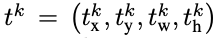의 Bounding box regression을 수행한다.
    - 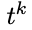 에 대해 Parameterization을 사용한다.
    -  에 대해 scale-invariant translation을 지정하고, 한 object proposal의 log-space에 대해 height/width를 shift한다.
    - 각 RoI 학습에 대해서 u : ground-truth class,  v : ground-truth bounding box regression target으로 정의한다.
    - 또한, L : a multi-task loss로 정의한다.

  - classification과 bounding-box regression의 수식

    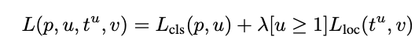

    - True class u에 대해서, 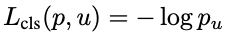로 정의된다.

    - class u에 대한 True bounding box regression에서

      -  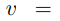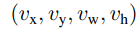
      - predicted tuple 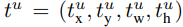

      로 정의된다.

    - Iverson bracket indicator function인 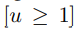는 u >= 1이면, 1로, 아니면 0으로 한다.

    - 일반적으로 catch-all background의 label은 u = 0으로 한다.

    - background에 대한 RoIs는 ground-truth bounding box의 개념이 없다. 이 경우에는 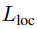 가 무시된다. (즉, background에 대한 bounding box는 생성되지 않는다는 뜻.)

    - Bounding box regression에서 loss함수는 다음과 같이 정의된다.

      - 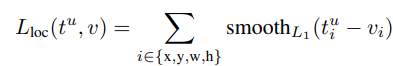
      - 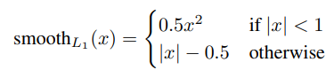
      - L1 Loss는 R-CNN과 SPPnet에서 사용된 L2 Loss보다 이상치데 덜 민감하다.
      - 만약 regression targets이 unbounded되었을때, L2 loss는 gradients exploding을 방지하기 위해 learning rates를 매우 신중하게 튜닝해야한다. **하지만 smooth_L1(x)는 이러한 민감성이 제거되었다**
      -  에서 hyper-parameter인 λ는 두 task의 loss에 대해 balance를 control한다.
      - zero mean과 unit variance를 가지기 위해서 ground-truth regression targets 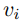를 정규화한다.
      - 모든 실험에서 λ=1로 한다.

#### (3) Mini-batch sampling

- fine-tuning
  - SGD mini-batch는 N = 2 images로 구성된다. (랜덤하게 결합해서 선택됨)
  - 각 이미지에서 64 RoIs를 sampling할 때, R = 128의 mini-batch size를 사용
  - IoU >= 0.5인 ground truth bounding box인 object proposals에서의 RoI에서 25%을 가져온다. (background가 아닌 class로 labeled된 것임.) 즉, u >= 1
  - 남은 75%의 RoIs은 0.1 <= IoU < 0.5의 IoU 값을 가지는 것 중 최대 값을 가지는 것으로 Sampling한다. (이것들은 Background이며, u = 0으로 라벨링된다.)
  - IoU < 0.1의 값을 가지는 것들은 hard example mining을 위한 heuristic로 작용한다.
  - 학습하는 동안 이미지는 50%의 확률로 가로로 뒤집힌다.(image augmentation을 위함. -> Data 늘리기)

#### (4) Back-propagation through RoI pooling layer

- Back-propagation은 RoI pooling layer을 거쳐서 진행된다.

- 모든 mini-batch마다 image 하나 (N=1)이라고 가정했을때, 모든 pass는 이미지를 독립적으로 다루기 때문에 N > 1로의 확장은 간단하다.

- x_i ∈ R을 RoI pooling layer에 들어가는 i 번째 activation이라고 정의한다.

- y_rj을 r번째 RoI의 j번째 output이라고 정의한다.

- RoI pooling layer는 

  - 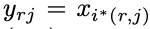
  - 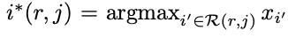

  라고 정의한다.

- R(r, j)는 y_rj의 max pools을 unit한 결과인 sub-window에 대한 inputs의 집합이다.

- x_i 한 개가 각각 다른 ouputs y_rj에 할당될 수 있다.

- RoI pooling layer의 backwards function은 argmax switch를 통해서 각 x_i에 대한 loss function의 부분적인 결과로 계산된다.

- Rol pooling layer의 backwards function

  - 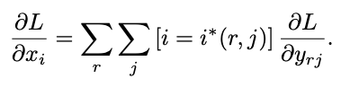
  - 여기서, r(mini-batch RoI)와 y_rj(pooling output unit), 편미분 L/y_rj 는 max pooling에 의한 y_rj에 대해 i가 argmax라면 축적된다(시그마연산).
  - Back-propagation에서 편미분 L/y_rj는 RoI pooling layer의 최상단에서 backwards function에 의해 미리 계산된다.

#### (5) SGD hyper-parameters

- Fully connected layers(softmax와 bounding box regression에 사용된 layer)는 각각 zero-mean Gaussian distributions(0.01 ~ 0.001)로 초기화된다.
  - biases는 초기에 0부터 시작한다.
- 모든 Layers는 1의 가중치 learning rate, biases는 2의 learning rate를 가지고, 전역 learning rate는 0.001이다.
  - VOC07과 VOC12를 학습할 때, 0.0001의 learning rate를 사용.
  - 0.9의 momentum과 0.0005의 감쇠율을 사용.

### 4) Scale invariance

- "Brute force" learning과 image pyramids를 사용.
- Brute force learning
  - 각 이미지는 사전에 정의된 크기로 처리된다. (training과 testing 동안)
  - training data로부터 network는 고정된 크기로 학습을 해야한다.(Object Detection에서)
- Multi-scale approaches
  - Image pyramids를 통해 Scale-incariance를 제공한다.
  - test-time에서 image pyramids는 각 object proposals의 scale-normalize에 사용된다.
  - Multi-scale의 training시에 image augmentation의 일종으로 pyramid scale을 랜덤하게 설정하여 샘플링한다.

## 3. Fast R-CNN detection

### * 서론

- Fast R-CNN이 fine-tuning되면, forward pass를 사용할 때보다 조금 더 많은 detection이 가능하다.(object proposals가 사전에 계산되었다고 가정했을 때)

### 1) Network 개요

1. input
   - img (image pyramid or list of images)
   - list of R (object proposals) -> scoring 하기 위함.
     - R은 약 2000개
2. image pyramid를 수행할 때, 각 RoI는 224 x 224의 크기를 가지게 된다.
3. 각 RoI r에 대해서 forward pass는 한 class에 대한 확률분포인 p를 산출한다. 또한 r에 대한 set of predicted bounding box offsets를 산출한다.
   - K개의 classes는 각 클래스마다 고유의 refined된 bounding box prediction을 가진다.
   - 각 object class k의 r에 대한 detection confidence는 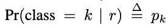 를 통해서 계산된다.
4. 이후에 각 class에 대해 non-maximum suppression을 독립적으로 수행하고, 그 이후의 알고리즘(bounding box regression)은 R-CNN과 동일하다.

### 2) Truncated SVD for faster detection

- Image classification
  - fully connected layers에서 계산되는 시간 < Conv layers에서 계산되는 시간
- Detection을 하기위한 RoIs의 수가 많아지면 그 시간은 늘어난다.
  - forward pass time의 절반은 fully connected layers를 계산하는데에서 소요된다.
- 이러한 Large fully connected layers는 **Truncate SVD**를 사용한 압축방식에 의해서 가속화된다.(시간이 짧아진다.)
- 이 방법에서 가중치 행렬 W = u x v로 parameterized된 layer는 SVD를 사용하므로써 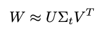 로 근사된다.
  - 이러한 구조에서 U는 W의 left-singular vectors t에 대해 u x t로 구성된다. (U = u x t)
  - 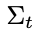 는 W의 top t singular values를 포함하는 t x t의 대각 행렬로 표현된다.
  - V는 W의 right-singular vectors t에 대해 v x t로 구성된다. (V = v x t)
  - 따라서 W = (u x t)(t x t)(t x v)로 정의될 수 있다.
- Truncated SVD는 u x v의 파라메터의 수를 t(u + v)로 감소시킨다. 여기서 t는 min(u, v)의 값보다 작은 값이다.
- 요약
  - W와 일치하는 하나의 fully connected layer는 2개의 fully connected layer로 대체된다. (이 두 layers 사이에는 비선형성이 없다.)
  - 첫 번째 Layer는 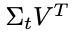 의 가중치 행렬(no biases)을 가지고, 두 번째 Layer는 U의 가중치 행렬(W의 biases를 가진다.)을 가진다.
  - 이러한 간단한 압축 기법은 많은 수의 RoIs에 대해서 좋은 속도 향상을 보여준다.

## * 용어

1. SPPnet
   - R-CNN에서 sharing computation을 사용하여 속도를 올리기 위해서 제안된 모델이다.
   - SPPnet은 R-CNN을 Test에서 10~100배 가속화했다.
   - Training time에서 Faster proposal feature extraction에 의해 약 3배 가속화했다.
   - R-CNN과 다르게 spatial pyramid pooling 전에 convolution layers를 업데이트하지 않는다.
   - 방법
     1. 전체 입력 이미지에 대해서 convolutional feature map을 계산한다.
     2. shared feature map으로부터 추출된 feature vector을 활용해서 각 region proposal을 분류한다.
     3. Features are extracted for a proposal by max- pooling the portion of the feature map inside the proposal into a fixed-size output
     4. 여러 개의 output sizes는 풀링되고, spatial pyramid pooling과 concatenated된다.
   - 단점
     - bounding box regressors와 SVMs를 log loss를 사용한 fine-tuning을 하는 과정 중 features를 추출하는 과정에서 multi-stage pipeline을 포함한다.
     - features가 disk에 기록된다.
     - very deep network에서 fixed convolution layers는 정확도를 제한하는 요소가 된다.
2. Multi-stage pipelines
   - R-CNN에서는 Selective search를 통한 Region proposals -> CNN -> SVM -> bounding box regression의 multi-stage pipelines를 가진다. 이로 인해 feature vector을 disk에 저장하는데 공간적 비용과 계산시간이 오래걸린다는 단점이 존재했다. (즉, 2-Stage-Object Detection)
3. Max pooling
4. Spatial pyramid pooling
5. Multi-task loss
6. Single-stage
7. Region of interest (RoI)
8. SGD
9. image augmentation
10. hard example mining

## * Reference

- [Paper](https://arxiv.org/pdf/1504.08083.pdf) - Fast R-CNN, Ross Girshick