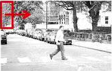
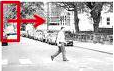
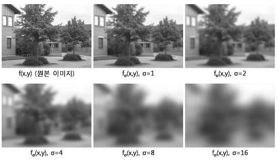
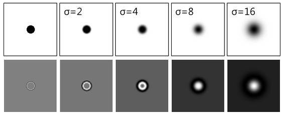

# Image pyramid

## 0. 정의

- 입력 이미지의 크기를 단계적으로 변화(축소)시켜 가면서 필요한 분석 작업을 하는 것으로, 이렇게 생성된 일련의 이미지 집합을 **Image pyramid**라고 부른다.

## 1. 예시

### 1) 이미지에서 보행자를 검출하는 경우

- 이미지

  

- 스케일 조정

  - 다음의 Image에서 Sliding window를 활용하여 보행자 검출을 시도한다.
  - 여기서 이미지의 크기를 줄이면 다음과 같다.
  - 
  - 해당 이미지는 사이즈는 작아졌지만 Scale은 커졌다고 표현할 수 있다.
    - Image에 대한 Detail은 잃어버리고, 큰 흐름을 표현하기 때문

- 즉, Scale과 이미지의 크기는 반비례한다.

## 2. Image pyramids를 구성하는 여러가지 방법

1. Gaussian Pyramid
   - 이미지를 1/2 축소, 블러링하는 과정을 반복하여 이미지 집합 즉, Image pyramids를 생성하는 것
   - 블러링에는 Gaussian filter를 사용한다.
     - Down Sampling 진행 시, 짝수번째 픽셀은 버리고, 홀수번째 픽셀들만을 취하는 방식을 취한다.
   - 장점
     - 이미지의 사이즈가 빠르게 줄어들기 때문에, 메모리 요구량이 낮고, 빠른 영상분석이 가능한 장점을 가진다.
   - 단점
     - 물체가 가질 수 있는 연속된 스케일 변화를 매우 조잡하게 샘플링한 것이기 때문에, 스케일 축 상에서 물체를 비교하거나 매칭할 때 알고리즘적으로 어려워지는 문제점이 존재한다.
   - 사용
     - 축소된 이미지에서 빠르게 원하는 특징이나 대상을 검출한 후에 점차적으로 원래의 스케일에서 보다 정확한 특징을 계산하는 coars-to-fine 형태로 주로 사용된다.

2. Scale Space

   - 단어적 의미

     - 어떤 대상을 볼 때, 하나의 스케일 또는 현재의 스케일 만을 보는 것이 아니라 대상이 가질 수 있는 다양한 스케일의 범위를 한번에 표현하는 것

   - Scale Space 적용 예시

     

   - Scale Space는 Gaussian 블러링을 통해 생성되는 일련의 이미지들로 구성된다.

   - 이미지를 직접 확대, 축소시키지 않고도 블러링을 통해 이미지의 스케일을 변화시키는 방법이다.

   - **Scale Invariance** 

     - Scale Space의 가장 큰 활용

     - 스케일에 불변(Scale Invariance)인 특징을 뽑는 것

     - 스케일 불변인 특징은 이미지를 어떤 스케일에 찍었든지, 동일한 물체 지점에 대해 계산된 영상 특징은 서로 동일해야 함을 의미한다.

     - Scale Space를 통한 Scale Invariance 적용 방법

       1. 현재 이미지에서 뿐만 아니라, 스케일 축 상에서 특징점을 찾는다.
       2. 해당 특징점이 발견된 스케일 이미지에서 영상 특징을 계산하는 것
       3. 이렇게 발견된 특징점 위치 및 스케일에서 영상 특징량을 계산하면 스케일에 불변인 영상 특징량이 된다.

     - 영상 특징점 찾기

       - 카메라 시점이 바뀌어도 쉽게 검출 가능한 코너점을 찾는 것
       - Laplacian이 극대 또는 극소인 점이 곧 Scale Invariance한 특징점이 된다.

     - 영상 특징점 및 특징량이 스케일 불변인 이유

       - 입력 이미지가 어떤 스케일에서 촬영되었다 하더라도 스케일 공간 탐색을 통해서 해당 스케일을 찾아냄으로써 동일한 특징량 계산이 가능해진다.

     - 예시 이미지

       

       점의 중앙 부분 및 가장자리 부분은 스케일이 변해도 불변한다. -> 특징점

