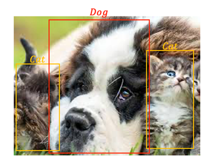
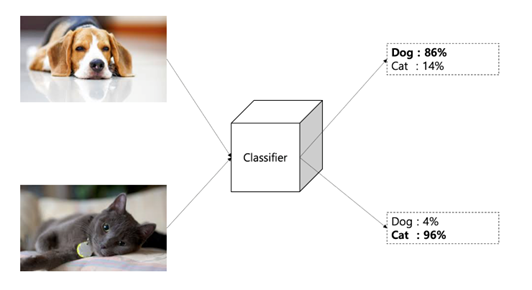
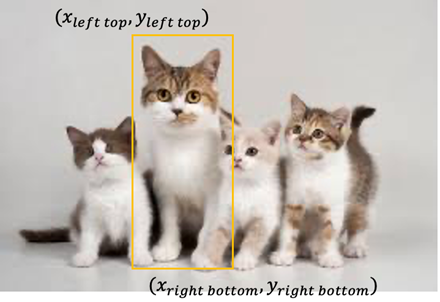
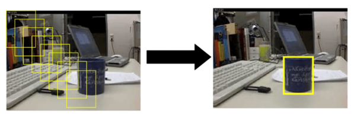
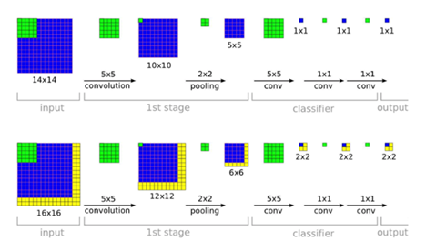
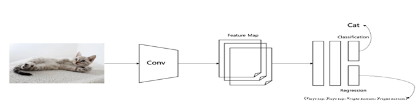

# Object Detection

## 1. Object Detection 정의

- Object Detection은 한 이미지 내에서 여러 Object에 대해서 Classification과 Localization을 함께 수행하는 것

- 같은 범주로 Classification된 Object에 대해서도 각각의 위치를 찾아야한다.

- 예시)

  

### 1) Classification

#### (1) 정의

- Objects를 분류하는 것

### 2) Localization

#### (1) 정의

- Objects를 인식하고, 그 위치를 찾아내는 것
- Bounding box를 이용하여 위치를 표시(left top, right botton의 좌표를 이용)

#### (2) Localization을 수행하는 방법들

1. Sliding Window

   - 사각형 상자 모양의 Window를 이용해 전체 이미지에 대해 Sliding 시키고 모든 사각형 영역에 대해 특정 Object가 포함되는지 분류하는 방법
   - CNN에 적용시 여러 번의 연산이 필요하므로 계산 속도가 느리다.
   - Window size를 크게하면 정확도가 낮아지지만 속도가 빨라지고, Window size를 작게하면 정확도는 높아지지만 속도가 느려진다.

   

2. Convolution 

   - CNN의 feature map의 feature vector을 사용하여 Objects 에 대해서 Localization과 Classification을 동시에 수행
   - CNN은 병렬연산이 가능하여 속도가 Sliding Window 방법에 비해 빠르다는 장점이 있다.

   

## 2. Object Detection의 종류

### 1) One-Stage Object Detection

- Classification과 Localization을 동시에 수행하는 Object Detection 방법

- Two-Stage Object Detection에 비해 속도는 빠르지만, 정확성이 다소 떨어진다.

- 동작

  1. 전체 Image에 대해서 CNN층을 이용하여 feature map을 학습한다.
  2. Feature map의 feature vector을 이용하여 Classification과 Localization을 수행한다.

- 구조

  