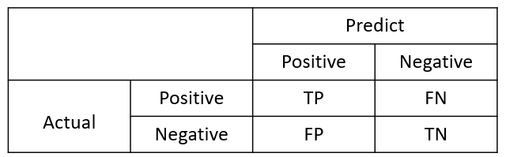
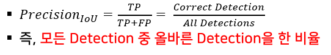

# mean Average Precision

> mAP는 Object Detection 모델의 성능을 평가하는 대표적인 지표이다. mAP에 대해서 이해하기 위해서는 Intersection over Union(IoU), Precision, Recall, PR-Curve, Average Precision(AP)의 개념을 먼저 정리한다.

## 1. Intersection over Union

### 1) 정의

- Object Detection Model의 성능 평가지표를 계산하는 과정에서 사용되는 값

- 계산식

  

  

- 예시

  - 예시 - 1

    

  - 예시 - 2

    

### 2) IoU Threshold

- Predict Bounding Box에 대해서 TP or FP를 판단할 때, 기준이되는 값

- 예시) IoU Threshold = 0.5일 때, Predict Bounding Box의 TP or FP

  

### 3) Confusion Matrix for IoU

- TP : 올바른 Detection, IoU >= IoU Threshold

- FP : 잘못된 Detection, IoU < IoU Threshold

- FN : None Detection

- TN : Detection 하지 말아야할 Object를 Detection 하지 않음

## 2. Confidence Score

### 1) 정의

- Bounding box안에 Object가 존재할 확률

- 예시)

  

  - 노란색 Bounding Box에는 물체가 존재하지 않으므로 Confidence Score가 0.0이고, 빨간색 Bounding Box에는 물체가 온전히 존재하므로 Confidence Score가 1.0이다.

- 계산식

  - Object Detection Algorithm마다 조금씩 차이가 있다.

    

    

## 3. Precision & Recall

> Precision & Recall은 분류모델을 평가할 때, 자주 사용되는 개념이다. 이것은 Object Detection에서는 IoU와 Confidence 관점에서 정의될 수 있다.

### 1) Precision

- 모델이 True로 예측한 것 중 실제 True인 비율로, 모든 True 예측 중 옳은 예측의 비율이다.

- 수식

  

  - TP (True Positive) : True로 예측한 것 중 True
  - FP (False Positive) : True로 예측한 것 중 False
  - Object Detection 관점에서 Precision은 모든 Detection 중 옳게 Detection한 비율이다.

#### (1) IoU와 Precision

#### (2) Confidence와 Precision

### 2) Recall

- 모든 True(정답) 중 True로 예측을 성공한 비율

## 4. PR - Curve

## 5. Average Precision(AP)

## 6. mean Average Precision

