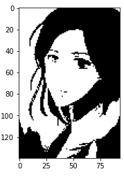

# OpenCV Contours

## 1. 함수
- Contours 찾기
    - ``cv2.findContours(image, mode, method)``
        - 이미지에서 Contour들을 찾는 함수 (다양힌 Object를 테두리별로 찾는다) == 테두리 찾기
        - ``mode`` : Contour들을 찾는 방법
            - ``RETR_EXTERNAL`` : 바깥쪽 Line만 찾기
            - ``RETR_LIST`` : 모든 Line을 찾기만, Hierarchy 구성 x
            - ``RETR_TREE`` : 모든 Line을 찾으며, 모든 Hierarchy 구성 O
        - ``method`` : Contour들을 찾는 근사치 방법
            - ``CHAIN_APPROX_NONE`` : 모든 Contour 포인트 저장
            - ``CHAIN_APPROX_SIMPLE`` : Contour Line을 그릴 수 있는 포인트만 저장
        - 입력 이미지는 Gray Scale Threshold 전처리 과정이 필요하다.
- Contours 그리기
    - ``cv2.drawContours(image, contours, contour_index, color, thickness)``
        - Contour들을 그리는 함수
        - ``contour_index`` : 그리고자 하는 Contours Line (전체: -1)

## 2. 코드


### 1) 패키지 로드

```python
import cv2
import numpy as np
import matplotlib.pyplot as plt
```


### 2) Contours

```python
image = cv2.imread('image.jpg')
image_gray = cv2.cvtColor(image, cv2.COLOR_BGR2GRAY)
ret, thresh = cv2.threshold(image_gray, 127, 255, 0)

plt.imshow(cv2.cvtColor(thresh, cv2.COLOR_GRAY2RGB))
plt.show()
```



```python
contours = cv2.findContours(thresh, cv2.RETR_TREE, cv2.CHAIN_APPROX_SIMPLE)[0] ## 0 인덱스가 모든 Contour
image = cv2.drawContours(image, contours, -1, (0, 255, 0), 4)

plt.imshow(cv2.cvtColor(image, cv2.COLOR_BGR2RGB))
plt.show()
```


