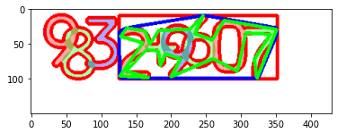

# OpenCV Contours 처리

## 1. 함수
- Contour의 사각형 외각 찾기
    - ``cv2.boundingRect(contour)``
        - Contour를 포함하는 사각형을 그립니다.
        - 사각형의 X, Y 좌표와 너비, 높이를 반환합니다.
- Contour의 Convex Hull
    - ``cv2.convexHull(contour)``
        - Convex Hull 알고리즘으로 외각을 구하는 함수
        - 대략적인 형태의 Contour 외각을 빠르게 구할 수 있습니다. (단일 Contour 반환)
- Contour의 유사 다각형 구하기
    - ``cv2.approxPolyDP(curve, epsilon, closed)``
        - 근사치 COntour을 구한다.
        - ``curve`` : Contour
        - ``epsilon`` : 최대 거리 (클수록 Point 개수 감소)
        - ``closed`` : 폐곡선 여부
- Contour의 기본 정보
    - ``cv2.contourArea(contour)``
        - Contour의 면적을 구한다.
    - ``cv2.arcLength(contour)``
        - Contour의 둘레를 구한다.
    - ``cv2.moments(contour)``
        - Contour의 특징을 추출한다.


## 2. 구현 코드


### 1) cv2.boundingRect(contour)

```python
import cv2
import matplotlib.pyplot as plt

image = cv2.imread('digit_image.png')
image_gray = cv2.cvtColor(image, cv2.COLOR_BGR2GRAY)
ret, thresh = cv2.threshold(image_gray, 230, 255, 0) # 픽셀의 값이 230보다 큰 경우 255로 바꾼다.
thresh = cv2.bitwise_not(thresh) # 검정색과 흰색을 서로 반전시킨다.

plt.imshow(cv2.cvtColor(thresh, cv2.COLOR_GRAY2RGB))
plt.show()
```


```python
contours = cv2.findContours(thresh, cv2.RETR_TREE, cv2.CHAIN_APPROX_SIMPLE)[0] # thresh 값을 넣었을 때 하얀색 값을 추출해준다. (기본적으로)
image = cv2.drawContours(image, contours, -1, (0, 0, 255), 4) # 모든 contours를 다 그림

plt.imshow(cv2.cvtColor(image, cv2.COLOR_BGR2RGB))
plt.show()
```


```python
# 첫번째 contour에 대해서 전체 외각 사각형을 그린다.
contour = contours[0]
x, y, w, h = cv2.boundingRect(contour)
image = cv2.rectangle(image, (x, y), (x + w, y + h), (0, 0, 255), 3)

plt.imshow(cv2.cvtColor(image, cv2.COLOR_BGR2RGB))
plt.show()
```


### 2) cv2.convexHull(contour)

```python
# 타이트한 외각 선을 그려준다.
contour = contours[0]
hull = cv2.convexHull(contour)
image = cv2.drawContours(image, [hull], -1, (255, 0, 0), 4)

plt.imshow(cv2.cvtColor(image, cv2.COLOR_BGR2RGB))
plt.show()
```


### 3) cv2.approxPolyDP(curve, epsilon, closed)

```python
# contour을 유사 다각형으로 만들기.
contour = contours[0]
epsilon = 0.01 * cv2.arcLength(contour, True) # epsilon 값을 작게하면 원래의 contour와 유사한 다각형을 그린다.
approx = cv2.approxPolyDP(contour, epsilon, True)
image = cv2.drawContours(image, [approx], -1, (0, 255, 0), 4)

plt.imshow(cv2.cvtColor(image, cv2.COLOR_BGR2RGB))
plt.show()
```




### 4) Contour의 기본 정보

```python
image = cv2.imread('digit_image.png')
image_gray = cv2.cvtColor(image, cv2.COLOR_BGR2GRAY)
ret, thresh = cv2.threshold(image_gray, 230, 255, 0) # 픽셀의 값이 230보다 큰 경우 255로 바꾼다.
thresh = cv2.bitwise_not(thresh) # 검정색과 흰색을 서로 반전시킨다.

contours = cv2.findContours(thresh, cv2.RETR_TREE, cv2.CHAIN_APPROX_SIMPLE)[0]
image = cv2.drawContours(image, contours, -1, (0, 0, 255), 4)

contour = contours[0]
area = cv2.contourArea(contour)
print(area)

length = cv2.arcLength(contour, True)
print(length)

M = cv2.moments(contour)
print(M)

plt.imshow(cv2.cvtColor(image, cv2.COLOR_BGR2RGB))
plt.show()
```


