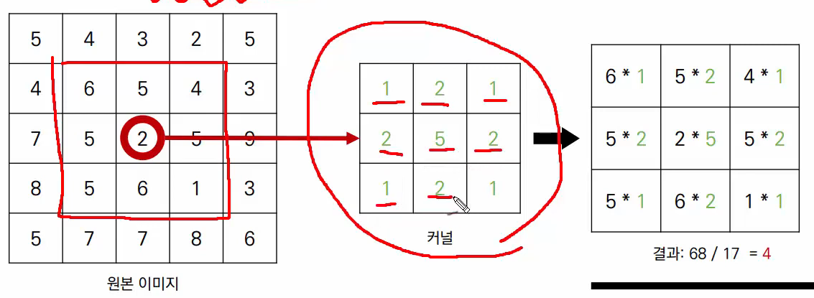
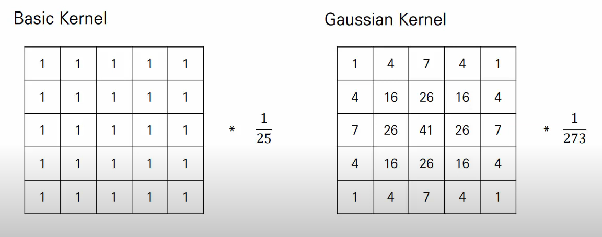
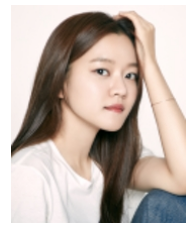
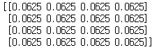
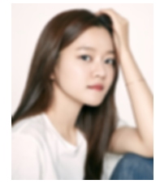
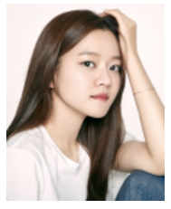
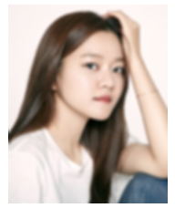
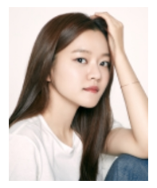
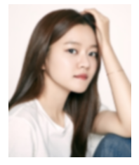

# OpenCV Filtering

## 1. Filtering이란?

- 이미지에 커널을 적용하여 이미지를 흐리게(Blurring = Smoothong) 처리할 수 있습니다.
- 이미지를 흐리게 만들면 노이즈 및 손상을 줄일 수 있습니다.

## 2. Convolution 계산
- 특정한 이미지에서 커널(Kernel)을 적용해 컨볼루션 계산하여 필터링을 수행할 수 있다.



- Kernel의 종류



- blur은 kernel size가 커질 수록 정도가 강해진다.

## 3. 코드 구현

### 1) 블러링 수행 (basic kernel)

```python
import cv2
import numpy as np
import matplotlib.pyplot as plt
```

```pyt
image = cv2.imread('./고아성.jpg')
image = cv2.cvtColor(image, cv2.COLOR_BGR2RGB)
plt.imshow(image)
plt.axis('off')
plt.show()
```



```python
size = 4
kernel = np.ones((size, size), np.float32) / (size ** 2)
print(kernel)
```



```python
image = cv2.imread('./고아성.jpg')
dst = cv2.filter2D(image, -1, kernel) # 모든 픽셀에 대해서 4 x 4의 영역의 값을 확인하고 filter 적용
image = cv2.cvtColor(dst, cv2.COLOR_BGR2RGB)
plt.imshow(image)
plt.axis('off')
plt.show()
```



### 2) 블러링 수행 (blur 함수 사용)

```python
image = cv2.imread('./고아성.jpg')
image = cv2.cvtColor(image, cv2.COLOR_BGR2RGB)
plt.imshow(image)
plt.axis('off')
plt.show()
```



```python
image = cv2.imread('./고아성.jpg')
dst = cv2.blur(image, (4, 4))
dst = cv2.cvtColor(dst, cv2.COLOR_BGR2RGB)
plt.imshow(dst)
plt.axis('off')
plt.show()
```



### 3) Gaussian Blur : size가 홀수여야 한다

```python
image = cv2.imread('./고아성.jpg')
image = cv2.cvtColor(image, cv2.COLOR_BGR2RGB)
plt.imshow(image)
plt.axis('off')
plt.show()
```



```python
image = cv2.imread('./고아성.jpg')
# kernel size : 홀수
dst = cv2.GaussianBlur(image, (5, 5), 0)
image = cv2.cvtColor(dst, cv2.COLOR_BGR2RGB)
plt.imshow(image)
plt.axis('off')
plt.show()
```



