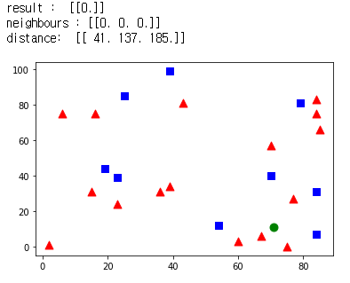

# OpenCV KNN

## 1. KNN Algorithm 이란?

- K-Nearest Neighbor
  - KNN은 비지도학습의 가장 간단한 예시.
  - 다양한 레이블의 데이터 중에서, 자신과 가까운 데이터를 찾아 자신의 레이블을 결정하는 방식이다.


## 2. 코드 실습

### 1) 패키지 로드

```python
import cv2
import numpy as np
import matplotlib.pyplot as plt
```


### 2) 랜덤한 25개의 데이터 생성

```python
# 각 데이터의 위치 : 25 X 2 크기에 각각 0 ~ 100
trainData = np.random.randint(0, 100, (25, 2)).astype(np.float32)
# 각 데이터는 0 or 1의 label을 가진다.
response = np.random.randint(0, 2, (25, 1)).astype(np.float32)
```


### 3) 데이터를 라벨링에 따라 다른 모양으로 표시 -> KNN 알고리즘 실행

```python
# 값이 0인 데이터를 각각 (x, y) 위치에 빨간색으로 칠합니다. -> 세모는 0
red = trainData[response.ravel() == 0]
plt.scatter(red[:, 0], red[:, 1], 80, 'r', '^')
# 값이 1인 데이터를 각각 (x, y) 위치에 파란색으로 칠합니다. -> 네모는 1
blue = trainData[response.ravel() == 1]
plt.scatter(blue[:, 0], blue[:, 1], 80, 'b', 's')

# (0 ~ 100, 0 ~ 100) 위치의 데이터를 하나 생성해 칠합니다.
newcomer = np.random.randint(0, 100, (1, 2)).astype(np.float32)
plt.scatter(newcomer[:, 0], newcomer[:, 1], 80, 'g', 'o')

knn = cv2.ml.KNearest_create() # KNN 모델 생성
knn.train(trainData, cv2.ml.ROW_SAMPLE, response)
ret, results, neighbours, dist = knn.findNearest(newcomer, 3)

# 가까운 3개를 찾고, 거리를 고려하여 자신을 정합니다.
print("result : ", results)
print("neighbours :", neighbours)
print("distance: ", dist)

plt.show()
```



- 결과
  - 입력된 데이터의 근처에는 세모가 많기 때문에 세모와 같은 라벨로 라벨링이 된다.