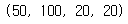
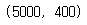
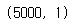
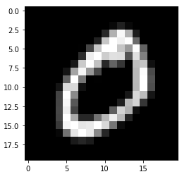
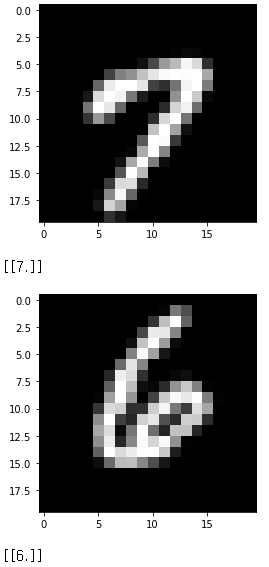
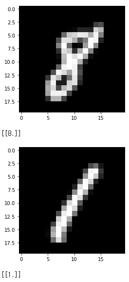

# OpenCV KNN 숫자 인식

- 사용할 데이터 : 숫자 약 5000개 (20 X 20 크기의 숫자)


## 1. 코드 실습


### 1) 패키지 로드

```python
import cv2
import numpy as np
import matplotlib.pyplot as plt
import glob
```


### 2) 학습 데이터 생성

```python
img = cv2.imread('digits.png')
gray = cv2.cvtColor(img, cv2.COLOR_BGR2GRAY)
```

```python
# 세로로 50줄, 가로로 100줄로 사진을 나눈다 -> 숫자가 하나씩 들어간 이미지 생성
cells = [np.hsplit(row, 100) for row in np.vsplit(gray, 50)]
x = np.array(cells)
x.shape
```



```python
# 각 (20 X 20) 크기의 사진을 한 줄 (1 X 400).으로 사이즈를 바꾼다.
train = x[:, :].reshape(-1, 400).astype(np.float32)
train.shape
```



```python
# 0이 500개, 1이 500개, .. 로 총 5000개가 들어가는 (1 X 5000)의 배열을 생성
k = np.arange(10)
train_labels = np.repeat(k, 500)[:, np.newaxis]

np.savez("trained.npz", train=train, train_labels=train_labels)
train_labels.shape # 정답 데이터
```



```python
# 글자를 하나씩 출력
plt.imshow(cv2.cvtColor(x[0, 0], cv2.COLOR_GRAY2RGB))
plt.show()
```



```python
# 0 ~ 9까지의 숫자를 하나씩 저장
cv2.imwrite('test_0.png', x[0, 0])
cv2.imwrite('test_1.png', x[5, 0])
cv2.imwrite('test_2.png', x[10, 0])
cv2.imwrite('test_3.png', x[15, 0])
cv2.imwrite('test_4.png', x[20, 0])
cv2.imwrite('test_5.png', x[25, 0])
cv2.imwrite('test_6.png', x[30, 0])
cv2.imwrite('test_7.png', x[35, 0])
cv2.imwrite('test_8.png', x[40, 0])
cv2.imwrite('test_9.png', x[45, 0])
```


### 3) KNN 학습 - 함수 정의

```python
FILE_NAME = 'trained.npz' # 학습 데이터 파일 이름
```

```python
# 파일로부터 학습 데이터를 불러옵니다.
def load_train_data(file_name):
    with np.load(file_name) as data:
        train = data['train']
        train_labels = data['train_labels']
    return train, train_labels

# 손 글씨 이미지를 (20 x 20) 크기로 Scaling합니다.
def resize20(image):
    img = cv2.imread(image)
    gray = cv2.cvtColor(img, cv2.COLOR_BGR2GRAY)
    gray_resize = cv2.resize(gray, (20, 20))
    plt.imshow(cv2.cvtColor(gray_resize, cv2.COLOR_GRAY2RGB))
    plt.show()
    # 최종적으로는 (1 x 400) 크기로 반환합니다.
    return gray_resize.reshape(-1, 400).astype(np.float32)

def check(test, train, train_labels):
    knn = cv2.ml.KNearest_create()
    knn.train(train, cv2.ml.ROW_SAMPLE, train_labels)
    # 가장 가까운 5개의 글자를 찾아, 어떤 숫자에 해당하는지 찾습니다.
    ret, result, neighbours, dist = knn.findNearest(test, k=5)
    return result
```


### 4) 결과

```python
train, train_labels = load_train_data(FILE_NAME)

for file_name in glob.glob('./test_*.png'):
    test = resize20(file_name)
    result = check(test, train, train_labels)
    print(result)
```





