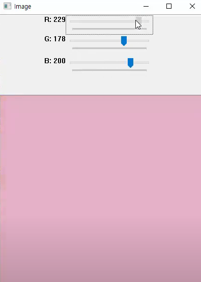

# OpenCV Tracker

- Tracker

  - ```
    cv2.createTrackbar(brack_bar_name, window_name, value, count, on_change)
    ```

    - Tracker를 생성하는 함수
    - `value` : 초기 값
    - `count` : Max 값 (Min : 0)
    - `on_change` : 값이 변경될 때 호출되는 Callback 함수


## 1. 코드 실습 (파이썬)

```python
## PyCharm에서 실행해야한다.
import cv2
import numpy as np

def change_color(x):
    r = cv2.getTrackbarPos("R", "Image")
    g = cv2.getTrackbarPos("G", "Image")
    b = cv2.getTrackbarPos("B", "Image")
    image[:] = [b, g, r]
    cv2.imshow('Image', image)
    
image = np.zeros((600, 400, 3), np.uint8)
cv2.namedWindow("Image")

cv2.createTrackbar("R", "Image", 0, 255, change_color)
cv2.createTrackbar("G", "Image", 0, 255, change_color)
cv2.createTrackbar("B", "Image", 0, 255, change_color)

cv2.imshow('Image', image)
cv2.waitKey(0)
```



- 다음과 같이 RGB를 조절할 수 있는 Tracker가 생성된 것을 확인 할 수 있다.