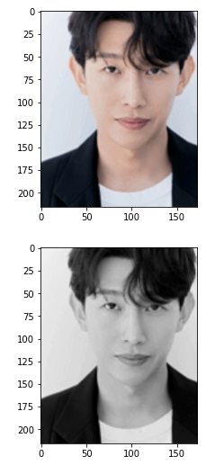

## 1. OpenCV란?

- 컴퓨터 비전을 위한 OpenCV
  - 영상 처리와 컴퓨터 비전을 위한 오픈소스 라이브러리
  - C, C++, Python 등에서 사용가능
- 사용
  - `import cv2`

### 1) 이미지를 읽어서 Numpy 객체로 만들기

- `cv2.imread(file_name, flag)`
  - file_name : 읽고자 하는 이미지 파일
  - flag : 이미지를 읽는 방법 설정
    - IMREAD_COLOR : 이미지를 color로 읽고, 투명한 부분은 무시
    - IMREAD_GRAYSCALE : 이미지를 Grayscale로 읽기
    - IMREAD_UNCHANGED : 이미지를 Color로 읽고, 투명한 부분도 읽기(Alpha)
  - 반환값 : Numpy 객체 (행, 열, 색상: 기본 BGR)
- `cv2.imshow(title, image)`
  - 특정한 이미지를 화면에 출력한다.
  - title : 윈도우 창의 제목
  - image : 출력할 이미지 객체
- `cv2.imwrite(file_name, image)`
  - 특정한 이미지를 파일로 저장
  - file_name : 저장할 이미지 파일 이름
  - image : 저장할 이미지 객체
- `cv2.waitKey(time)`
  - 키보드 입력을 처리하는 함수
  - time : 입력 대기 시간 (무한대기 : 0)
  - 반환값 : 사용자가 입력한 Ascii Code (ESC: 27)
- `cv2.destroyAllWindows()`
  - 화면의 모든 윈도우를 닫는 함수

## 2. 실습

```python
import cv2
import matplotlib.pyplot as plt
```

- 사진을 흑백으로 바꾸기
- OpenCV는 BGR을 기준으로하고, Matpolotlib은 RGB를 기준으로 한다.

```python
# OpenCV : [B, G, R] / Matplotlib : [R, G, B]
img_basic = cv2.imread('./image/강기영.jpg', cv2.IMREAD_COLOR)
plt.imshow(cv2.cvtColor(img_basic, cv2.COLOR_BGR2RGB))
plt.show()

img_basic = cv2.cvtColor(img_basic, cv2.COLOR_BGR2GRAY)
plt.imshow(cv2.cvtColor(img_basic, cv2.COLOR_BGR2RGB))
plt.show()
```



