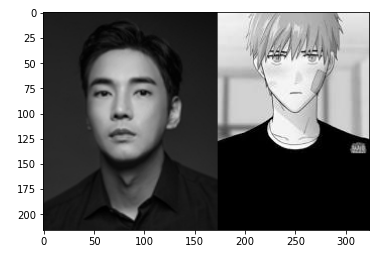
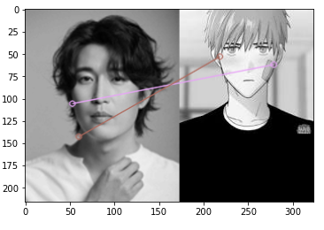
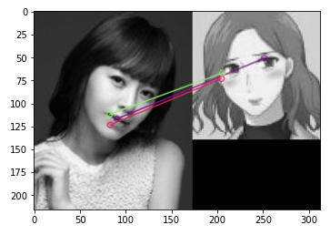

# OpenCV 피처매칭을 이용한 이미지 유사성 비교


## 1. 패키지 로드

```python
import cv2
import numpy as np
from matplotlib import pyplot as plt
```


## 2. 이미지 클래스 정의

- 이미지를 가져와 흑백 객체로 만든다.
- 이미지를 비교한다.

```python
class compareImg :
    def __init__(self) :
        pass

    def readImg(self, filepath) :
        img = cv2.imread(filepath, cv2.IMREAD_GRAYSCALE)
        # cv2.namedWindow("root", cv2.WINDOW_NORMAL) # window 생성
        # cv2.imshow("root", img) # window에 이미지 띄우기
        # cv2.waitKey(5000) # 5초 기다림. 아무키나 입력되면 대기 종료
        # cv2.destroyAllWindows() # window 제거
        return img


    def diffImg(self, img1, img2, ratio) :
        # Initiate SIFT detector
        orb = cv2.ORB_create()

        # find the keypoints and descriptors with SIFT
        kp1, des1 = orb.detectAndCompute(img1, None)
        kp2, des2 = orb.detectAndCompute(img2, None)

        # create BFMatcher object
        bf = cv2.BFMatcher(cv2.NORM_HAMMING, crossCheck=True)

        # Match descriptors.
        matches = bf.match(des1,des2)

        # Sort them in the order of their distance.
        matches = sorted(matches, key = lambda x:x.distance)

        # BFMatcher with default params
        bf = cv2.BFMatcher()
        matches = bf.knnMatch(des1, des2, k=2)

        # Apply ratio test
        good = []
        for m,n in matches:
            if m.distance < ratio * n.distance:
                good.append([m])

        # Draw first 10 matches.
        knn_image = cv2.drawMatchesKnn(img1, kp1, img2, kp2, good, None, flags=2)
        plt.imshow(knn_image)
        plt.show()
        
        return len(good)

    def run(self, path1, path2, ratio) :
        # 이미지 파일 경로 설정
        filepath1 = path1
        filepath2 = path2
        
        # 이미지 객체 가져옴
        img1 = self.readImg(filepath1)
        img2 = self.readImg(filepath2)

        # 2개의 이미지 비교
        good_len = self.diffImg(img1, img2, ratio)
        
        return good_len
```

## 3. 이미지 비교

```python
img_path1 = './image/강지섭.jpg'
img_path2 = './image/강남미인_남주.jpg'

cimg = compareImg()
good_len = cimg.run(img_path1, img_path2, ratio=0.75)
```



```python
print(f'{good_len}개의 유사성이 존재합니다.')
```

```
0개의 유사성이 존재합니다.
```


```python
img_path1 = './image/강경준.jpg'
img_path2 = './image/강남미인_남주.jpg'

cimg = compareImg()
good_len = cimg.run(img_path1, img_path2, ratio=0.75)
```



```python
print(f'{good_len}개의 유사성이 존재합니다.')
```

```
2개의 유사성이 존재합니다.
```


```python
img_path1 = './image/강성연.jpg'
img_path2 = './image/강남미인_여주.jpg'

cimg = compareImg()
good_len = cimg.run(img_path1, img_path2, ratio=0.75)
```



```python
print(f'{good_len}개의 유사성이 존재합니다.')
```

```
3개의 유사성이 존재합니다.
```


## 4. 평가

- 피처를 비교하나 매칭이 잘 이루어지지 않는 모습이다.