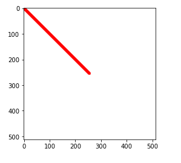
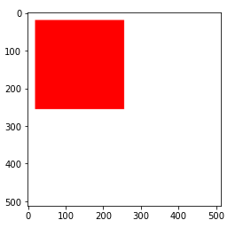

# OpenCV를 이용한 도형 그리기

## 1. OpenCV 도형 그리기 함수

- 직선 그리기

  - ```
    cv2.line(image, start, end, color, thickness)
    ```

    - 하나의 직선을 그리는 함수
    - `start` : 시작 좌표 (2차원)
    - `end` : 종료 좌표 (2차원)
    - `thickness` : 선의 두께

- 사각형 그리기

  - ```
    cv2.rectangle(image, start, end, color, thickness)
    ```

    - 하나의 사각형을 그리는 함수
    - `start` : 시작 좌표 (2차원)
    - `end` : 종료 좌표 (2차원)
    - `thickness` : 선의 두께 (채우기 : -1)

- 다각형 그리기

  - ```
    cv2.polylines(image, points, is_closed, color, thickness)
    ```

    - 하나의 다각형을 그리는 함수
    - `points` : 꼭지점들
    - `is_closed` : 닫힌 도형 여부
    - `thickness` : 선의 두께 (채우기 : -1)

- 텍스트 그리기

  - ```
    cv2.putText(image, text, position, font_type, font_scale, color)
    ```

    - 하나의 텍스트를 그리는 함수
    - `position` : 텍스트가 출력될 위치
    - `font_type` : 글씨체
    - `font_scale` : 글씨 크기 가중치

## 2. 실습 코드

### 1) 직선 그리기

```python
import cv2
import numpy as np
import matplotlib.pyplot as plt
```

```pyt
image = np.full((512, 512, 3), 255, np.uint8) # 512 x 512, 255로 다 채움
image = cv2.line(image, (0, 0), (255, 255), (255, 0, 0), 10)

plt.imshow(image)
plt.show()
```



### 2) 사각형 그리기

```python
image = np.full((512, 512, 3), 255, np.uint8)
image = cv2.rectangle(image, (20, 20), (255, 255), (255, 0, 0), -1)

plt.imshow(image)
plt.show()
```




### 3) 다각형 그리기

```python
image = np.full((512, 512, 3), 255, np.uint8)
points = np.array([[5, 5], [128, 128], [540, 444], [350, 100]])
image = cv2.polylines(image, [points], True, (0, 0, 255), 4)

plt.imshow(image)
plt.show()
```


### 4) 텍스트 그리기

```python
image = np.full((512, 512, 3), 255, np.uint8)
image = cv2.putText(image, 'Hello World', (0, 200), cv2.FONT_ITALIC, 2, (255, 0, 0))

plt.imshow(image)
plt.show()
```


