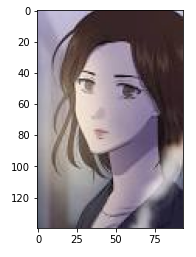
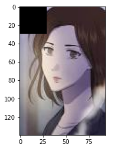
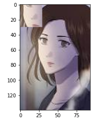
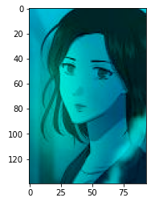

# OpenCV 이미지 연산

## * 패키지 로드

```python
import cv2
import matplotlib.pyplot as plt
import time
```

## * 이미지 로드

```python
image = cv2.imread('image.jpg')
plt.imshow(cv2.cvtColor(image, cv2.COLOR_BGR2RGB))
plt.show()
```



## 1. 이미지 크기 및 픽셀 확인

```python
# 픽셀 수 및 이미지 크기 확인
print(image.shape)
print(image.size)

# 이미지 Numpy 객체의 특정 픽셀을 가리킨다.
px = image[50, 50]

# B, G, R 순서로 출력된다.
# 단, Gray Scale인 경우에는 B, G, R로 구분되지 않는다.
print(px)

# R 값만 출력하기
print(px[2])
```

```
(140, 94, 3)
39480
[173 153 166]
166
```


## 2. 특정 범위 픽셀 변경

```python
start_time = time.time()
for i in range(0, 30):
    for j in range(0, 30):
        image[i, j] = [255, 255, 255]
print(f"--- {time.time()- start_time} seconds ---")

start_time = time.time()
image[0:30, 0:30] = [0, 0, 0]
print(f"--- {time.time()- start_time} seconds ---")

plt.imshow(cv2.cvtColor(image, cv2.COLOR_BGR2RGB))
plt.show()
```

```
--- 0.0019953250885009766 seconds ---
--- 0.0009970664978027344 seconds ---
```




## 3. ROI 추출 및 복사

```python
image = cv2.imread('image.jpg')

# Numpy Slicing : ROI 처리
roi = image[50:80, 20:50]

# ROI 단위로 이미지 복사하기
image[0:30, 0:30] = roi

plt.imshow(cv2.cvtColor(image, cv2.COLOR_BGR2RGB))
plt.show()
```




## 4. 픽셀별로 색상 다루기

```python
image = cv2.imread('image.jpg')

image[:, :, 2] = 0 # R(빨간색)을 모두 없앤다.
plt.imshow(cv2.cvtColor(image, cv2.COLOR_BGR2RGB))
plt.show()
```

