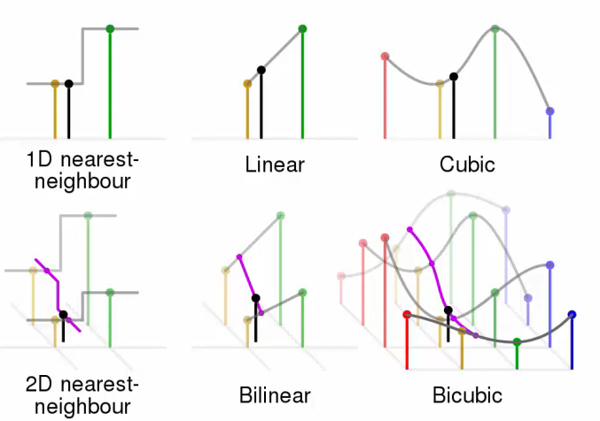
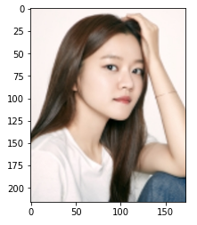
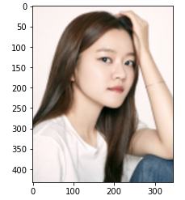
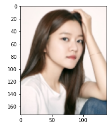
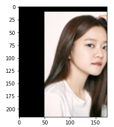
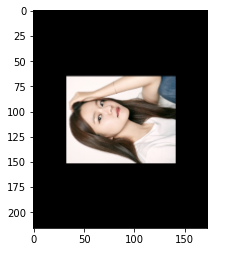

# OpenCV 이미지 변형

- 이미지 변형 방안

  - 크기를 늘릴 때, 추가되는 픽셀이 어떻게 채울 것인가?
  - 보간법(Interpolation) 사용
  - 보간법이란 사이즈가 변할 때 픽셀 사이의 값을 조절하는 방법을 의미한다.

- 이미지 크기 조절

  - ```
    cv2.resize(image, dsize, fx, fy, interpolation)
    ```

    - 이미지 크기 조절
    - `dsize` : Manual Size
    - `fx` : 가로 비율
    - `fy` : 세로 비율
    - interpolation : 보간법
      - `INTER_CUBIC` : 사이즈를 크게 할 때 주로 사용한다.
      - `INTER_AREA` : 사이즈를 작게 할 때 주로 사용한다.

- 이미지 위치 변경

  - ```
    cv2.warpAffine(image, M, dsize)
    ```

    - 이미지 위치 변경
    - M : 변환 행렬
    - `dsize` : Manual Size

- 이미지 회전

  - ```
    cv2.getRotationMatrix2D(center, angle, scale)
    ```

    - 이미지 회전을 위한 변환 행렬 생성
    - `center` : 회전 중심
    - `angle` : 회전 각도
    - `scale` : Scale Factor




## 1. 패키지 로드

```python
import cv2
import numpy as np
import matplotlib.pyplot as plt
```


## 2. 이미지 로드

```python
image = cv2.imread('고아성.jpg')
plt.imshow(cv2.cvtColor(image, cv2.COLOR_BGR2RGB))
plt.show()
```




## 3. 이미지 확대

```python
expand = cv2.resize(image, None, fx=2.0, fy=2.0, interpolation=cv2.INTER_CUBIC)
plt.imshow(cv2.cvtColor(expand, cv2.COLOR_BGR2RGB))
plt.show()
```



- 가로, 세로를 보면 확대되었지만, 해당 환경에서는 이미지를 적절하게 자동으로 조절한다.


## 4. 이미지 축소

```python
shrink = cv2.resize(image, None, fx=0.8, fy=0.8, interpolation=cv2.INTER_AREA)
plt.imshow(cv2.cvtColor(shrink, cv2.COLOR_BGR2RGB))
plt.show()
```



- 이미지 축소됨(좌표확인)


## 5. 이미지 위치 변경

```python
# 행과 열 정보만 저장합니다.
height, width = image.shape[:2]

M = np.float32([[1, 0, 50], [0, 1, 10]]) # 가로 50, 세로 10 만큼 이동
dst = cv2.warpAffine(image, M, (width, height))

plt.imshow(cv2.cvtColor(dst, cv2.COLOR_BGR2RGB))
plt.show()
```




## 6. 이미지 회전

```python
# 행과 열 정보만 저장합니다.
height, width = image.shape[:2]

M = cv2.getRotationMatrix2D((width / 2, height / 2), 90, 0.5)
dst = cv2.warpAffine(image, M, (width, height))

plt.imshow(cv2.cvtColor(dst, cv2.COLOR_BGR2RGB))
plt.show()
```



