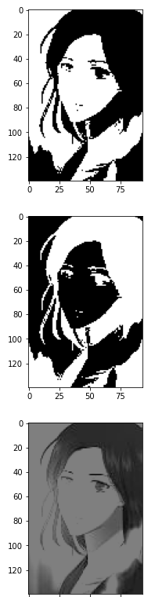

# OpenCV 임계점 처리

- 이미지의 기본 이진화

  - ```
    cv2.threshold(image, thresh, max_value, type)
    ```

    - 임계값을 기준으로 흑/백으로 분류하는 함수
    - `image` : 처리할 Gray Scale 이미지
    - `thresh` : 임계 값 (전체 픽셀에 적용)
    - `max_value` : 임계 값을 넘었을 때 적용할 값
    - ``type`` : 임계점을 처리하는 방식
      - THRESH_BINARY : 임계 값보다 크면 max_value, 작으면 0
      - THRESH_BINARY_INV : 임계 값보다 작으면 max_value, 크면 0
      - THRESH_TRUNC : 임계 값보다 크면 임계 값, 작으면 그대로
      - THRESH_TOZERO : 임계 값보다 크면 그대로, 작으면 0
      - THRESH_TOZERO_INV : 임계 값보다 크면 0, 작으면 그대로


```python
import cv2
import matplotlib.pyplot as plt

image = cv2.imread('image.jpg', cv2.IMREAD_GRAYSCALE)

images = []
ret, thres1 = cv2.threshold(image, 127, 255, cv2.THRESH_BINARY)
ret, thres2 = cv2.threshold(image, 127, 255, cv2.THRESH_BINARY_INV)
ret, thres3 = cv2.threshold(image, 127, 255, cv2.THRESH_TRUNC)
ret, thres4 = cv2.threshold(image, 127, 255, cv2.THRESH_TOZERO)
ret, thres5 = cv2.threshold(image, 127, 255, cv2.THRESH_TOZERO_INV)
images.append(thres1)
images.append(thres2)
images.append(thres3)
images.append(thres4)
images.append(thres5)

for i in images:
    plt.imshow(cv2.cvtColor(i, cv2.COLOR_GRAY2RGB))
    plt.show()
```




- 이미지의 적응 임계점 처리
    - 하나의 이미지에 다수의 조명상태가 존재하는 경우 적용하면 좋다.

    - ``cv2.adaptiveThreshold(image, max_value, adaptive_method, type, block_size, C)``
        - 적응 임계점 처리 함수
        - ``max_value`` : 임계 값을 넘었을 때 적용할 값
        - ``adaptive_method`` : 임계 값을 결정하는 계산 방법
            - ADAPTIVE_THRESH_MEAN_C : 주변영역의 평균값으로 결정
            - ADAPTIVE_THRESH_GAUSSIAN_C : 가우시안 필터를 이용
        - ``type`` : 임계점을 처리하는 방식
        - ``block_size`` : 임계 값을 적용할 영역의 크기
        - ``C`` : 평균이나 가중 평균에서 차감할 값

    - Adaptive Threshold를 이용하면, 전체 픽셀을 기준으로 임계 값을 적용하지 않는다.

    - ADAPTIVE_THRESH_MEAN_C

        

    - ADAPTIVE_THRESH_GAUSSIAN

        


```python
image = cv2.imread('image.jpg', cv2.IMREAD_GRAYSCALE)

ret, thres1 = cv2.threshold(image, 127, 255, cv2.THRESH_BINARY)
thres2 = cv2.adaptiveThreshold(image, 255, cv2.ADAPTIVE_THRESH_MEAN_C, cv2.THRESH_BINARY, 21, 3)

plt.imshow(cv2.cvtColor(image, cv2.COLOR_GRAY2RGB))
plt.show()

plt.imshow(cv2.cvtColor(thres1, cv2.COLOR_GRAY2RGB))
plt.show()

plt.imshow(cv2.cvtColor(thres2, cv2.COLOR_GRAY2RGB))
plt.show()
```


