# 의사결정나무 모델: 분류 및 회귀나무

## 1. 의사결정나무 모델 개요
- 분류 나무(Classification Tree)
    - 종속변수가 명목형인 경우 사용하는 의사결정나무 모델
    - 분류 알고리즘 : 이진 분류 시 지니지수(Gini index) 기반의 CART(Classification & Regression Tree) 사용
    - 과적합 방지 및 모델 단순화를 위해 Depth, Impurity 등 관련 설정 활용
    
- 회귀 나무(Regression Tree)
    - 종속변수가 연속형인 경우 사용하는 의사결정나무 모델
    - 분류 알고리즘 : 평균과 표준편차를 활용
    - 과적합 방지 및 모델 단순화를 위해 Depth, Impurity 등 관련 설정 활용
    
## 2. 주요 함수 및 메서드
- sklearn - DecisionTreeClassifier()
    - 의사결정나무 분류나무를 수행할 때 사용하는 함수
    - max_depth와 random_state로 모델의 성장과 결과 고정 설정 가능
    - DecisionTreeClassifier() 함수의 fit() 메서드에 독립변수와 종속변수 할당
- sklearn - DecisionTreeRegressor()
    - 의사결정나무 회귀나무를 수행할 때 사용하는 함수
    - max_depth와 random_state로 모델의 성장과 결과 고정 설정 가능
    - DecisionTreeRegressor() 함수의 fit() 메서드에 독립변수와 종속변수 할당


## 3. 코드 예제


### * 패키지

```python
import pandas as pd
from sklearn.tree import DecisionTreeClassifier
from sklearn.tree import DecisionTreeRegressor
```


### 1) DecisionTreeClassifier()

```python
df = pd.read_csv("iris.csv")
df.head(2)
```

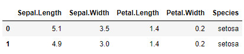

```python
df['is_setosa'] = (df['Species'] == 'setosa') + 0
df.head(2)
```

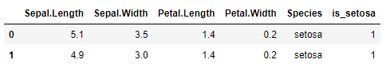

```python
model_c = DecisionTreeClassifier(random_state=123)
model_c.fit(X = df.iloc[:, :4],
           y = df['is_setosa'])
model_c
```

```python
pred_c = model_c.predict(df.iloc[:, :4])
pred_c[:4]
```

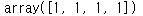


### 2) DecisionTreeRegressor()

```python
model_r = DecisionTreeRegressor(random_state=123)
model_r.fit(X = df.iloc[:, :3], y = df["Petal.Width"])
pred_r = model_r.predict(df.iloc[:, :3])
pred_r[:4]
```

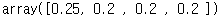


## 4. 문제


### Q1. 당뇨병 발병 여부를 예측하기 위하여 의사결정나무를 사용하고자 한다. 이 때 혈당, 혈압, 임신 횟수를 기반으로 예측을 했을 때 예측 정확도는?

```python
df = pd.read_csv("diabetes.csv")
df.head(2)
```

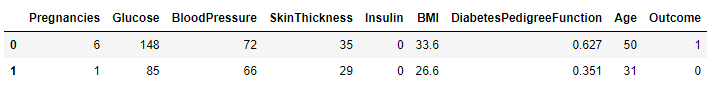

```python
df_X = df.loc[:, ['Glucose', 'BloodPressure', 'Pregnancies']]
df_X.head(2)
```

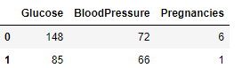

```python
df_Y = df['Outcome']
df_Y.head(2)
```

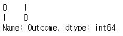

```python
from sklearn.model_selection import train_test_split

train_X, test_X, train_y, test_y = train_test_split(df_X, df_Y, random_state=123, test_size=0.2)
```

```python
model_c = DecisionTreeClassifier(random_state=123)
model_c.fit(train_X, train_y)
```

```python
model_c.score(test_X, test_y)
```

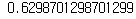

```python
from sklearn.metrics import accuracy_score

accuracy_score(y_pred = model_c.predict(test_X), y_true = test_y)
```

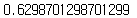

답 : 63%


### Q2. 환자의 BMI를 예측하기 위하여 회귀나무를 사용하고자 한다. 이 때 혈당, 혈압, 피부 두께를 독립변수로 했을 경우 RMSE는 얼마인가?

```python
df = pd.read_csv("diabetes.csv")
df.head(2)
```

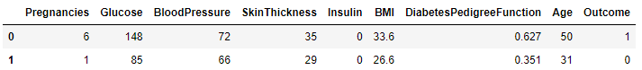

```python
df_X = df.loc[:, ['Glucose', 'BloodPressure', 'SkinThickness']]
df_Y = df['BMI']
```

```python
train_X, test_X, train_y, test_y = train_test_split(df_X, df_Y, random_state=123, test_size=0.2)
```

```python
model_r = DecisionTreeRegressor(random_state=123)
model_r.fit(train_X, train_y)
```

```python
from sklearn.metrics import mean_squared_error

mse = mean_squared_error(y_true = test_y, y_pred=model_r.predict(test_X))

rmse = mse ** 0.5
rmse
```

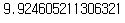

답 : 9.9


### Q3. 분류나무의 파라미터를 바꿔가면서 성능 평가를 하려고 한다. 당뇨 발병 여부를 종속변수로 하고 혈당, 혈압, 임신 횟수, BMI, 나이를 독립변수로 하고 Depth를 3에서 6까지 변화시킬 때 그 결과로 틀린 것은?

```python
df = pd.read_csv("diabetes.csv")
df.head(2)
```

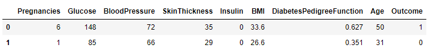

```python
df_X = df.loc[:, ['Glucose', 'BloodPressure', 'Pregnancies', 'BMI', 'Age']]
df_y = df['Outcome']

train_X, test_X, train_y, test_y = train_test_split(df_X, df_y, random_state=345, test_size=0.3)

model_c3 = DecisionTreeClassifier(random_state=345, max_depth = 3)
model_c3.fit(train_X, train_y)
model_c4 = DecisionTreeClassifier(random_state=345, max_depth = 4)
model_c4.fit(train_X, train_y)
model_c5 = DecisionTreeClassifier(random_state=345, max_depth = 5)
model_c5.fit(train_X, train_y)
model_c6 = DecisionTreeClassifier(random_state=345, max_depth = 6)
model_c6.fit(train_X, train_y)
```

```python
model_c3.score(test_X, test_y), model_c4.score(test_X, test_y), model_c5.score(test_X, test_y), model_c6.score(test_X, test_y)
```

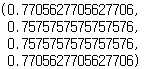

답 : 4번