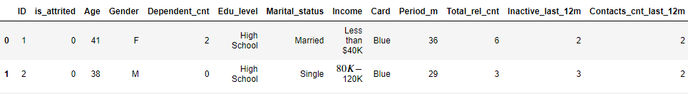
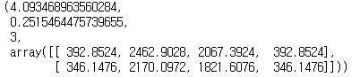
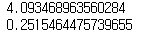
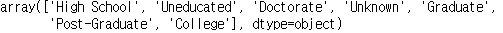
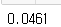
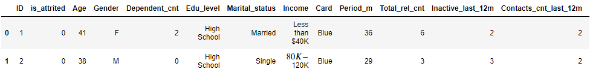
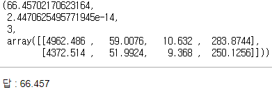
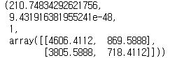

# 가설검정 : 독립성 검정


## 1. 독립성 검정(=카이제곱 검정) 개요

- 특징
  - 두 명목형 변수를 대상으로 실시하는 분석 (crosstab을 쓰는 것을 권장)
  - 독립 관점의 해석과 연관 관점에서의 해석이 존재
  - 연속형 변수 -> 명목형 변수로 변환 후 실시
- 가설
  - 귀무가설 : 두 변수는 서로 독립이다.
  - 대립가설 : 두 변수는 서로 독립이 아니다.

## 2. 주요 함수 및 메서드

- scipy - chi2_contingency
  - scipy의 독립성 검정을 실시하는 함수
  - 입력 : 두 개의 명목형 변수와 각 원소의 빈도
  - 출력은 검정통계량, P-value, 자유도, 기대도수 4개의 연산 결과가 튜플로 산출


## 3. 코드 예시

```python
import pandas as pd
from scipy.stats import chi2_contingency
```

```python
df = pd.read_csv('financial_info_10k_persons.csv')
df.head(2)
```



```python
chi2_contingency(pd.crosstab(df.Gender, df.Marital_status))
```

**반드시 crosstab을 사용하여 입력**



```python
stat, p, dof, e_val = chi2_contingency(pd.crosstab(df.Gender, df.Marital_status))
print(stat)
print(p)
```




## 4. 문제


#### Q1. 고객의 학력이 고졸인 경우 성별과 이탈여부를 사용하여 독립성 검정을 실시했을 때 p-value는?

```python
df = pd.read_csv('financial_info_10k_persons.csv')
df.head(2)
```

```python
df.Edu_level.unique()
```



```python
df_hs = df[df.Edu_level == 'High School']

stat, p, dof, e_val = chi2_contingency(pd.crosstab(df_hs.Gender, df_hs.is_attrited), correction=False)
print(round(p,4))
```



답 : 0.0461


#### Q2. 성별에 따른 카드 등급은 서로 관련이 있는지 독립성 검정을 실시하고 해당 검정 결과의 검정통계량은 얼마인가?

```python
df = pd.read_csv('financial_info_10k_persons.csv')
df.head(2)
```



```python
chi2_contingency(pd.crosstab(df.Gender, df.Card))
```




#### Q3. 최근 12개월의 이용 실적 중 3개월 이상 사용 실적이 없는 것과 고객 이탈의 관계가 있는지 독립성 검정을 실시한 결과로 옳은 것은?

```python
df = pd.read_csv('financial_info_10k_persons.csv')

# 파생변수를 생성해야한다.
df['is_Inactive_last_12m'] = (df['Inactive_last_12m'] >= 3) + 0

chi2_contingency(pd.crosstab(df.is_Inactive_last_12m, df.is_attrited))
```



답 : 검정통계량은 200이상이다.

