# 상관분석


## 1. 상관분석 이란?

- 두 변수의 선형관계를 확인하기 위함
- 두 수치형 변수의 비교는 Pearson's Correlation Coefficient를 확인, 외에도 다양한 상관관수 존재
- 상관계수가 0에 가까울수록 선형관계가 약함, 절대값이 1에 가까울수록 선형관계가 강함

## 2. 주요 함수 및 메서드

- pandas - corr()
  - pandas에서 상관계수를 실시하는 데이터프레임 전용 메서드(매우 편함)
  - method에 "pearson", "kendall", "spearman"는 각각의 상관계수로 계산
- scipy - pearsonr()
  - scipy의 Pearson 상관분석을 하는 메서드
  - 입력은 두 일차원 벡터를 넣고 출력은 상관계수와 p-value가 차례로 출력
- scipy - spearmanr()
  - scipy의 Spearman 상관분석을 하는 메서드
  - 입력은 두 일차원 벡터를 넣고 출력은 상관계수와 p-value가 차례로 출력
- scipy - kendalltau()
  - scipy의 kendalltau 상관분석을 하는 메서드
  - 입력은 두 일차원 벡터를 넣고 출력은 상관계수와 p-value가 차례로 출력


## 3. 코드 예시


### * 패키지

```python
import pandas as pd
from scipy.stats import pearsonr
from scipy.stats import spearmanr
from scipy.stats import kendalltau
```


### 1) pandas - corr()

```python
df = pd.read_csv('bike.csv')
df.head(2)
```

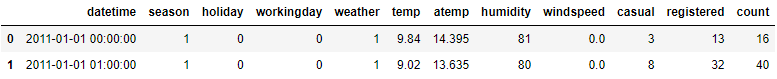

```python
df.corr()
```

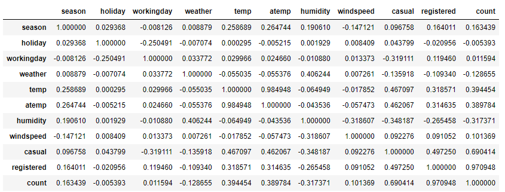

```python
df[['casual', 'registered', 'count']].corr() # 속성을 뽑아서 진행가능
```

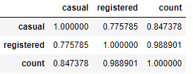


### 2) scipy - pearsonr()

```python
pearsonr(df.casual, df.registered)
```

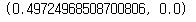


### 3) scipy - spearmanr()

```
spearmanr(df.casual, df.registered)
```

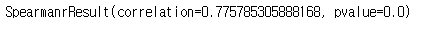


### 4) scipy - kendalltau()

```python
kendalltau(df.casual, df.registered)
```


## 4. 문제


### Q1. 기온, 체감온도, 상대습도, 총 자전거 대여 숫자의 상관관계를 분석하였을 때 가장 낮은 상관계수는 얼마인가?

```python
df = pd.read_csv('bike.csv')
df.head(2)
```


```python
df[['temp', 'atemp', 'humidity', 'casual']].corr().min().round(2)
```

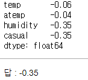


### Q2. 계절별로 체감온도와 자전거 대여 숫자의 상관관계를 알아보고자 한다. 이 때 적절한 상관분석기법을 사용하였을 때 상관계수로 옳은 것은?

```python
df = pd.read_csv('bike.csv')
df.head(2)
```

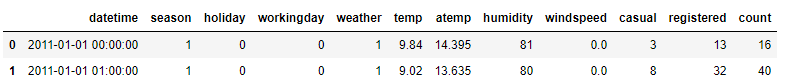

```python
df_spring = df.loc[df.season == 1, ['casual', 'atemp']]
df_summer = df.loc[df.season == 2, ['casual', 'atemp']]
df_autumn = df.loc[df.season == 3, ['casual', 'atemp']]
df_winter = df.loc[df.season == 4, ['casual', 'atemp']]
```

```python
df_spring.corr(), df_summer.corr(), df_autumn.corr(), df_winter.corr()
```

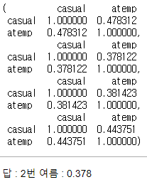

다른풀이

```python
df_corr = df[['season', 'atemp', 'casual']].groupby('season').corr()
df_corr = df_corr.reset_index()
df_corr = df_corr.loc[df_corr['atemp'] < 1, ]
df_corr
```

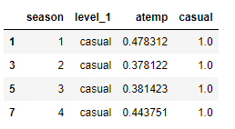


### Q3. 날씨에 따른 기온과 자전거 대여의 상관계수 변화를 알아보고자 한다. 날씨가 맑은 날과 그렇지 않은 날의 상관계수 차이의 절대값은 얼마인가?

```python
df = pd.read_csv('bike.csv')
df.head(2)
```

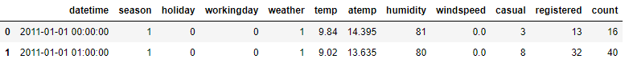

```python
df['is_good_weather'] = (df.weather == 1) + 0
df.head(2)
```

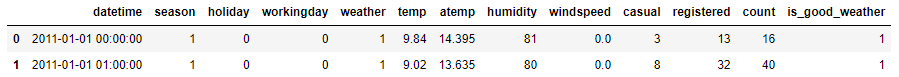

```python
df_good = df.loc[df.is_good_weather == 1, ['temp', 'casual']]
df_bad = df.loc[df.is_good_weather == 0, ['temp', 'casual']]

cor_good = df_good.corr().min().min()
cor_bad = df_bad.corr().min().min()
round(abs(cor_good - cor_bad), 3)
```

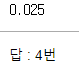

