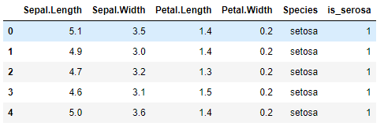
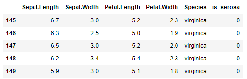
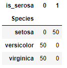
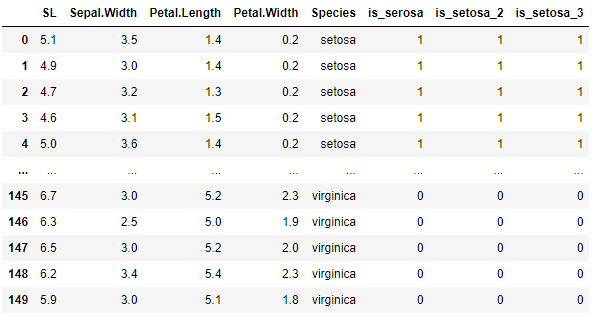
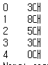
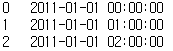
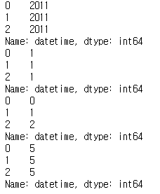
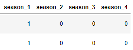

# 데이터 전처리 : 파생변수 생성


## 1) 파생변수 개요

- 정의
  - 기존 변수를 조합하여 만들어내는 새로운 변수
  - ex. 체감온도 변수, 환불 비율 변수, 주 방문 매장 변수


## 2) numpy.where()

```python
df['is_serosa'] = np.where(df['Species'] == "setosa", 1, 0)
df.head()
```

where(조건, 조건만족, 조건만족x)



```python
df.tail()
```



```python
pd.crosstab(df["Species"], df["is_serosa"])
```




## 3) rename

```python
df.rename(columns={"Sepal.Length" : "SL"})
```

df.rename(columns={'변경대상' : '변경이름'})




## 4) apply

```python
bike_sub.apply(func = sum, axis = 1)
bike_sub.apply(func= lambda x : round(x.mean()))
```

apply(func=적용할 함수, axis=적용할 축)


## 5) astype

```python
bike_sub['casual'].astype("str") + "대"
```

astype('변경할자료형')




## 6) to_datetime

```python
bike_time = pd.to_datetime(bike['datetime'][:3])
bike_time
```



```python
print(bike_time.dt.year)
print(bike_time.dt.month)
print(bike_time.dt.hour)
print(bike_time.dt.weekday)
```



자료형이 datetime인 경우 년, 월, 일, 시 별로 추출가능


## 7) get_dummies

```python
bike_dum = pd.get_dummies(data = bike, columns = ['season'])
bike_dum.head(2)
```



