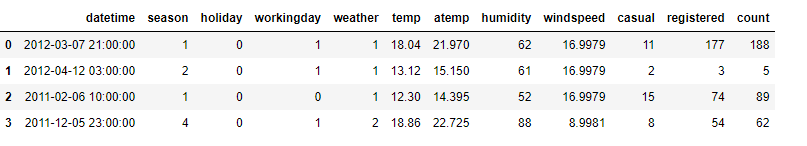
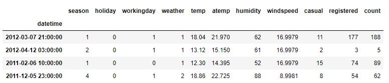
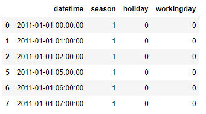
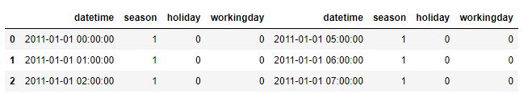
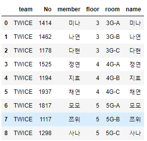
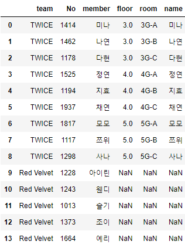

# 데이터 전처리 : 데이터 병합

- 병합의 종류
  - 데이터를 이어 붙이는 바인딩
  - 특정 변수를 기준으로 두 데이터를 엮는 조인
  - Inner Join : 공통
  - Left Join : 왼쪽 기준
- 주요 함수
  - pandas - reset_index()
    - 기존의 인덱스 초기화
  - pandas - set_index()
    - 특정 변수를 인덱스로 지정
  - pandas - concat()
    - 데이터를 row 방향 또는 columns 방향으로 이어 붙이는 함수
  - pandas - merge()
    - 데이터프레임을 변수 기준으로 병합하는 함수


## 1. pandas - reset_index()

```python
bike_sub.reset_index(drop=True)
```




## 2. pandas - set_index()

```python
bike_sub = bike_sub.set_index("datetime")
bike_sub
```




## 3. pandas - concat()

```python
pd.concat([bike_1, bike_2], axis=0)
```



```python
pd.concat([bike_1, bike_2.reset_index(drop=True)], axis=1) # 제대로 붙이기 위해 인덱스를 통일
```




## 4. pandas - merge()

```python
df_A = pd.read_csv("join_data_group_members.csv")
df_B = pd.read_csv("join_data_member_room.csv")

pd.merge(left=df_A, right=df_B, left_on="member", right_on="name", how="inner")
```



```python
pd.merge(left=df_A, right=df_B, left_on="member", right_on="name", how="left")
```



