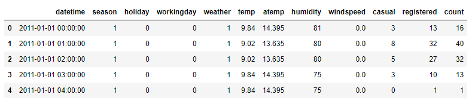
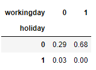
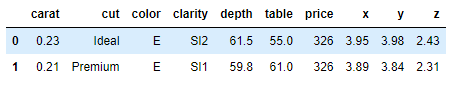
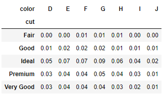
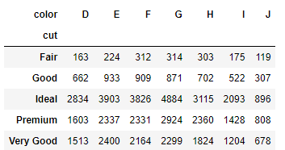
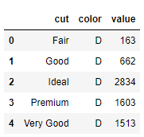
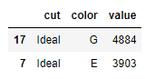
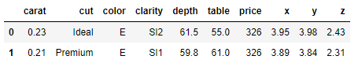
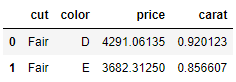
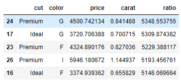

# 데이터 전처리 : 정렬 및 변환


## 1. 주요 메서드

- pandas - crosstab()
  - 기본적으로 데이터프레임의 두 변수의 원소 조합 빈도를 확인하는 함수
  - normalize 인자 설정으로 각 조합의 비율을 손쉽게 계산
  - value와 aggfunc 인자에 변수와 요약 함수를 지정하면 빈도가 아닌 별도 산술연산 가능

- pandas - sort_values()
  - 데이터프레임의 특정 변수를 기준으로 정렬하는 메서드
  - ascending인자 설정으로 오름차순/내림차순 설정 가능
  - 두 변수 이상의 기준으로 정렬 시 리스트 형식으로 각 인자에 값 할당

- pandas - melt()
  - wide form 데이터프레임을 long form으로 변환
  - id_vars인자에 기준이 되는 변수 지정

- pandas - pivot()
  - long form의 데이터 프레임을 wide form으로 변환
  - index/columns/values 인자에 각각 대상 변수 지정


## 2. 문제


### Q1. workingday가 아니면서 holiday가 아닌 날의 비율은?

```python
bike = pd.read_csv('bike.csv')
bike.head()
```



```python
pd.crosstab(bike.holiday, bike.workingday, normalize=True).round(2)
```



답 : 0.29


### Q2. 가장 많은 데이터가 있는 세공 수준과 색상 조합을 순서대로 고르면?

```python
dia = pd.read_csv('diamonds.csv')
dia.head(2)
```



```python
pd.crosstab(dia.cut, dia.color, normalize=True).round(2)
```



답 : Ideal, G


### Q2-1. melt를 이용한 풀이

```python
cross = pd.crosstab(dia.cut, dia.color)
cross
```



```python
cross_melt = cross.reset_index().melt(id_vars='cut')
cross_melt.head()
```



```python
cross_melt.sort_values('value', ascending=False).head(2)
```




### Q3. 세공수준별 색상별 가격과 케럿의 평균을 구하고 1캐럿당 가격이 가장 높은 세공수준과 색상 조합을 순서대로 고르면?

```python
dia = pd.read_csv('diamonds.csv')
dia.head(2)
```



```python
dia_agg = dia.groupby(['cut', 'color'])[['price', 'carat']].mean().reset_index()
dia_agg.head(2)
```



```python
dia_agg['ratio'] = dia_agg['price'] / dia_agg['carat']
dia_agg = dia_agg.sort_values('ratio', ascending=False)
dia_agg.head()
```



답 : Premium, G