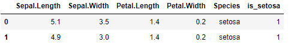
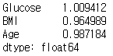

# 분류: 로지스틱 회귀분석(Logistic Regression)

## 1. 로지스틱 회귀분석 개요

- 이항 로지스틱 회귀 분석 : 종속변수가 0과 1이며 베르누이 분포를 따를 경우 사용
- 모델의 산출 값은 각 데이터가 1이 될 확률, 이진 분류를 위해서 경계값이 필요
- 모델 평가 : 각종 분류 관련 지표 및 AUC 사용

## 2. 주요 함수 및 메서드

- statsmodels - Logit() - 통계적 값
    - 로지스틱 회귀분석 함수
    - endog, exog 인자에 각각 종속변수와 독립변수 할당
    - 산출 모델 객체의 params attribute에 모델의 계수 저장
    - 산출 모델 객체의 predict() 메서드로 예측값 생산, 이는 종속변수가 1이 될 확률 값
- sklearn - LogisticRegression() - 최적값
    - 로지스틱 회귀분석 함수
    - fit_intercept, solver 인자로 절편 적학 여부 및, 최적화 알고리즘 설정 가능
    - fit() 메서드에 독립변수, 종속변수 할당
    - coef_ attribute에 모델의 계수 저장
    - predict_proba() 메서드로 예측값을 생산, 두 번째 열이 종속변수가 1이 될 확률값
- sklearn - roc_auc_score()
    - AUC(Area Under Curve)를 산출하는 함수
    - y_true, y_score 인자에 각각 종속변수와 예측 확률값 할당
- sklearn - accuracy_score()
    - 분류모델의 정확도를 산출하는 함수
    - y_pred와 y_true에 각각 예측 분류 결과와 실제 값을 할당
- sklearn - f1_score()
    - 분류모델의 f1 값을 산출하는 함수
    - y_pred와 y_true에 각각 예측 분류 결과와 실제 값을 할당
- sklearn - precision_score()
    - 분류모델의 정밀도(precision)를 산출하는 함수
    - y_pred와 y_true에 각각 예측 분류 결과와 실제 값을 할당
- sklearn - recall_score()
    - 분류모델의 재현율(recall)를 산출하는 함수
    - y_pred와 y_true에 각각 예측 분류 결과와 실제 값을 할당


## 3. 코드 예시


### * 패키지

```python
import pandas as pd
import numpy as np
from statsmodels.api import Logit
from sklearn.linear_model import LogisticRegression
from sklearn.metrics import roc_auc_score
from sklearn.metrics import accuracy_score
from sklearn.metrics import precision_score
from sklearn.metrics import recall_score
from sklearn.metrics import f1_score
```


### 1) Logit()

```python
df = pd.read_csv("iris.csv")
df.head(2)
```


```python
df['Species'].unique()
```


```python
df["is_setosa"] = (df['Species'] == "setosa") + 0
df.head(2)
```



```python
model = Logit(endog=df['is_setosa'],
             exog=df.iloc[:, :2]).fit() # 너무 같은 변수를 넣으면 error 발생
model
```


```python
model.params # 독립변수의 계수
model.pvalues # 각각의 변수에 대한 p-value
```

```python
pred = model.predict(df.iloc[:3, :2]) # 모델이 예측 : 1에 가까울 확률
pred
```


```python
(pred > 0.5) + 0
```


### 2) LogisticRegression()

```python
model = LogisticRegression(random_state=123) # 결과 고정을 위한 random_state 지정
model.fit(X = df.iloc[:, :2],
         y = df['is_setosa'])
model
```


```python
model.coef_ # 계수
model.intercept_ # y 절편
```

```python
pred = model.predict_proba(df.iloc[:3, :2])
pred = pred[:, 1]
pred
```


```python
(pred > 0.5) + 0
```


```python
pred = model.predict_proba(df.iloc[:, :2])
pred = pred[:, 1]
pred[:10]
```


```python
roc_auc_score(y_true = df["is_setosa"],
             y_score = pred)
```


```python
accuracy_score(y_true = df["is_setosa"],
             y_pred = (pred > 0.8) + 0)
```


## 4. 문제


### Q1. 독립변수를 혈압, 혈당, BMI, 인슐린으로 하고 종속변수를 당뇨 여부로 할 경우 분류 정확도는 얼마인가?

```python
df = pd.read_csv("diabetes.csv")
df.head(2)
```


```python
from sklearn.model_selection import train_test_split

train_X, test_X, train_y, test_y = train_test_split(df.iloc[:, [1, 2, 4, 5]], df['Outcome'], random_state=123, test_size=0.2)
```

```python
model = Logit(endog = train_y,
             exog = train_X).fit()
model
```

```python
pred = model.predict(test_X)

accuracy_score(y_true = test_y,
             y_pred = (pred > 0.5) + 0) # 별 언급이 없으면 0.5를 경곗값으로 설정
```


답 : 0.70


### Q2. 독립변수를 혈당, BMI, 나이로 하고 종속변수를 당뇨 여부로 할 경우 나이의 승산비는 얼마인가?

```python
df = pd.read_csv("diabetes.csv")
df.head(2)
```


```python
model = Logit(endog = df['Outcome'],
             exog = df.loc[:, ["Glucose", 'BMI', 'Age']]).fit()
model.params
```


```python
np.exp(model.params)
```



답 : 0.99


### Q3. 독립변수를 혈당, BMI, 나이로 하고 종속변수를 당뇨 여부로 할 경우 모델의 AUC는 얼마인가?

```python
df = pd.read_csv("diabetes.csv")
df.head(2)
```


```python
model = Logit(endog=df["Outcome"],
             exog=df.loc[:, ["Glucose", "BMI", "Age"]]).fit()
```

```python
model.predict(df.loc[:, ["Glucose", "BMI", "Age"]])[:5]
```


```python
roc_auc_score(y_true=df["Outcome"],
             y_score = model.predict(df.loc[:, ["Glucose", "BMI", "Age"]]))
```


답 : 0.54