# 다중 회귀분석(Multiple Linear Regression)

## 1. 다중 회귀분석 개요
- 연속형 종속변수와 두 개 이상의 독립변수 간 선형관계 및 설명력을 확인하는 기법
- 모델 성능 향상을 위한 파생변수 생성 및 성능 비교 필요
- 명목형 변수가 독립변수인 경우 가변수 변환(dummies로 변환) 후 모델 적합

- 다중 공선성 문제
    - 독립변수 간 강한 상관관계가 나타나는 문제
    - 상관계수를 확인하여 그 값이 높은 것을 사전에 제거
    - 회귀 모델 생성 이후 분산 팽창 계수(VIF) 확인(10 이상)하여 관련 변수 처리(제거)
    
## 2. 주요 함수 및 메서드
- patsy - dmatrices()
    - pasty의 수식을 기반으로 데이터 행렬을 생성하는 함수
    - 분산 팽창 계수 확인을 위해 입력 데이터를 전처리 할 때 필요
    - return_type 인자에 "dataframe"으로 설정 시 후처리 용이
- statsmodels - variance_inflation_factor()
    - 분산 팽창 계수 연산 (VIF 생성)
    - 분산 팽창 계수 연산을 위해 반복문 또는 list comprehension 사용


## 3. 코드 예시


### * 패키지

```python
import pandas as pd
from patsy import dmatrices
from statsmodels.stats.outliers_influence import variance_inflation_factor as vif
```


### 1) patsy - dmatrices()

```python
df = pd.read_csv("bike.csv")
df.head(2)
```

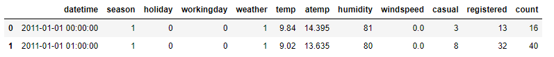

```python
df_sub = df.loc[:, "season":"casual"]
df_sub.head(2)
```

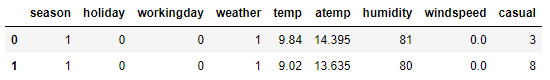

```python
formula = "casual ~ " + " + ".join(df_sub.columns[:-1])
y, X = dmatrices(formula, data = df_sub, return_type='dataframe')
```

```python
df_vif = pd.DataFrame()
df_vif["colname"] = X.columns
df_vif["VIF"] = [vif(X.values, i) for i in range(X.shape[1])]
df_vif
```

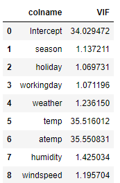

=> VIF > 10 == 다중 공선성

```python
df_sub = pd.concat([df.loc[:, "season":"temp"],
                   df.loc[:, "humidity":"casual"]],
                  axis=1)
```

```python
formula = "casual ~ " + " + ".join(df_sub.columns[:-1])
y, X = dmatrices(formula, data = df_sub, return_type='dataframe')

df_vif = pd.DataFrame()
df_vif["colname"] = X.columns
df_vif["VIF"] = [vif(X.values, i) for i in range(X.shape[1])]
df_vif
```

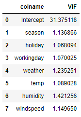

=> 다중 공선성


## 4. 문제


### Q1. Price를 종속변수로 하고 나머지 수치형 변수를 독립변수로 했을 때 다중 공선성의 문제가 있다고 판단되는 변수의 개수는?

```python
df = pd.read_csv("diamonds.csv")
df.head(2)
```

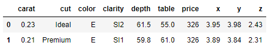

```python
df_sub = df.iloc[:, [6, 0, 4, 5, 7, 8, 9]]
df_sub.head(2)
```

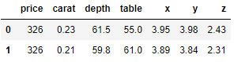

```python
formula = "price ~ " + " + ".join(df_sub.columns[1:])
y, X = dmatrices(formula, data = df_sub, return_type='dataframe')
X.head(2)
```

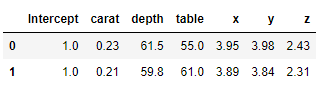

```python
df_vif = pd.DataFrame()
df_vif["colname"] = X.columns
df_vif["VIF"] = [vif(X.values, i) for i in range(X.shape[1])]
df_vif
```

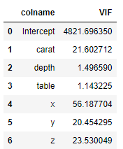

답 : 4개 (intercept는 제외)


### Q2. price를 종속변수로 하고 carat과 depth를 독립변수로 하여 생성한 선형 회귀 모델을 사용하여 알아본 carat이 1이고 depth가 60, table이 55인 다이아몬드 가격은 얼마인가?

```python
df = pd.read_csv("diamonds.csv")
df.head(2)
```

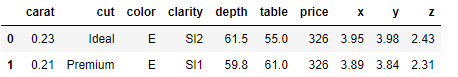

```python
from statsmodels.formula.api import ols

model = ols(formula = "price ~ carat + depth", data = df).fit()
model.summary()
```

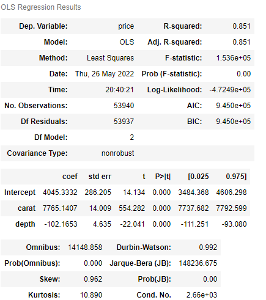

```python
df_test = pd.DataFrame({"carat" : [1],
                       "depth" : [60],
                       "table" : [55]})
df_test
```

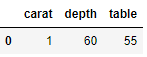

```python
model.predict(df_test)
```

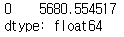

답 : 5680


### Q3. price를 종속변수로 하고 carat, color, depth를 독립변수로 하여 생성한 선형 회귀 모델을 사용하여 알아본 carat이 1이고 depth가 50, color가 E인 다이아몬드의 가격은 얼마인가?

```python
df = pd.read_csv("diamonds.csv")
df.head(2)
```

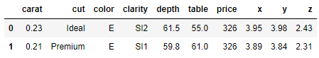

```python
df_sub = df.loc[:, ["price", "carat", "color", "depth"]]
df_dum = pd.get_dummies(df_sub, columns = ["color"], drop_first=True)
df_dum.head(2)
```

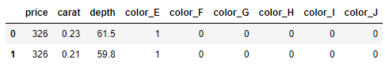

```python
model = ols(formula = "price ~ " + " + ".join(df_dum.columns[1:]),
           data = df_dum).fit()
model.summary()
```

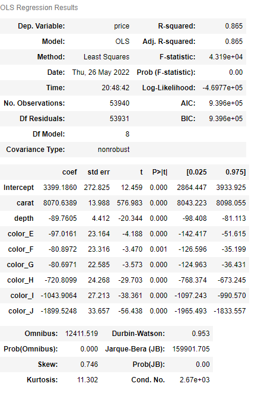

```python
df_test = df_dum.iloc[[0], ]
df_test
```

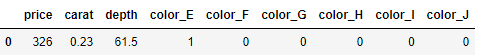

```python
df_test["carat"] = 1
df_test["depth"] = 50
df_test
```

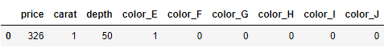

```python
model.predict(df_test)
```

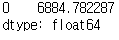

답 : 6885

