# One Way ANOVA


## 1. 일원 분산 분석(One way ANOVA)

- 특징
    - 수치형 종속변수와 명목형 독립변수가 각각 1개 일 때 실시하는 분석
    - 종속변수로 나뉘어지는 그룹이 2개 이상일 때 사용
    - 귀무가설을 기각하는 경우 사후검정(Post-hoc)을 실시
        - 귀무가설 : 집단 간 평균이 같음
        - 대립가설 : 평균이 같지 않은 집단이 **한 쌍 이상** 존재
        - 사후검정 : Tukey's HSD, Duncan's MRT, Scheffe's test
            - 어떤 집단간 평균이 유의미하게 차이 나는지 알 수 있다.
            

## 2. 주요 함수 및 메서드
- 일원 분산 분석 - f_oneway()
    - scipy의 함수
    - 입력은 각각 집단의 pandas의 series로 진행 권장
    - 출력은 검정통계량과 p-value, 하나의 객체에 할당할 경우 튜플로 저장됨
- 일원 분산 분석 - ols(), anova_lm()
    - ols()는 모델을 생성하고 적합
    - anova_lm()은 적합한 모델정보를 기반으로 일원 분산 분석표를 보여줌
    - ols() 함수에 수식 입력 시 독립변수에 C()함수 사용 권장
- 사후검정 - pairwise_tukeyhsd()
    - 종속변수와 독립변수를 차례대로 선언
    - reject 변수의 True는 귀무가설을 기각하는 것
    - 결과 확인을 위해서는 print 함수를 이용해야한다.


## 3. 코드 예시


### * package

```python
import pandas as pd
from scipy.stats import f_oneway
from statsmodels.formula.api import ols
from statsmodels.stats.anova import anova_lm
from statsmodels.stats.multicomp import pairwise_tukeyhsd
```


### 1) f_oneway()

```python
df = pd.read_csv('diamonds.csv')
df.head(2)
```

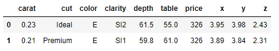

```python
df['color'].unique()
```

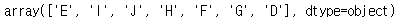

```python
stat, p = f_oneway(df.loc[df['color'] == 'E', "price"],
                  df.loc[df['color'] == 'I', "price"],
                  df.loc[df['color'] == 'J', "price"])

print(round(stat, 3))
print(round(p, 3))
```

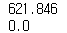


### 2) ols()

```python
bike = pd.read_csv('bike.csv')
bike.head(2)
```

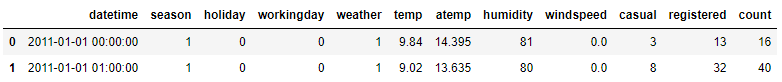

```python
# C() 명목형임을 나타낸다. : season이 1, 2, 3, 4로 되어있어 잘못하면 수치로 해석된다.
model = ols(formula='temp ~ C(season)', data = bike).fit()
anova_lm(model)
```

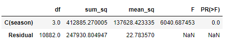

```python
# 사후 검정
result = pairwise_tukeyhsd(bike['temp'], bike['season'])
print(result)
```

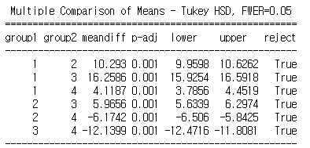


## 4. 연습문제


### Q1. 계절별 기온 평균을 분산분석 시 검정통계량은?


#### 1번 풀이방법)

```python
bike = pd.read_csv('bike.csv')
bike.head(2)
```

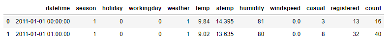

```python
bike['season'].unique()
```

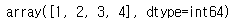

```python
stat, p = f_oneway(bike.loc[bike['season'] == 1, 'temp'],
            bike.loc[bike['season'] == 2, 'temp'],
            bike.loc[bike['season'] == 3, 'temp'],
            bike.loc[bike['season'] == 4, 'temp'])
print(stat, p)
```

답 : 6040.687


#### 2번 풀이방법)

```python
formula = "temp ~ C(season)"
lm = ols(formula, bike).fit()
anova_lm(lm)
```

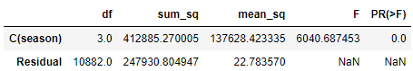


### Q3. 요일별 registered의 평균을 사후검정 했을 때, 평균이 유의미하게 차이 나지 않는 조합은 총 몇 개 인가?

```python
bike = pd.read_csv('bike.csv')
bike.head(2)
```

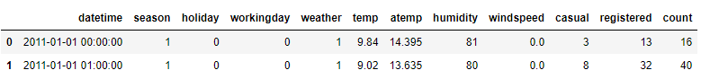

```python
# weekday는 요일을 추출한다.
bike['datetime'] = pd.to_datetime(bike['datetime'])
bike['wday'] = bike['datetime'].dt.weekday
bike.head(2)
```

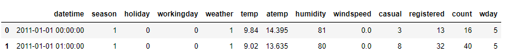

```python
result = pairwise_tukeyhsd(bike['registered'], bike['wday'])
print(result)
```

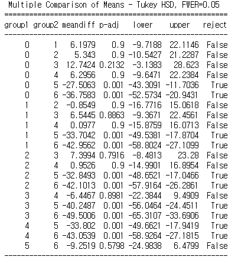

답 : 11개