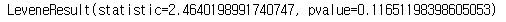

# 등분산 검정(F-test of equality of variances)


## 1. 등분산 검정 개요
- 등분산 검정 종류
    - F-test : 두 집단의 등분산 검정(각 집단이 정규분포를 따를 때 사용)
    - Bartlett's test : 두 집단 이상의 등분산 검정(각 집단이 정규분포를 따를 때 사용)
    - Levene's test : 두 집단 이상의 등분산 검정(각 집단이 정규분포를 따를 필요 없음)
- 가설
    - 귀무가설 : 집단 간 분산은 서로 같다
    - 대립가설 : 집단 간 분산은 서로 다르다
    
    
## 2. 주요 함수 및 메서드
- F-검정 - f.cdf()
    - scipy 패키지에서 f 검정 실시하는 함수
    - F 검정통계량을 입력받아 P-value 산출
    - 입력은 F 검정통계량, 첫 번째 데이터의 자유도, 두 번째 데이터의 자유도가 필요
- Bartlett 검정 - bartlett()
    - scipy 패키지에서 Bartlett 검정 실시하는 함수
    - 분산을 연산하기 위한 집단을 함수에 입력
- Levene 검정 - levene()
    - scipy 패키지에서 Levene 검정을 실시하는 함수
    - 분산을 연산하기 위한 집단을 함수에 입력


## 3. 코드 예시


### * 패키지

```python
import pandas as pd
from scipy.stats import f
from scipy.stats import bartlett
from scipy.stats import levene
```


### 1) f.cdf()

```python
df = pd.read_csv("financial_info_10k_persons.csv")
df.head(2)
```


```python
ser_M = df.loc[df.Gender == 'M', "Period_m"]
ser_F = df.loc[df.Gender == 'F', "Period_m"]
```

```python
F = ser_M.var() / ser_F.var()
F
```


```python
result = f.cdf(F, dfd = len(ser_M) - 1, dfn = len(ser_F))
result
```


```python
# 검정 통계량 기반 p-value
p = (1 - result) * 2
p
```


### 2) bartlett()

```python
ser_M = df.loc[df.Gender == 'M', "Period_m"]
ser_F = df.loc[df.Gender == 'F', "Period_m"]
```

```
stat, p = bartlett(ser_F, ser_M)
stat, p
```


### 3) levene()

```python
levene(ser_F, ser_M)
```




## 4. 문제


### Q1. 남성과 여성의 1회 평균 송금액의 분산을 비교 검정하고 그 결과의 검정 통계량은 얼마인가?

```python
df = pd.read_csv('financial_info_10k_persons.csv')
df.head(2)
```


```python
ser_M = df.loc[df.Gender == 'M', 'Total_trans_amt'] / df.loc[df.Gender == 'M', 'Total_trans_cnt']
ser_F = df.loc[df.Gender == 'F', 'Total_trans_amt'] / df.loc[df.Gender == 'F', 'Total_trans_cnt']
```

```python
F = ser_M.var() / ser_F.var()
F
```


답 : 1.67


### Q2. 50, 60, 70대의 1회 평균 송금액의 분산을 비교 검정하였을 때 산출되는 p-value는 얼마인가?

```python
df = pd.read_csv('financial_info_10k_persons.csv')
df.head(2)
```


```python
df['trans_1_mean'] = df['Total_trans_amt'] / df['Total_trans_cnt']
df['Age_g'] = (df['Age'] // 10) * 10
df.head(2)
```


```python
bartlett(df.loc[df['Age_g'] == 50, 'trans_1_mean'],
        df.loc[df['Age_g'] == 60, 'trans_1_mean'],
        df.loc[df['Age_g'] == 70, 'trans_1_mean'],)
```


답 : 0.004


## Q3. 부양가족이 없는 남성을 대상으로 교육수준에 따른 1회 평균 송금액의 분산을 비교 검정하였을 때 산출되는 p-value는 얼마인가?

```python
df = pd.read_csv('financial_info_10k_persons.csv')
df.head(2)
```


```python
df['trans_1_mean'] = df['Total_trans_amt'] / df['Total_trans_cnt']
df_M = df[df.Gender == 'M']
df_M.head(2)
```


```python
df_M_D0 = df_M[df.Dependent_cnt == 0]
df_M_D0.head(2)
```


```python
df_M_D0.Edu_level.unique()
```


```python
levene(df_M_D0.loc[df_M_D0['Edu_level'] == df_M_D0['Edu_level'].unique()[0], 'trans_1_mean'],
      df_M_D0.loc[df_M_D0['Edu_level'] == df_M_D0['Edu_level'].unique()[1], 'trans_1_mean'],
      df_M_D0.loc[df_M_D0['Edu_level'] == df_M_D0['Edu_level'].unique()[2], 'trans_1_mean'],
      df_M_D0.loc[df_M_D0['Edu_level'] == df_M_D0['Edu_level'].unique()[3], 'trans_1_mean'],
      df_M_D0.loc[df_M_D0['Edu_level'] == df_M_D0['Edu_level'].unique()[4], 'trans_1_mean'],
      df_M_D0.loc[df_M_D0['Edu_level'] == df_M_D0['Edu_level'].unique()[5], 'trans_1_mean'],
      df_M_D0.loc[df_M_D0['Edu_level'] == df_M_D0['Edu_level'].unique()[6], 'trans_1_mean'],)
```


답 : 0.5

