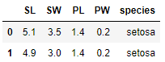

# 단순 회귀분석


## 1. 단순 회귀분석 개요
- 연속형 종속변수와 독립변수 간 선형관계 및 설명력을 확인하는 기법
- 종속변수와 독립변수가 각각 하나인 경우의 단순 선형 회귀 모형
- 설명력과 오차 평가 지표로 모델의 성능 평가

## 2. 주요 함수 및 메서드
- statsmodels - ols()
    - statsmodels의 선형 회귀분석을 하는 메서드
    - ols() 함수 내에 종속변수와 독립변수 선언
    - ols() 함수의 fit() 메서드로 모델 적합
    - 변수명에 온점 등 특정 특수문자가 있으면 오류발생 가능
    - 모델 객체의 predict() 메서드로 예측
- sklearn - LinearRegression()
    - sklearn의 선형 회귀분석을 하는 메서드
    - LinearRegression() 함수 내 fi_intercept로 절편 적합 여부 설정 가능
    - LinearRegression() 함수의 fit() 메서드로 학습 데이터 할당
    - 모델 객체의 coef_와 intercept_ 어트리뷰트로 각각 계수와 절편 확인 가능
    - 모델 객체의 predict() 메서드로 예측
- sklearn - mean_absolute_error()
    - MAE(Mean Absolute Error)을 연산하는 함수
- sklearn - mean_squared_error()
    - MSE(Mean Squared Error)을 연산하는 함수
    - 해당 결과에 제곱근 연산하면 RMSE(Root Mean Squared Error) 계산 가능


## 2. 코드 예시


### * 패키지

```python
import pandas as pd
from statsmodels.formula.api import ols
from sklearn.linear_model import LinearRegression
from sklearn.metrics import mean_absolute_error
from sklearn.metrics import mean_squared_error
```


### 1) ols()

```python
df = pd.read_csv('iris.csv')
df.head(2)
```


```python
# 온점이 있으면 에러발생
model = ols(formula = "Sepal.Length ~ Sepal.Width", data = df).fit()
model
```


```python
df.columns = ["SL", "SW", "PL", "PW", "species"]
df.head(2)
```



```python
model = ols(formula = "SL ~ SW", data = df).fit()
model.summary()
```


=> p-value가 0.152로 귀무가설을 기각하지 못한다. == 선형성을 만족하지 못하므로 해당 모델은 사용할 수 없다.

```python
model = ols(formula = "PL ~ PW", data = df).fit()
model.summary()
```


=> p-value가 매우작아 귀무가설을 기각 == 선형성을 가지고 있다. 선형회귀 모델에 적합하다.
y = 2.2299x + 1.0836의 수식이 생성된다.

```python
df['pred'] = model.predict(df) # 입력변수를 알아서 선별한다.
df.head()
```


### 2) LinearRegression()

```python
# 2차원으로 입력해야하는 것에 유의
model = LinearRegression().fit(X = df[['PL']], y = df[['PW']])
```

```python
model.coef_
```


```python
model.intercept_
```


```python
model.predict(df[["PL"]])
```


### 3) statsmodel

```python
# MAE
mean_absolute_error(y_true=df["PL"], y_pred=df["PW"])
```


```python
# MSE
mean_squared_error(y_true=df["PL"], y_pred=df["PW"])
```


```python
# RMSE
mean_squared_error(y_true=df["PL"], y_pred=df["PW"]) ** 0.5
```


## 3. 문제


### Q1. 종속변수를 registered, 독립변수를 temp로 했을 때 결정계수는?

```python
df = pd.read_csv("bike.csv")
df.head(2)
```


```python
from sklearn.model_selection import train_test_split

df_train, df_test = train_test_split(df, train_size=0.7, random_state=123)
df_train.head(2)
```


```python
model = ols(formula = "registered ~ temp", data=df_train).fit()
model.summary()
```


답 : 0.106


### Q2. 종속변수를 casual, 독립변수를 atemp로 했을 때 RMSE는?

```python
df = pd.read_csv("bike.csv")
df.head(2)
```


```python
df_train, df_test = train_test_split(df, test_size=0.3, random_state=123)
df_train.head(2)
```


```python
model = ols(formula = "casual ~ atemp", data = df_train).fit()
pred = model.predict(df_test)
pred[:4]
```


```python
mean_squared_error(y_pred = pred, y_true = df_test['casual']) ** 0.5
```


답 : 44.5


### Q3. 종속변수를 casual, 독립변수를 atemp로 했을 때 여름과 겨울의 RMSE 차이는?

```python
df = pd.read_csv("bike.csv")
df.head(2)
```

```python
df_summer = df[df.season == 2] # 여름
df_winter = df[df.season == 4] # 겨울
```

```python
df_train_summer, df_test_summer = train_test_split(df_summer, test_size=0.3, random_state=123)
df_train_winter, df_test_winter = train_test_split(df_winter, test_size=0.3, random_state=123)
```

```python
model_summer = ols(formula="casual ~ atemp", data=df_train_summer).fit()
pred = model_summer.predict(df_test_summer)
RMSE_summer = mean_squared_error(y_pred=pred, y_true=df_test_summer['casual']) ** 0.5
RMSE_summer
```


```python
model_winter = ols(formula="casual ~ atemp", data=df_train_winter).fit()
pred = model_winter.predict(df_test_winter)
RMSE_winter = mean_squared_error(y_pred=pred, y_true=df_test_winter['casual']) ** 0.5
RMSE_winter
```


```python
round(abs(RMSE_summer - RMSE_winter), 1)
```


답 : 8.6

