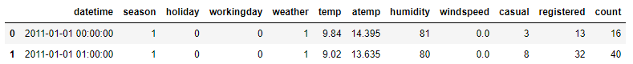
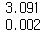
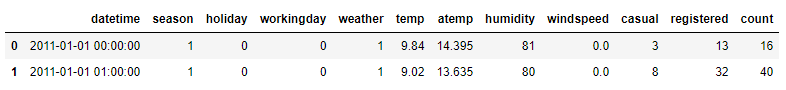
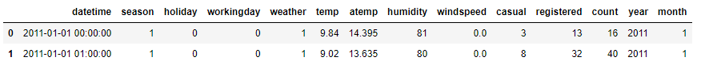
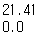
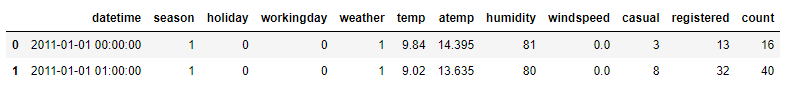
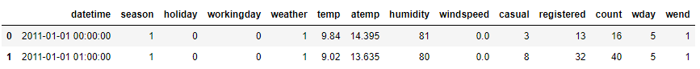

# 모평균 비교에 관한 가설검정 : t-test


## 1. t-검정

- - 단일 표본 t-검정
    - 단일 모집단에서 추출된 하나의 표본이 대상
    - 모평균과 표본 평균 차이를 검정
  - 대응 표본 t-검정
    - 동일한 모집단으로부터 추출된 두 표본 집단을 대상
    - 표본이 정규성을 만족하지 못하는 경우, Wilcoxon rank sum test 사용
  - 독립 2 표본 t-검정
    - 독립된 두 표본집단을 대상
    - 등분산 여부에 따라 검정통계량 계산식이 다름
    - 표본이 정규성을 만족하지 못하는 경우, Wilcoxon rank sum test 사용
  - 가설
    - 귀무가설 : 두 집단 간 평균이 같다
    - 대립가설 : 두 집단 간 평균이 같지 않다.

 

## 2. 주요 함수 및 메서드

- scipy - ttest_1samp()
  - 단일 표본 t 검정을 실시할 때 사용
  - 모집단의 평균은 popmean 인자에 지정
- scipy - ttest_rel()
  - 대응 표본 t검정을 실시할 때 사용하는 함수
  - 검정에 실시하는 두 변수를 차례대로 지정
- scipy - ttest_ind()
  - 독립 2 표본 t검정을 실시할 때 사용하는 함수
  - 검정에 실시하는 두 변수를 차례로 지정
  - 등분산 가정을 만족하는 경우, equal_var 인자에 True를 할당


## 3. 문제


### Q1. 자료가 수집된 지역의 평균온도는 20도라고 한다. 수집된 데이터를 사용하여 양측 검정을 실시했을 때 p-value는 얼마인가?

```python
bike = pd.read_csv('bike.csv')
bike.head(2)
```



```python
stat, p = ttest_1samp(bike.temp, popmean=20)
print(round(stat, 3))
print(round(p, 3))
```



답 : 0.002


### Q2. 2011년 1월의 데이터를 대상으로 동 시간대의 casual과 registered의 평균 차이 검정 시 검정통계량은?

```python
df = pd.read_csv('bike.csv')
df.head(2)
```



```python
df['datetime'] = pd.to_datetime(df.datetime)
df['year'] = df.datetime.dt.year
df['month'] = df.datetime.dt.month
df.head(2)
```



```python
df_sub = df.loc[(df.year == 2011) & (df.month == 1), ]

stat, p = ttest_rel(df_sub.casual, df_sub.registered)
print(round(abs(stat), 3))
print(round(p, 3))
```



답 : 21.41


### Q3. 주중과 주말의 registered 평균 검정 시 검정통계량은?

```python
df = pd.read_csv('bike.csv')
df.head(2)
```



```python
df['datetime'] = pd.to_datetime(df.datetime)
df['wday'] = df.datetime.dt.weekday
df['wend'] = (df['wday'] >= 5) + 0
df.head(2)
```



```python
stat, p = ttest_ind(df.loc[df.wend == 1, 'registered'],
                   df.loc[df.wend == 0, 'registered'])
print(round(abs(stat), 3))
print(round(p, 3))
```


답 : 12.073