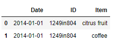
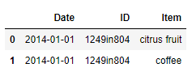

# 추천: 연관성 분석(Association Rule)

## 1. 연관성 분석 개요
- 연관성 분석(Association Rule) 특징
    - 상품 또는 서비스간의 관계 속에서 유용한 규칙을 찾을 때 사용
    - 유통 분야에서 주로 활용되며 장바구니 분석(Market Basket Analysis)이라는 별칭 존재
    - 비지니스적으로 중요한 요소를 고려하기 어렵고, 연산량이 많음

- 주요 평가 지표
    - 지지도(Support): 상품 X와 Y를 동시에 구매한 비율, 규칙의 중요성
    - 신뢰도(Confidence): 상품 X를 구매 시 Y를 구매한 비율(조건부 확률), 규칙의 신뢰성
    - 향상도(Lift): 상품 X 구매시 임의 상품 구입 대비 Y를 포함하는 경우의 비중, 규칙의 상관성

- 향상도 해석
    - Lift > 1: 품목 간 양의 상관 관계(보완재)
    - Lift = 1: 품목 간 상호 독립 관계
    - Lift < 1: 품목 간 음의 상관 관계(대체재)

## 2. 주요 함수 및 메서드
- mlxtend - apriori()
    - 구매 아이템 빈도를 계산하는 mlxtend의 함수
    - 입력 데이터 세트는 구매 아이템 기반으로 더미변수화(OHE) 되어있어야 함
    - min_support와 max_len 인자로 최소 지지도와 아이템 조합 최대값을 설정
    - use_colnames 인자를 True로 하여 분석 하는 것 권장(필수)
    - ``pip install mlxtend``로 설치
- mlxtend - association_rules()
    - 구매 아이템 빈도를 활용하여 연관규칙을 계산하는 mlxtend의 함수
    - metric에 필터링 기준 지표를 설정하고 min_threshold에 그 경계값을 지정

## 3. 코드

```python
import pandas as pd
from mlxtend.frequent_patterns import apriori
from mlxtend.frequent_patterns import association_rules
```

### 1) apriori()

```python
df = pd.read_csv("association_rules_mart.csv")
df.head(2)
```

```python
df["purchase"] = True # 피봇 테이블을 사용하기 위함

# 더미 변수 생성
df_pivot = df.pivot_table(index = "ID", columns= "Item",
                         values = "purchase", aggfunc = max,
                         fill_value = False)
df_pivot.head(2)
```


```python
item_freq = apriori(df_pivot, min_support=0.005, use_colnames=True)
item_freq.head()
```


### 2) association_rules()

```python
df_rules = association_rules(item_freq, metric="lift",
                            min_threshold=1.5)
df_rules.head()
```


## 4. 문제


### Q1. 최소 지지도와 신뢰도를 0.005로 설정하고 연관성 분석을 실시했을 때 지지도가 0.1 이상인 규칙은 몇개인가?

- association_rules_mart.csv 사용
- 사전 중복 제거 실시

```python
data = pd.read_csv("association_rules_mart.csv")
data.head(2)
```



```python
len(data)
```

```
40000
```

```python
data = data.iloc[:, 1:].drop_duplicates()
len(data)
```

```
34766
```

```python
data['purchase'] = True

data_pivot = data.pivot_table(index = "ID", columns= "Item",
                         values = "purchase", aggfunc = max,
                         fill_value = False)
data_pivot.head(2)
```


```python
item_sets = apriori(df = data_pivot, min_support=0.005, use_colnames=True)
item_sets.head()
```


```python
rules = association_rules(item_sets,
                         metric="confidence",
                         min_threshold=0.005)
rules.head(2)
```


```python
rules_sub = rules.loc[rules["support"] > 0.1,]
rules_sub = rules_sub.sort_values("lift", ascending=False)
rules_sub.head(2)
```


```python
len(rules_sub)
```

```
26
```

답 : 26


### Q2. 최소 지지도와 신뢰도를 0.005로 설정하고 연관성 분석을 실시했을 때 지지도가 0.01 이상인 규칙 중 향상도가 가장 높은 규칙과 관련 없는 품목은?

- association_rules_mart.csv 사용
- 사전 중복 제거 실시
- max_len = 3으로 설정

```python
df = pd.read_csv("association_rules_mart.csv")
df.head(2)
```



```python
df = df.iloc[:, 1:].drop_duplicates()
len(df)
```


```python
df['purchase'] = True
df_pivot = df.pivot_table(index = "ID", columns="Item", values="purchase", aggfunc=max, fill_value=False)
df_pivot.head(2)
```


```python
item_sets = apriori(df=df_pivot, min_support=0.005, use_colnames=True, max_len=3)
item_sets.head(2)
```


```python
rules = association_rules(df = item_sets, metric="confidence", min_threshold=0.005)
rules.head(2)
```


```python
rules_sub = rules.loc[rules.support >= 0.01,]
rules_sub.head(2)
```


```python
rules_sub.sort_values("lift", ascending=False).head(1)
```


답 : beer


### Q3. 판매 실적 상위 30위 품목만 사용하여 최소 지지도와 신뢰도를 0.005로 설정한 연관성 분석 결과를 보았을 때 지지도가 3% 이상인 규칙 중 가장 높은 향상도는 얼마인가?

- association_rules_mart.csv 사용
- 판매 실적은 개수로 하며 1행당 1개로 취급

```python
df = pd.read_csv("association_rules_mart.csv")
df.head(2)
```


```python
df_item_cnt = df["Item"].value_counts().reset_index()
df_item_cnt = df_item_cnt.sort_values("Item", ascending = False)
df_item_cnt.head()
```


```python
df_item_cnt = df_item_cnt.iloc[:30, ]
df_item_cnt.head(2)
```


```python
df_sub = df.loc[df["Item"].isin(df_item_cnt["index"],)] # isin을 통해서 아이템 매칭
df_sub.head()
```


```python
df_sub['purchase'] = True
df_pivot = pd.pivot_table(data = df_sub,
                         index = "ID", columns='Item', values="purchase",
                         aggfunc=max,
                         fill_value=False)
df_pivot.head(2)
```


```python
item_sets = apriori(df = df_pivot,
                   min_support=0.005, use_colnames=True)
```

```python
rules = association_rules(item_sets,
                         metric="confidence", min_threshold=0.005)
```

```python
rules_sub = rules.loc[rules["support"] > 0.03,]
rules_sub = rules_sub.sort_values("lift", ascending=False)
rules_sub.head(2)
```


답. 1.60