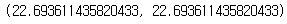
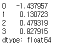
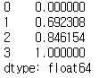

# 데이터 전처리 : 사용자 정의 함수 활용


### * 패키지

```python
import pandas as pd
```


## 1. 문제


### Q1. 입력 객체의 원소를 모두 제곱한 후 그 원소를 더한 다음 제곱근을 취하는 사용자 정의 함수를 만들었을 때 해당 사용자 정의 함수에 [3, 5, 9, 20]를 입력으로 하는 경우 그 출력값은?

```python
# 1번 방법
def Q1_func(x):
    result = x ** 2
    result = result.sum()
    result = result ** 0.5
    return result

# 2번 방법
def Q1_func2(x):
    result = x.pow(2).sum() ** 0.5
    return result

Q1_func(pd.Series([3, 5, 9, 20])), Q1_func2(pd.Series([3, 5, 9, 20]))
```



답 : 22.69


### Q2. 표준화(Standardization) 사용자 정의 함수를 만들고 [-4, 5, 7, 9]를 입력한 경우 여기서 입력한 7은 몇으로 반환되는가?

```python
def Q2_func(x):
    result = (x - x.mean()) / x.std()
    return result

Q2_func(pd.Series([-4, 5, 7, 9]))
```



답 : 0.48


### Q3. MinMax 정규화 사용자 정의 함수를 만들고 [-4, 5, 7, 9] 를 입력한 경우 여기서 입력한 7은 몇으로 반환되는가?

```python
def Q3_func(x):
    result = (x - x.min()) / (x.max() - x.min())
    return result

Q3_func(pd.Series([-4, 5, 7, 9]))
```



답 : 0.85

