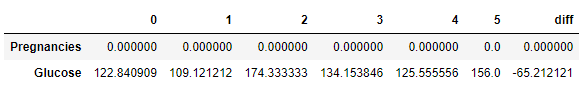

# 계층적 군집분석(Hierarchical Clustering)

## 1. 계층적 군집분석 개요

- 특징
    - 데이터간 유사도를 기반으로 계산하며 군집의 개수가 정해져 있지 않음
    - 계층적 군집분석을 실시하는 과정과 실시 후 특정 군집 개수로 데이터를 라벨링 하는 과정이 있음
    - 데이터의 변동에 민감하며 학습 데이터가 많을 경우 연산에 많은 시간이 소요됨
- 계층도(Dendrogram)
    - 데이터간 거리 기반으로 도식화한 도표
    - 계층도의 높이는 데이터 또는 군집간 거리에 비례한다.

## 2. 주요 함수 및 메서드
- sklearn - AgglomerativeClustering()
    - 계층적 군집분석을 실시할 수 있는 sklearn의 함수
    - n_clusters에 분리할 군집 개수 설정
    - affinity에 데이터 간 거리계산 방법, linkage에 군집간 유사도 방법 설정
- scipy - dendrogram(), linkage()
    - 계층도를 그리기 위한 scipy의 함수
    - linkage() 함수로 데이터 간 거리 계산 및 군집 형성
    - dendrogram() 함수로 계층도 시각화

## 3. 코드

### * 패키지

```python
import pandas as pd
from sklearn.cluster import AgglomerativeClustering
from scipy.cluster.hierarchy import dendrogram, linkage
from matplotlib import pyplot as plt
```

### 1) AgglomerativeClustering()

```python
df = pd.read_csv("iris.csv")
df.head(2)
```


```python
df_sub = df.iloc[:, :-1]
df_sub.head(2)
```


```python
model = AgglomerativeClustering(n_clusters = 3).fit(df_sub)
model
```


```python
model.labels_ # 군집 분석 결과
```


```python
df["cluster"] = model.labels_
df.head(2)
```


```python
pd.crosstab(df["Species"], df["cluster"])
```


```python
df.groupby("cluster").mean().reset_index()
```


### 2) linkage(), dendrogram()

```python
link = linkage(df_sub, method="ward")
link
```


```python
plt.figure()
dendrogram(link)
plt.show()
```


## 4. 문제

### Q1. 당뇨병 여부(Outcome) 변수를 제외한 나머지 변수를 입력으로 하고 계층적 군집분석을 실시했을 때 3번 군집의 인슐린(Insulin) 평균은?

```python
df = pd.read_csv("diabetes.csv")
df.head(2)
```


```python
df_sub = df.drop("Outcome", axis=1)
df_sub.head(2)
```


```python
model = AgglomerativeClustering(n_clusters=4).fit(df_sub)
df_sub['cluster'] = model.labels_
df_sub.head(2)
```


```python
df_sub.groupby("cluster").mean()
```


답 : 85.05


### Q2. 당뇨병 여부(Outcome) 변수를 제외한 나머지 변수를 입력으로 하고 계층적 군집분석을 실시했을 때 6개의 군집으로 분할하는 경우 군집의 개수가 가장 큰 군집의 행 개수는?

```python
df = pd.read_csv("diabetes.csv")
df.head(2)
```


```python
df_sub = df.drop("Outcome", axis=1)
df_sub.head(2)
```


```python
model = AgglomerativeClustering(n_clusters=6).fit(df_sub)
df_sub["cluster"] = model.labels_
df_sub.head(2)
```


```python
df_sub2 = df_sub.loc[(df.Pregnancies == 0) & (df.BMI > 0),]
df_sub2.head(2)
```


```python
df_sub2.cluster.value_counts()
```


답 : 44개


### Q3. 당뇨병 여부(Outcome) 변수를 제외한 나머지 변수를 입력으로 하고 계층적 군집분석을 실시했을 때 6개의 군집으로 분할하는 경우 1번과 2번 군집의 유클리드 거리는 얼마인가?"

```python
df = pd.read_csv("diabetes.csv")
df.head(2)
```


```python
df_sub = df.drop("Outcome", axis=1)
df_sub = df_sub.loc[(df_sub.Pregnancies == 0) & (df_sub.BMI > 0),]
df_sub.head(2)
```


```python
model = AgglomerativeClustering(n_clusters=6).fit(df_sub)
df_sub["cluster"] = model.labels_
df_sub.head(2)
```


```python
df_cl = df_sub.groupby("cluster").mean().reset_index()
df_cl
```


```python
df_cl = df_cl.iloc[:, 1:]
df_cl
```


```python
df_cl_t = df_cl.transpose()
df_cl_t.head(2)
```


```python
df_cl_t["diff"] = df_cl_t[1] - df_cl_t[2]
df_cl_t.head(2)
```



```python
(df_cl_t["diff"] ** 2).sum() ** 0.5
```

```
466.248496093336
```