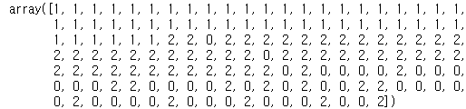
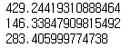

# 비계층적 군집분석(K-means Clustering)

## 1. k-means

- 임의의 k개의 점을 기반으로 가까운 거리의 데이터를 묶는 것과 더불어 평균을 활용하는 군집분석 기법
- 군집 개수(k)를 확정하기 위해 여러 번의 시행착오 필요
- 결과 고정을 위해 seed 설정 필요

## 2. 주요 함수 및 메서드

- sklearn - MinMaxScaler()
  - MinMax 정규화를 실시하는 sklearn의 함수
  - fit() 메서드로 규칙 모델을 만들고 transform() 함수로 변환을 실시
- sklearn - StandardScaler()
  - 표준화를 실시하는 sklearn의 함수
  - fit() 메서드로 규칙 모델을 만들고 transform() 함수로 변환을 실시
- sklearn - KMeans()
  - k-means 군집분석을 실시하는 sklearn 함수
  - n_clusters, max_iter, random_state에 각각 군집 개수, 최대 반복 연산, 결과 고정 설정 가능
  - KMeans() 함수의 fit() 메서드에 데이터를 할당하여 학습 진행
  - 결과 객체의 cluster_centers_와 labels_ 어트리뷰트로 군집 중심과 각 행의 군집 번호 확인 가능

## 3. 코드

### * 패키지

```python
import pandas as pd
from sklearn.cluster import KMeans
from sklearn.preprocessing import MinMaxScaler
from sklearn.preprocessing import StandardScaler
```

### 1) MinMaxScaler() - StandardScaler()와 사용법 같음

```python
# 데이터 로드
df = pd.read_csv("iris.csv")
df.head(2)
```


```python
# 데이터 분리 -> 기준에 따른 차이 확인을 위함
df_1 = df.head()
df_2 = df.tail(1)
```


```python
nor_minmax = MinMaxScaler().fit(df_1.iloc[:, :-1])
nor_minmax.transform(df_2.iloc[:, :-1])
```


```python
# 학습의 기준에 주의해야한다.
nor_minmax = MinMaxScaler().fit(df_2.iloc[:, :-1])
nor_minmax.transform(df_2.iloc[:, :-1])
```


```python
# 데이터 프레임 변환
df_minmax = pd.DataFrame(nor_minmax.transform(df_1.iloc[:, :-1]), columns=df_1.columns[:4])
df_minmax
```


### 2) KMeans()

```python
model = KMeans(n_clusters=3, random_state=123).fit(df.iloc[:, :-1])
model
```


```python
# 분류 확인
model.labels_
```



```python
# 중심 값 확인
model.cluster_centers_
```


```python
# 클러스터 별 평균 값 확인
df["cluster"] = model.labels_
df.groupby("cluster").mean()
```


## 4. 문제

### Q1. BMI가 0이 아닌 사람 데이터를 대상으로 k-means 군집 분석을 실시하는 경우 군집 개수가 가장 큰 군집의 Insulin 평균은 얼마인가?

```python
df = pd.read_csv("diabetes.csv")
df.head(2)
```


```python
df = df.loc[df.BMI != 0]
df.head(2)
```


```python
model = KMeans(n_clusters=4, random_state=123).fit(df)
df["cluster"] = model.labels_
df.groupby("cluster")["Insulin"].mean()
```


```python
df.cluster.value_counts()
```


답 : 4.103194

### Q2. BMI가 0이 아닌 사람 데이터를 대상으로 k-means 군집 분석을 실시하는 경우 군집 개수가 가장 큰 군집의 나이 평균은 얼마인가?

```python
df = pd.read_csv("diabetes.csv")
df.head(2)
```


```python
df_sub = df.loc[df.BMI != 0,]
df_sub.head(2)
```


```python
df_sub = MinMaxScaler().fit_transform(df_sub)
df_sub
```


```python
df_sub = pd.DataFrame(df_sub, columns=df.columns)
df_sub.head(2)
```


```python
model = KMeans(n_clusters=4, random_state=123).fit(df_sub)
df_sub2 = df.loc[df.BMI != 0,]
df_sub2.head(2)
```


```python
df_sub2["cluster"] = model.labels_
df_sub2.head(2)
```


```python
df_sub2.groupby("cluster")["Age"].mean()
```


```python
df_sub2.cluster.value_counts()
```


### Q3. BMI가 0이 아닌 사람 데이터를 대상으로 k-means 군집 분석을 실시하고 군집의 중심점간 유클리드 거리가 가장 가까운 그룹간 거리는?

```python
df = pd.read_csv("diabetes.csv")
df.head(2)
```


```python
df_sub = df.loc[df.BMI != 0,]
df_sub.head(2)
```


```python
model = KMeans(n_clusters=3, random_state=123).fit(df_sub)
df_centers = pd.DataFrame(model.cluster_centers_, columns=df_sub.columns)
df_centers
```


```python
df_centers = df_centers.transpose()
df_centers
```


```python
print(sum((df_centers.iloc[:, 0] - df_centers.iloc[:, 1]) **2) **0.5)
print(sum((df_centers.iloc[:, 1] - df_centers.iloc[:, 2]) **2) **0.5)
print(sum((df_centers.iloc[:, 0] - df_centers.iloc[:, 2]) **2) **0.5)
```



답 : 146