# 분류: 나이브 베이즈(Naive Bayes)

## 1. 나이브 베이즈 분류기 특징
- 사전 확률 및 추가 정보를 기반으로 사후 확률을 추론하는 통계적 방법인 베이즈 추정 기반 분류
- 종속변수 각 범주의 등장 빈도인 사전확률 설정이 중요
- 각 데이터의 사전 확률을 기반으로 사후확률을 계산


## 2. 주요 함수 및 메서드
- sklearn - GaussianNB()
    - 나이브베이즈 분류 모델을 위한 sklearn의 함수
    - 독립변수와 종속변수는 GaussianNB() 함수의 메서드인 fit() 함수에 할당
    - 모델 객체의 predict_proba() 메서드로 예측 확률값을 생산
    - 이진 분류의 경우 출력된 예측 확률값의 두 번째 열이 1이 될 확률

## 3. 코드

```python
import pandas as pd
from sklearn.naive_bayes import GaussianNB
```

```python
df = pd.read_csv("iris.csv")
df.head(2)
```

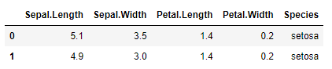

```python
# 파생변수 생성
df["is_setosa"] = (df["Species"] == "setosa") + 0
df.head(2)
```

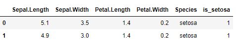

```python
df["is_setosa"].value_counts(normalize=True) # 퍼센트로 나타내기 : 사전확률
```

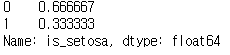

```python
# 모델 생성
model = GaussianNB().fit(X = df.iloc[:, :4],
                        y = df["is_setosa"])
```

```python
model.class_prior_ # 종속변수 사전확률
```

```
array([0.66666667, 0.33333333])
```

```python
model.theta_ # 회귀식의 계수 같은 것
```

```
array([[6.262, 2.872, 4.906, 1.676],
       [5.006, 3.428, 1.462, 0.246]])
```

```python
# 예측
pred = model.predict_proba(df.iloc[:, :4])
pred = pred[:, 1]
pred[:4]
```

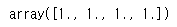

```python
# 정확도 계산
from sklearn.metrics import accuracy_score
pred_class = (pred > 0.99) + 0 # 임계값 0.99로 설정
accuracy_score(y_true = df["is_setosa"],
              y_pred = pred_class)
```

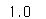


## 4. 문제

### Q1. BMI가 0 초과인 데이터만 사용하여 나이브 베이즈 분류를 실시하고자한다. Outcome을 종속변수로 하고 나머지 변수를 독립변수로 할 때 종속변수의 사전확률은?

- diabates.csv 사용
- Outcome 1을 대상으로 사전확률을 계산한다.

```python
df = pd.read_csv("diabetes.csv")
df.head(2)
```

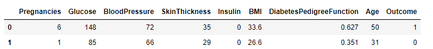

```python
model = GaussianNB().fit(X = df.iloc[:, :8],
                        y = df.Outcome)
```

```python
model.class_prior_
```

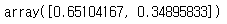

- 다른 풀이

```python
df_sub = df.loc[df["BMI"] > 0,]
df_sub["Outcome"].value_counts(normalize=True)
```

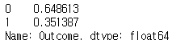

답 : 0.35


### Q2. 혈당, 혈압, 나이를 독립변수로 하고 당뇨 발병 여부를 종속변수로 했을 때 그 정확도는 얼마인가?

- diabates.csv 사용
- Outcome 1을 대상으로 사전확률 계산

```python
df = pd.read_csv("diabetes.csv")
df.head(2)
```

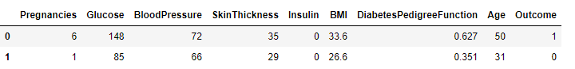

```python
var_list = ['Glucose', 'BloodPressure', 'Age']

model = GaussianNB().fit(X = df[var_list],
                        y = df['Outcome'])
```

```python
accuracy_score(y_true= df["Outcome"],
              y_pred=model.predict(X = df[var_list]))
```

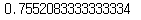

답 : 76%


### Q3. 임신여부, 연령대, BMI, 혈당을 독립변수로 하고 당뇨 발병 여부를 종속변수로 했을 때 나이브 베이즈와 로지스틱 회귀 분석을 실시하고 둘 중 정확도가 높은 모델의 정확도는?

- diabates.csv 사용
- BMI가 0 초과인 것을 사용하며 학습/평가 데이터 세트를 8:2로 분할, Seed는 123
- 연령대는 Age가 21인 경우 20으로, 39일 경우 30으로 계산한다.
- sklearn의 로지스틱 회귀 함수를 사용하며, 임계값(threshold)은 0.5로 한다.

```python
df = pd.read_csv("diabetes.csv")
df.head(2)
```

```python
# 파생변수 생성
df = df.loc[df.BMI > 0,]
# 연령대
df['Age'] = (df['Age'] // 10) * 10
# 임신여부
df['is_Pregnancies'] = (df.Pregnancies > 0) + 0
```

```python
from sklearn.model_selection import train_test_split
from sklearn.linear_model import LogisticRegression

val_list = ['is_Pregnancies', 'Age', 'BMI', 'Glucose']

train_X, test_X, train_y, test_y = train_test_split(df[val_list], df['Outcome'], test_size=0.2, random_state=123)

model_nb = GaussianNB().fit(train_X, train_y)
model_lg = LogisticRegression().fit(train_X, train_y)

# 가우시안
pred = model_nb.predict_proba(test_X)
accuracy_score(y_true=test_y,
              y_pred=(pred[:, 1] > 0.5) + 0)
              
# 로지스틱
accuracy_score(y_true=test_y,
              y_pred=model_lg.predict(test_X))
```

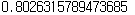

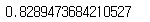

답 : 83%

