# 주성분 분석(PCA)

## 1. 주성분 분석 개요
- 주성분 분석 특징
    - 특정 데이터의 주성분(Principal Component)를 찾는 방법
    - 대표적인 차원 축소 기법
    - 입력 변수 개수와 각 주성분의 설명 비를 고려하여 주성분 개수 결정
- 주성분(Principal Component)
    - 입력 변수를 기반으로 최대의 분산을 가지는 새로운 변수
    - 각 주성분은 직교하기 때문에 상관계수가 0에 가까움

## 2. 주요 함수 및 메서드
- sklearn - PCA()
    - 주성분 분석을 시행하기 위한 sklearn 함수
    - n_component 인자에 산출할 주성분 개수 입력
    - PCA() 함수로 생성한 객체의 fit_transform() 메서드로 주성분 연산
    - PCA() 함수로 생성한 객체의 explained_variance로 각 주성분의 분산 파악 가능
- pandas - cumsum()
    - 숫자 원소가 있는 시리즈 객체의 누적합을 계산하기 위한 pandas 메서드
    - 주성분의 분산 또는 분산비를 활용하여 누적 분산 또는 누적 분산비 계산 용이


## 3. 코드

```python
import pandas as pd
from sklearn.decomposition import PCA
```

```python
df = pd.read_csv("iris.csv")
df.head(2)
```

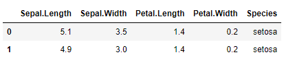

```python
pca = PCA(n_components=3)

df_pca = pca.fit_transform(df.iloc[:, :4])
df_pca = pd.DataFrame(df_pca,
                     columns=["comp_1", "comp_2", "comp_3"])
df_pca.head(2)
```

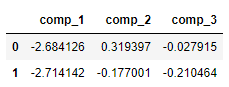

```python
pca.explained_variance_ # 분산
```

```
array([4.22824171, 0.24267075, 0.0782095 ])
```

```python
pca.explained_variance_ratio_ # 비율로 보기
```

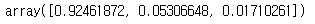

```python
pd.Series(pca.explained_variance_ratio_).cumsum() # 누적분산
```

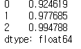

```python
pca.singular_values_ # 고유값
```

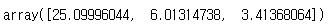

```python
df_pca.corr().round(2)
```

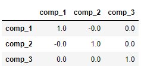


## 4. 문제


### Q1. x, y, z 변수와 해당 변수를 기반으로 3개의 주성분을 생성했을 때 기존 변수의 상관계수와 주성분의 상관계수의 최대값은 각각 얼마인가?

```python
df = pd.read_csv("diamonds.csv")
df.head(2)
```

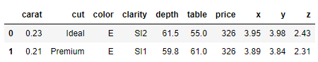

```python
pca_model = PCA(n_components=3)
df_pca = pca_model.fit_transform(df.loc[:, ["x", 'y',  'z']])

df_pca = pd.DataFrame(df_pca, columns=["comp_1", "comp_2", "comp_3"])

df.loc[:, ["x", "y", "z"]].corr().round(3)
```

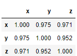

```python
df_pca.corr().round(2)
```

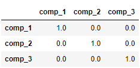

답: 0.975, 0.0


### Q2. x, y, z table, depth 변수를 사용하여 주성분 분석을 실시하였을 때 누적 분산이 99%가 최초로 넘는 주성분은 몇 번째 주성분인가?


```python
df = pd.read_csv("diamonds.csv")
df.head(2)
```

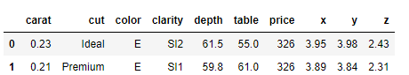

```python
pca_model = PCA(n_components=5)
df_pca = pca_model.fit_transform(df.loc[:, ["x", "y", "z", "table", "depth"]])

ser = pd.Series(pca_model.explained_variance_ratio_)
ser.cumsum()
```

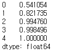

답 : 3


### Q3. 가격을 예측하기 위해 기존 변수와 주성분 변수의 성능을 비교하고자한다. 독립변수를 carat과 x를 둔 회귀모델 1번과 carat과 주성분 변수 한 개를 사용한 회귀모델 2번 중 성능이 더 좋은 모델의 RMSE는?

- diamonds.csv
- 8:2 분할
- 주성분은 x, y, z 변수로 생성한 첫 번째 주성분을 사용
- seed : 123


```python
df = pd.read_csv("diamonds.csv")
df.head(2)
```

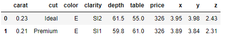

```
pca_model = PCA(n_components=1)
df_pca = pca_model.fit_transform(df.loc[:, ["x", "y", "z"]])

df["comp_1"] = df_pca
```

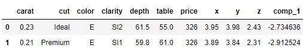

```python
from sklearn.model_selection import train_test_split

df_train, df_test = train_test_split(df, train_size=0.8, random_state=123)
```

```python
from statsmodels.formula.api import ols
from sklearn.metrics import mean_squared_error

model_1 = ols(formula = "price ~ carat + x", data = df_train).fit()
pred_1 = model_1.predict(df_test)
rmse_1 = mean_squared_error(y_pred = pred_1, y_true = df_test["price"]) ** 0.5
round(rmse_1, 3)
```

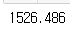

```python
model_2 = ols(formula = "price ~ carat + comp_1", data = df_train).fit()
pred_2 = model_2.predict(df_test)
rmse_2 = mean_squared_error(y_pred = pred_2, y_true = df_test["price"]) ** 0.5
round(rmse_2, 3)
```

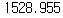

답 : 1, 1526

