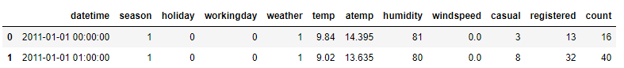
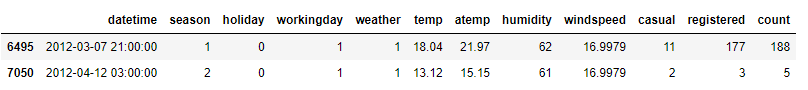
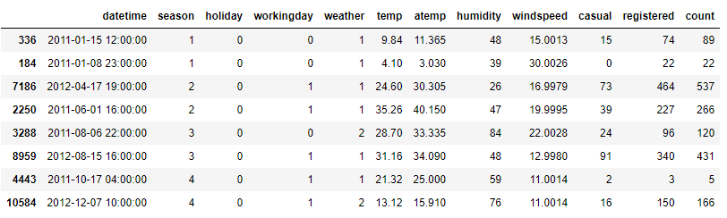
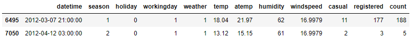
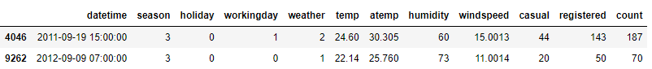
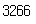
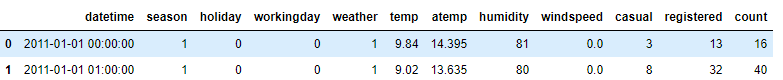
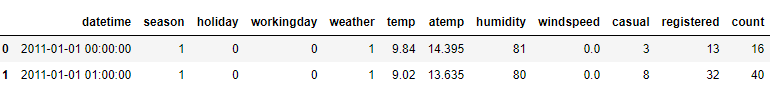
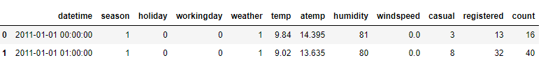

# 표본 추출

## 1. 표본 추출 개요
- 단순 임의 추출(Simple Random Sampling)
    - 별도의 규칙이 존재하지 않은 보통의 임의 추출
    - 규칙이 없어서 편향된 표본이 추출될 수 있다.
- 층화 표본 추출(Stractified Random Sampling)
    - 군집별로 지정한 비율 만큼의 데이터를 임의 추출
- 계통 추출(Systematic Sampling)
    - 첫 표본을 무작위로 추출하고 표집 간격 k 만큼 떨어진 곳의 데이터 추출
    - 편항된 표본을 추출할 수 있어 잘 사용하지 않는 방법
- 군집 추출(Cluster Sampling)
    - 소수의 군집으로 분할하고 일정 수의 소집단을 임의 표본 추출

## 2. 주요 함수 및 메서드
- pandas - sample()
    - 단순임의 추출을 수행하는 메서드
    - n은 표본 개수, frac은 비율, random_state는 표본 추출 결과를 고정
    - groupby() 메서드를 추가하면 층화 표본추출 가능
- sklearn - train_test_split()
    - 입력 데이터프레임이나 배열을 두 세트(학습, 평가)로 나누는 함수
    - train_size 또는 test_size에 개수 또는 비율을 입력하여 표본 개수 조절
    - random_state는 표본 추출 결과를 고정


## 3. 코드 예제


### * 패키지 로드

```python
import pandas as pd
from sklearn.model_selection import train_test_split
```


### 1) 데이터 로드

```python
df = pd.read_csv("bike.csv")
df.head(2)
```




### 2) sample()

```python
df.sample(n = 2, random_state = 123) # random_state를 지정하지 않으면 값이 변한다.
```



```python
df.groupby('season').sample(n = 2, random_state = 123) # season 별 2가지의 샘플을 추출
```



```python
df.sample(frac=0.005, random_state = 123).head(2) # frac을 통한 비율 설정
```




### 3) train_test_split()

```python
df_train, df_test = train_test_split(df, train_size=0.7, random_state=123) # 8:2, 7:3의 비율을 많이 사용한다.
df_train.head(2)
```



```python
len(df_test) # 길이 확인
```




## 4. 문제


### Q1. 주어진 데이터의 1.23% 를 추출하면 몇 개의 행이 추출되는가?

```python
df = pd.read_csv('bike.csv')
df.head(2)
```



```python
len(df.sample(frac=0.0123))
```

답 : 134


### Q2. Season 기준 5%씩 추출 시 추출되는 총 행의 수는?

```python
df = pd.read_csv("bike.csv")
df.head(2)
```



```python
df.groupby('season').sample(frac=0.05).shape[0]
```

답 : 545


### Q3. 학습과 평가용 데이터 세트로 8:2 분리 시 평가용 데이터의 최고기온은?

```python
df = pd.read_csv("bike.csv")
df.head(2)
```



```python
train_df, test_df = train_test_split(df, test_size=0.2, random_state=123)
```

```python
test_df.temp.max()
```

답: 39.36

