# 시계열 분석

## 1. 시계열 분석 개요
- 평활화(smoothing)
    - 시계열 데이터를 일련의 정제법을 사용하여 보다 부드럽게 만드는 과정
    - 이동 평균법
        - 단순이동평균법(Simple Moving Average)
        - 가중이동평균법(Weighted Moving Average)
    - 지수 평활법
        -단순(EWMA)/이중(Winters)/삼중(HoltWinters) 지수 평활법

- 시계열 분해(Time Series Decomposition)
    - 시계열 데이터를 일련의 공식을 활용하여 추세, 변동 등 세부 시계열 요소로 분리하는 일련의 과정
    - 고전 시계열 분해법
        - 가법모형(Addictive Model)
        - 승법모형(Multiplicative Model)

## 2. 주요 함수 및 메서드
- pandas - rolling()
    - 단순이동평균을 수행하는 pandas의 메서드
    - window에는 이동평균 대상이 되는 데이터 개수를 지정
    - 뒤에 붙이는 메서드에 따라서 각 구간의 연산 결과가 달라진다
    - center에 True를 입력할 경우 중심 이동평균 실시 가능
- pandas - ewm()
    - 단순이동평균을 수행하는 pandas 메서드
    - alpha에는 지수평활계수 입력
    - 뒤에 붙이는 메서드에 따라서 각 구간의 연산 결과가 달라짐
- statsmodels - seasonal_decompose()
    - 시계열 분해를 위한 statsmodels의 함수
    - model 인자에 "multiplicative"를 입력하면 승법모형 적용(default : 가법모형)
    - 입력하는 시계열 데이터는 pandas의 시리즈이며 인덱스는 시간 데이터 필수


## 3. 코드 예시


### 1) rolling()

```python
import pandas as pd

df = pd.read_csv("seoul_subway.csv")
df.head(2)
```

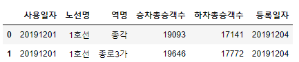

```python
df_sub = df.loc[(df["노선명"] == "1호선") & (df["역명"] == "종로3가"), ]
df_sub.head(2)
```

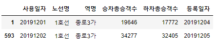

```python
df_sub["MA_5"] = df_sub["승차총승객수"].rolling(window=5).mean() # 5일 이동 평균
df_sub.head(5) # 5개의 자료가 모인시점부터 계산하게 되어 앞의 4개는 NaN값
```

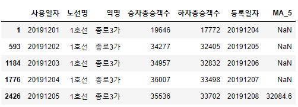


### 2) ewm()

```python
from statsmodels.tsa.seasonal import seasonal_decompose

df = pd.read_csv("seoul_subway.csv")
df.head(2)
```

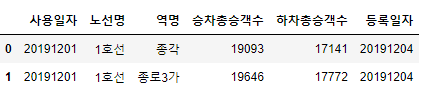

```python
df_sub = df.loc[(df.노선명 == "1호선") & (df.역명 == "종각"),]
df_sub.head(2)
```

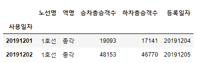

```python
df_sub["사용일자"] = pd.to_datetime(df_sub["사용일자"], format = "%Y%m%d")
df_sub.head(2)
```

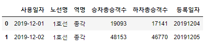

```python
df_sub = df_sub.set_index("사용일자")
df_sub.head(2)
```

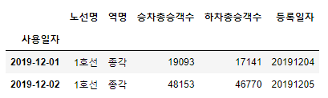

```python
result = seasonal_decompose(df_sub["승차총승객수"])
result.plot()
```

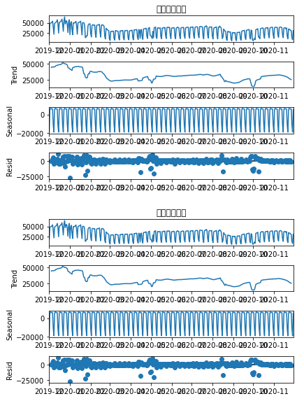

```python
result.trend
```

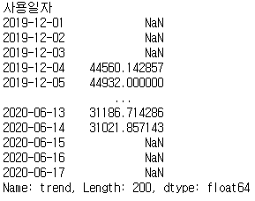


## 4. 문제


### Q1. rolling()메서드의 window에 정수 n을 입력하는 경우 출력 데이트 세트의 결측치는 총 몇 개인가?


답 : n-1개


## Q2. 6호선 이태원역 데이터를 활용하여 EWMA를 실시했을 때 지수평활계수가 0.1과 0.9로 설정한 결과를 비교하고자 한다. 2020년 11월 30일 기준 산출값 차이의 절대값은?

```python
data = pd.read_csv("seoul_subway.csv")
data.head(2)
```

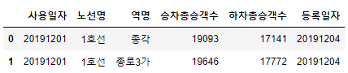

```python
data = data.loc[(data.노선명 == "6호선") & (data.역명 == "이태원"),]
data.head(2)
```

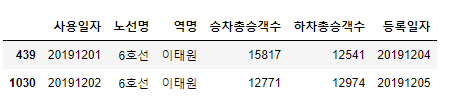

```python
data["alpha01"] = data["하차총승객수"].ewm(alpha=0.1).mean()
data["alpha09"] = data["하차총승객수"].ewm(alpha=0.9).mean()
data["diff"] = data.alpha01 - data.alpha09
data.tail(2)
```

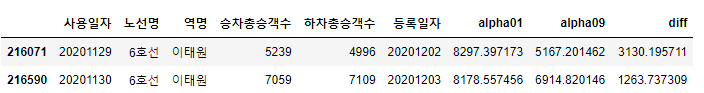

답 : 1263


### Q3. 3호선 신사역 승차 총 승객수를 활용하여 시계열분해 가법모형을 실시하였을 때 2020년 11월 30일의 추세값은?


```python
sub = pd.read_csv("seoul_subway.csv")
sub.head(2)
```

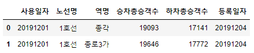

```python
sub = sub.loc[(sub["노선명"] == "3호선") & (sub["역명"] == "신사"), ]
sub.head(2)
```

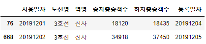

```python
sub["date"] = pd.to_datetime(sub["사용일자"], format = "%Y%m%d")
sub.head(2)
```

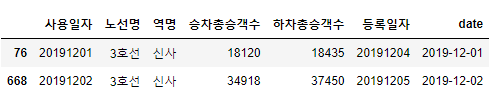

```python
sub = sub.set_index("date")
sub.head(2)
```

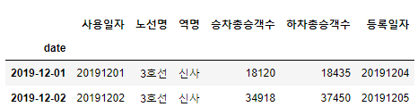

```python
td = seasonal_decompose(sub["승차총승객수"],
                       model = "addictive",
                       extrapolate_trend=1)
td.trend.tail()
```

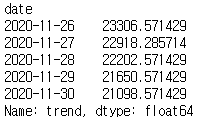\

답 : 21098