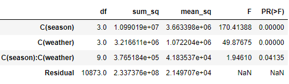

# 모평균 비교에 관한 가설검정 : Two way ANOVA


## 1. 이원 분산 분석(Two Way ANOVA) 개요

- 수치형 종속변수가 1개, 명목형 독립변수가 2개 일 때 실시하는 분석
- 두 요인이 서로 상호간에 영향을 주고 받으면서 나타나는 교호작용 효과 확인 가능
- 가설 - 주요 효과
  - 귀무가설 : 집단간 평균이 같음
  - 대립가설 : 평균이 같지 않은 집단이 한 쌍 이상 존재
- 가설 - 교호작용 효과
  - 귀무가설 : 요인 간 교호작용이 없음
  - 대립가설 : 요인 간 교호작용이 있음


## 2. 주요 함수 및 메서드

- 이원 분산 분석 - ols()
  - statmodels의 분산 분석을 수행하는 함수
  - 이원 분산 분석에서는 각 요인의 교호작용을 확인하기 위해서 : 를 사용


## 3. 코드 예시


### * 패키지

```python
import pandas as pd
from statsmodels.formula.api import ols
from statsmodels.stats.anova import anova_lm
```


### 1) ols(), anova_lm()

- 데이터 로드

```python
df = pd.read_csv("diamonds.csv")
df.head(2)
```


- two way ANOVA

```python
formula = "price ~ cut + color + cut:color"
model = ols(formula, data = df).fit()
anova_lm(model)
```


## 4. 문제


### Q1. 다음 중 종속변수를 registerd, 독립변수를 season, holiday로 지정했을 때 분석 결과 해석으로 틀린 것은?


- 데이터 로드

```python
df = pd.read_csv("bike.csv")
df.head(2)
```


- two way ANOVA

```python
formula = "registered ~ C(season) + C(holiday) + C(season):C(holiday)" # 카테고리형 변수는 C로 지정해주어야 한다.
model = ols(formula, data=df).fit()
anova_lm(model)
```


답 : 2번


### Q2. 다음 중 종속변수를 registered, 독립변수를 season, weather로 지정했을 때 분석 결과 해석으로 틀린 것은?


- 데이터 로드

```python
df = pd.read_csv("bike.csv")
df.head(2)
```


- two way ANOVA

```python
formula = "registered ~ C(season) + C(weather) + C(season):C(weather)"
model = ols(formula, data=df).fit()
anova_lm(model).round(5)
```



답 : 4번


### Q3. 다음 중 종속변수를 BMI, 독립변수를 연령대와 임신여부로 지정했을 때 교호작용 효과의 p-value는?


- 데이터 로드

```python
df = pd.read_csv("diabetes.csv")
df.head(2)
```


- 데이터 정리

```python
# 나이가 70세 이상, BMI가 0이면 제거
df = df.loc[(df.Age < 70) & (df.BMI > 0),]
# 임신여부 열 생성, 0 또는 1
df['is_preg'] = (df['Pregnancies'] > 0) + 0
# 나이대 열 생성
df['Age_g'] = (df.Age // 10) * 10
df.head(2)
```


- two way ANOVA

```python
formula = "BMI ~ C(Age_g) + C(is_preg) + C(Age_g):C(is_preg)"
lm = ols(formula, data=df).fit()
anova_lm(lm).round(5)
```


답 : 4번(0.13)

