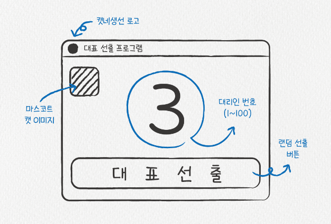
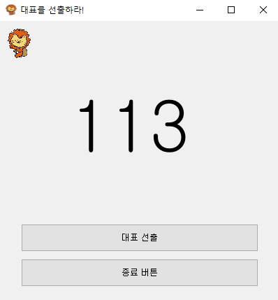

# PyQt5 Chaper 01


## 1. 화면설계

1. 화면 스케치

   - 내가 만들 화면에 대해서 그림판 또는 기타 tool을 사용하여 화면을 간단하게 스케치한다.

     

2. 디자인

   - 스케치에 대해서 간단하게 디자인한다.
   - 보통은 클라이언트의 요구사항에 따라 디자인을 진행한다.


## 2. PyQt5 코드


### 1) 패키지 로드

```python
import sys
from PyQt5.QtWidgets import QApplication, QWidget, QLabel, QPushButton, QToolTip
from PyQt5.QtGui import QIcon, QPixmap, QFont
from PyQt5.QtCore import QCoreApplication
import random
```

- ``sys`` : System 함수 사용
- ``PyQt5.QtWidgets`` :  UI용 그래픽 요소를 포함하여 Application에 바로 사용할 수 있는 위젯들이 있는 라이브러리
  - ``QApplication`` : GUI 응용 프로그램의 제어 흐름 및 기본 설정 관리
  - ``QWidget`` : interface 개체의 기본 클래스 (상속받아서 사용)
  - ``QLabel`` : Text 또는 Image를 표시하는 기능 제공
  - ``QPushButton`` : Event를 발생시키는 버튼 생성(단, 이벤트 콜백 함수는 별도로 지정해주어야 한다.)
  - ``QToolTip`` : 모든 Widget에 대한 설명 말풍선을 제공
- ``PyQt5.QtGui`` : openGL을 기반으로 작성된 모듈로, 2D 그래픽, 이미징, 글꼴 및 텍스트등을 위한 클래스를 제공한다. (사용자는 해당 클래스를 커스터마이징할 수 있다.)
  - ``QIcon`` : 다양한 모드와 상태에서 확장 가능한 아이콘을 제공
  - ``QPixmap`` : 이미지를 스크린 상에 매핑하고, 이미지를 조정할 수 있다.
  - ``QFont`` : Text의 폰트를 설정
- ``PyQt5.QtCore`` : 개체 통신을 위한 라이브러리
  - ``QCoreApplication`` : UI가 없는 Qt Application에 대한 이벤트 루프를 제공


### 2) Class 정의

> UI의 경우에 Class를 통하여 각 기능을 관리하는 것이 유지보수에 좋기 때문에 모듈별로 정의하여 관리한다.
>
> 각, 기능별 설명은 코드 주석을 참고한다.


```python
class SelectRepresentative(QWidget):
    
    # 1. 초기화 함수 정의
    def __init__(self):
        super().__init__()                                                                         # QWidget의 초기화 함수를 실행
        self.init_ui()                                                                             # UI 초기화 함수 실행

    # 2. UI초기화 함수 정의
    def init_ui(self):
        self.image()
        self.button()
        self.tooltip()
        self.number_of_agent()

        self.setWindowTitle('대표를 선출하라!')                                                     # Window의 Title 설정
        self.setWindowIcon(QIcon('../img/weniv-licat.png'))                                        # Window의 Icon 설정
        self.setGeometry(500, 500, 400, 400)                                                       # 화면의 크기를 설정 : Window로부터 (500, 500)의 위치에 400 X 400의 크기
        self.show()

    # 3. 기능별 함수 정의
    def image(self):
        self.representative_img = QLabel(self)
        self.representative_img.setPixmap(QPixmap('../img/weniv-licat.png').scaled(35, 44))
        self.representative_img.move(10, 10)                                                       # 이미지 위치 지정

    def button(self):
        self.bnt_election = QPushButton('대표 선출', self)
        self.bnt_election.setFixedSize(340, 40)                                                    # width, height 지정
        self.bnt_election.move(30, 290)                                                             
        self.bnt_election.clicked.connect(self.choice)                                             # Click 이벤트 발생 (함수 호출)

        self.bnt_close = QPushButton('종료 버튼', self)
        self.bnt_close.setFixedSize(340, 40)
        self.bnt_close.move(30, 340)
        self.bnt_close.clicked.connect(self.close)

    def choice(self):
        s = str(random.randint(1, 1000))
        print(s)
        self.agent_label.setText(s)                                                                # Label에 Text 적용

    def close(self):
        return QCoreApplication.instance().quit()                                                  # instance 종료

    def tooltip(self):
        self.bnt_election.setToolTip('이 버튼을 누르면 대표를 선출합니다.\n주의하세요. 되돌릴 수 없습니다.')
        self.bnt_close.setToolTip('이 버튼을 누르면 프로그램을 종료합니다.')
        self.representative_img.setToolTip('생성가게 대표 라이켓')
        self.setToolTip('이곳은 QWidget')

    def number_of_agent(self):
        # https://doc.qt.io/qtforpython/PySide2/QtGui/QFont.html : 폰트

        self.agent_label = QLabel('000', self)
        self.agent_label.setFont(QFont("Helvetica", pointSize=75, weight=2))
        self.agent_label.move(100, 100)
```


### 3) 실행

> 코드가 반복적으로 실행되면서 SelectRepresentative의 init 함수가 반복적으로 실행 -> UI 표시

```python
loop_program = QApplication(sys.argv)
run_instance = SelectRepresentative()
loop_program.exec_()            
```



