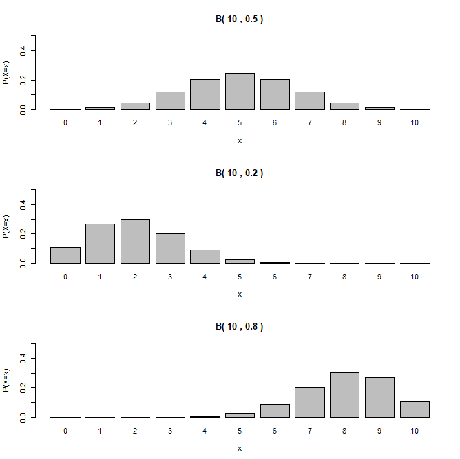
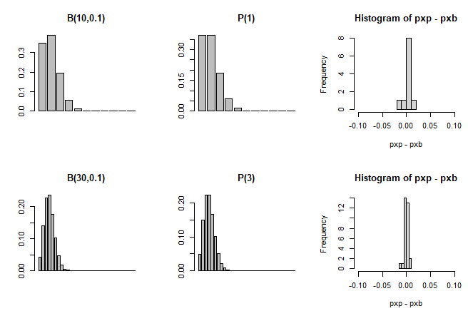

# R Basic Function


## 1. 순열과 조합

```R
# 1. 순열 조합

factorial(3)				# 3!
factorial(5)/factorial(2)	#  , combination
choose(5,2)					#  , combination
```


## 2. 확률 분포


### 1) 이항분포 관련함수

- ``rbinom`` : (r)andom generator 난수
- ``pbinom`` : (p)robability or CDF(comulative distribution function) 누적확률 P(X<=x)
- ``qbinom`` : (q)uantile or percentile function 분위수/백분위수

- ``dbinom`` : (d)ensity function (or probability mass function) 밀도/질량함수 
- ``?rbinome`` : 문법/용례를 알고자 할 때 help


### 2) 확률함수 일부목록

- 이항분포                 dbinom(x,n,p)

- 베르누이분포       dbinom(x,1,p)

- 초기하분포          dhyper(x,r,N-r,n) (혹은 dhyper(x,Np,N-Np,n)) (r=m,N-r=n,n=k)

- 포아송분포    dpois(x,lambda)


### 3) 이항분포표 (예, )

```R
### 2.3.1 P(X = x) 

# R 함수사용 
n=10; p=0.5; x=0:n
px = dbinom(x,n,prob=p)
names(px) = paste(x)
round(px,4)

# 직접계산 
pxx = choose(n,x) * p^x *(1-p)^(n-x)
names(pxx) = paste(x)
round(pxx,4)
```


```R
### 2.3.2 P(X <= x)

# R 함수사용
cdf.x = pbinom(x,n,p)
names(cdf.x)=paste(x)
round(cdf.x,4)

# 직접계산
round(cumsum(px),4)
```


```R
### 2.3.4 그래프 비교

par(mfrow=c(2,2))
plot(x,px,type="h",xlab="x",ylab="P(X=x)",ylim=c(0,1),main="B(10,0.5)-확률질량함수")
plot(x,cdf.x,type="s",xlab="x",ylab="P(X<=x)",ylim=c(0,1),main="B(10,0.5)-누적확률질량함수")
barplot(px,xlab="x",ylab="P(X=x)" ,ylim=c(0,1),main="B(10,0.5)-확률질량함수")
barplot(cdf.x,xlab="x",ylab="P(X<=x)" ,ylim=c(0,1), main="B(10,0.5)-누적확률질량함수")
```


## * 참고


### A1. 성공확률에 따른 이항분포의 모양 비교

```R
# A1. 성공확률에 따른 이항분포의 모양 비교

bin.dist=function(n,p)
{
  x=0:n
px=dbinom(x,n,prob=p)
names(px)=paste(x)
barplot(px,xlab="x",ylab="P(X=x)" ,ylim=c(0,.5),main=paste("B(" ,n, ",",p, ")"))
}

par(mfrow=c(3,1))
bin.dist(n=10,p=0.5)
bin.dist(n=10,p=0.2)
bin.dist(n=10,p=0.8)
```




### A2.  이항분포의 포아송분포 근사

```R
# A2. 이항분포의 포아송분포 근사

bp = function(n,p)
{
 mu=n*p
 x = 0:n
pxb = dbinom(x,n,prob=p)
pxp = dpois(x,lambda=mu)
barplot(pxb,main=paste("B(",n,",",p,")",sep=""))
barplot(pxp,main=paste("P(",mu,")",sep=""))
hist(pxp-pxb,xlim=c(-0.1,0.1))
ptab = round(cbind(x,pxb,pxp,(pxp-pxb)),6)
dimnames(ptab)=list(paste(x),c("x","p(binom)","p(poisson)", "diff(p-d)"))
ptab
}

# p 고정, n 증가

par(mfrow=c(3,3))
bp(n=10,p=0.1)
bp(n=30,p=0.1)
bp(n=100,p=0.1)

# n 고정, p 감소
par(mfrow=c(3,3))
bp(n=30,p=0.20)
bp(n=30,p=0.10)
bp(n=30,p=0.05)
```




